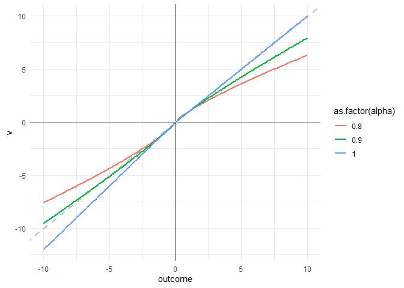
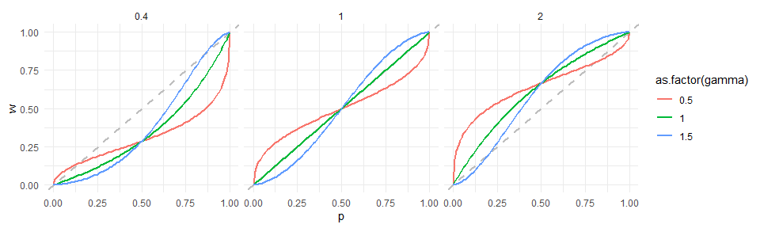
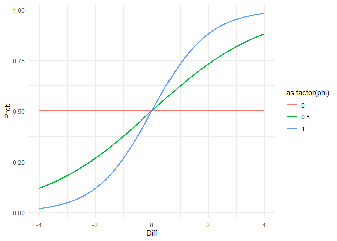
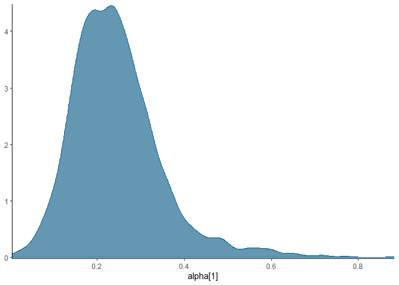
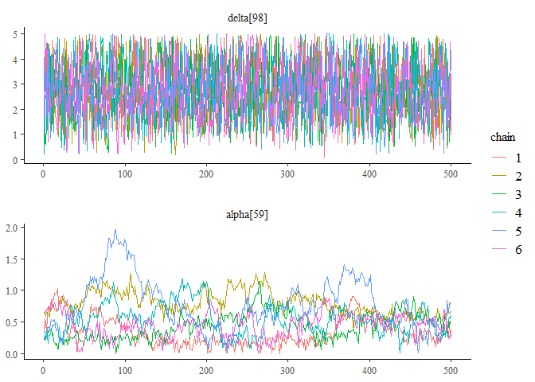
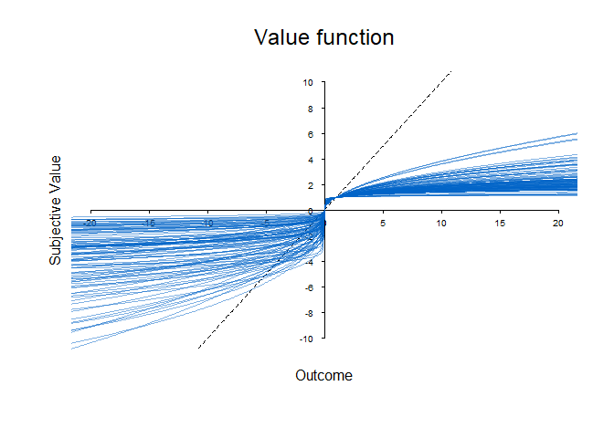
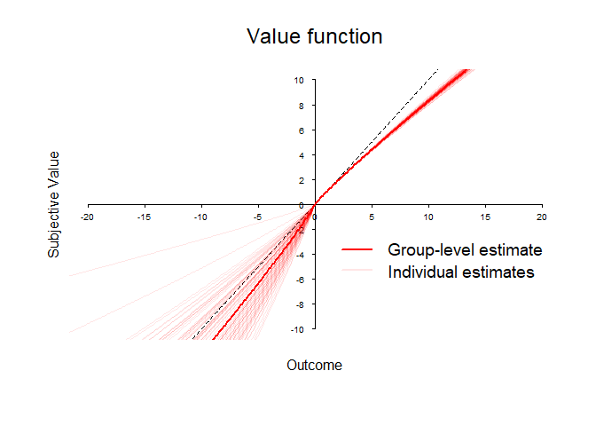
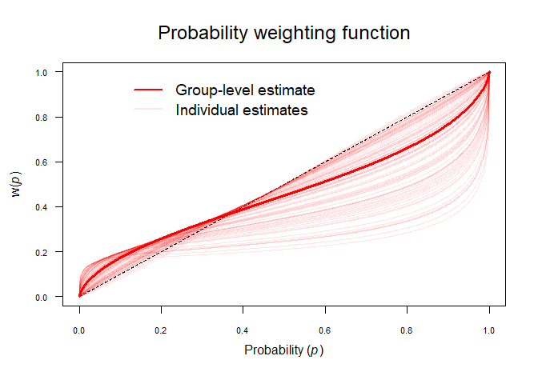

## Risky Choice

Sometimes in your life, you make choices between certain outcomes (e.g., whether to buy an Android phone or an iPhone). In other situations, you have to make risky choices:
When making decisions under risk, choosing an option does not always lead to the same outcome.
Instead, choosing an option can lead to one of several outcomes with some probability. A classical example would be playing a lottery or to invest in the stock market, another real life example would be deciding to buy insurance or not (where the future event of getting a disease is not for sure but may only happen with some predicted probability).

In our studies, we often investigate people's choice behavior in a controlled context. For this, we present them with different lotteries ("risky prospects") and ask which one they prefer.
Consider the following risky choice problem from a study of [Kellen et al. (2016)](https://linkinghub.elsevier.com/retrieve/pii/S0010027716302104), involving two options, $A$ and $B$. 
The different columns represent different features of both options.


```
## New names:
## New names:
## • `` -> `...7`
## • `` -> `...8`
## • `` -> `...13`
## • `` -> `...14`
```


```r
# read data
problems <- read_xlsx("BayesianCognitiveModeling/kellen2016.xlsx", sheet=1) # problem features

# clean data
problems %<>% 
  select(-c(`...7`,`...8`,`...13`,`...14`)) %>% 
  mutate(domain = case_when(outcomeA1 >= 0 & outcomeA2 >= 0 & outcomeB1 >= 0 & outcomeB2 >= 0 ~ "Gain" , 
                            outcomeA1 <= 0 & outcomeA2 <= 0 & outcomeB1 <= 0 & outcomeB2 <= 0 ~ "Loss" , 
                            .default = "Mixed"))  %>% 
  select( problem, label, domain, everything()) %>% 
  arrange(domain)
```


```r
kable(problems[1,])
```


| problem|label    |domain | probA1| outcomeA1| probA2| outcomeA2| probB1| outcomeB1| probB2| outcomeB2|
|-------:|:--------|:------|------:|---------:|------:|---------:|------:|---------:|------:|---------:|
|       1|hertwig1 |Gain   |      1|         3|      0|         0|    0.8|         4|    0.2|         0|

For instance, `Option B` has two possible outcomes, indicated by `outcomeB1` and `outcomeB2`. 
When choosing this option, one of the outcomes is obtained.
Specifically, `outcomeB1`=4 occurs with `probB1`=0.8 and `outcomeB2`=0 occurs with `probB2`=0.2. 
When choosing this option repeatedly, we therefore expect to obtain `4` most of the time, but sometimes also a `0`.
To illustrate, we simulate choosing `Option B` 100 times. 


```r
sample(c(problems[[1,'outcomeB1']], problems[[1,'outcomeB2']]) , 
       size=100 ,
       replace = TRUE ,
       prob=c(problems[[1,'probB1']], problems[[1,'probB2']]))
```

```
##   [1] 4 4 4 0 4 0 0 4 4 4 4 4 4 4 4 4 4 0 4 4 0 4 4 4 4 4 4 4 0 4 4 4 4 4 0 4 4
##  [38] 4 4 4 0 4 4 4 4 4 4 4 4 4 4 0 4 4 4 4 4 4 4 4 0 4 4 4 4 4 4 4 4 0 4 0 4 4
##  [75] 4 0 0 4 4 0 4 4 4 4 4 4 4 4 4 4 4 4 4 0 4 4 4 4 0 4
```

Turning to `Option A`, we notice that `outcomeA1`=3 occurs with `probA1`=1 and `outcomeA2`=0 occurs with `probA2`=0.
Thus, this option is effectively a safe option, where `outcomeA2` does not really exist and we instead always obtain a `3`. 
(Note that we still need to keep the (in reality non-existent) outcome A2 in our dataframe for modeling purposes. We will get to that later.). 

To illustrate, we also simulate choosing `Option A` 100 times. 


```r
sample(c(problems[[1,'outcomeA1']], problems[[1,'outcomeA2']]) , 
       size=100 ,
       replace = TRUE ,
       prob=c(problems[[1,'probA1']], problems[[1,'probA2']]))
```

```
##   [1] 3 3 3 3 3 3 3 3 3 3 3 3 3 3 3 3 3 3 3 3 3 3 3 3 3 3 3 3 3 3 3 3 3 3 3 3 3
##  [38] 3 3 3 3 3 3 3 3 3 3 3 3 3 3 3 3 3 3 3 3 3 3 3 3 3 3 3 3 3 3 3 3 3 3 3 3 3
##  [75] 3 3 3 3 3 3 3 3 3 3 3 3 3 3 3 3 3 3 3 3 3 3 3 3 3 3
```

In a typical risky choice study, people are presented with the possible outcomes and probabilities of both options and need to decide which of the options they prefer (so-called *decisions from description*). 
However, most studies involve more than just one choice problem. 
For instance, in the study by Kellen et al. (2016), participants were presented with 114 different choice problems, each represented by a row in the table below. 
Each problem is a unique combination of the outcomes and probabilities for `Option A` and `Option B`.

The column `domain` indicates whether all possible outcomes are $\geq 0$ (`Gain`), or whether all outcome are $\leq 0$ (`Loss`), or whether the problem involves some outcomes that are $>0$ and some that are a $<0$ - i.e., a problem featuring a gamble that could lead to either a gain, or a loss. 


```r
kable(problems)
```


| problem|label      |domain | probA1| outcomeA1| probA2| outcomeA2| probB1| outcomeB1| probB2| outcomeB2|
|-------:|:----------|:------|------:|---------:|------:|---------:|------:|---------:|------:|---------:|
|       1|hertwig1   |Gain   |  1.000|       3.0|  0.000|         0|  0.800|       4.0|  0.200|         0|
|       3|hertwig3   |Gain   |  0.250|       3.0|  0.750|         0|  0.200|       4.0|  0.800|         0|
|       5|hertwig5   |Gain   |  1.000|       3.0|  0.000|         0|  0.100|      32.0|  0.900|         0|
|       7|hertwig7   |Gain   |  0.250|       3.0|  0.750|         0|  0.025|      32.0|  0.975|         0|
|       9|hertwig9   |Gain   |  0.750|       0.5|  0.250|         0|  0.150|       6.0|  0.850|         0|
|      11|hertwig11  |Gain   |  0.700|       0.9|  0.300|         0|  0.150|      13.0|  0.850|         0|
|      13|risk1      |Gain   |  0.100|     770.0|  0.900|        20|  0.100|     400.0|  0.900|       320|
|      14|risk2      |Gain   |  0.200|     770.0|  0.800|        20|  0.200|     400.0|  0.800|       320|
|      15|risk3      |Gain   |  0.300|     770.0|  0.700|        20|  0.300|     400.0|  0.700|       320|
|      16|risk4      |Gain   |  0.400|     770.0|  0.600|        20|  0.400|     400.0|  0.600|       320|
|      17|risk5      |Gain   |  0.500|     770.0|  0.500|        20|  0.500|     400.0|  0.500|       320|
|      18|risk6      |Gain   |  0.600|     770.0|  0.400|        20|  0.600|     400.0|  0.400|       320|
|      19|risk7      |Gain   |  0.700|     770.0|  0.300|        20|  0.700|     400.0|  0.300|       320|
|      20|risk8      |Gain   |  0.800|     770.0|  0.200|        20|  0.800|     400.0|  0.200|       320|
|      21|risk9      |Gain   |  0.900|     770.0|  0.100|        20|  0.900|     400.0|  0.100|       320|
|      22|risk10     |Gain   |  1.000|     770.0|  0.000|         0|  1.000|     400.0|  0.000|         0|
|      41|rieskamp1  |Gain   |  0.420|     470.0|  0.580|       640|  0.340|     240.0|  0.660|       590|
|      42|rieskamp2  |Gain   |  0.200|     570.0|  0.800|       940|  0.880|     790.0|  0.120|       820|
|      43|rieskamp3  |Gain   |  0.440|     230.0|  0.560|       310|  0.740|     620.0|  0.260|         0|
|      44|rieskamp4  |Gain   |  0.950|     680.0|  0.050|       950|  0.050|     560.0|  0.950|       720|
|      45|rieskamp5  |Gain   |  0.430|      70.0|  0.570|       970|  0.250|     840.0|  0.750|       430|
|      46|rieskamp6  |Gain   |  0.710|     550.0|  0.290|       630|  0.280|      70.0|  0.720|       740|
|      47|rieskamp7  |Gain   |  0.760|     130.0|  0.240|       900|  0.090|     560.0|  0.910|       190|
|      48|rieskamp8  |Gain   |  0.980|     560.0|  0.020|        80|  0.630|     410.0|  0.370|       180|
|      49|rieskamp9  |Gain   |  0.390|     670.0|  0.610|       630|  0.880|     720.0|  0.120|       290|
|      50|rieskamp10 |Gain   |  0.600|      60.0|  0.400|       450|  0.610|     370.0|  0.390|       500|
|      51|rieskamp11 |Gain   |  0.150|     440.0|  0.850|       290|  0.080|     540.0|  0.920|       310|
|      52|rieskamp12 |Gain   |  0.630|     430.0|  0.370|       530|  0.920|     630.0|  0.080|        50|
|      53|rieskamp13 |Gain   |  0.320|     390.0|  0.680|       560|  0.780|     320.0|  0.220|       990|
|      54|rieskamp14 |Gain   |  0.790|     150.0|  0.210|       290|  0.160|     660.0|  0.840|       230|
|      55|rieskamp15 |Gain   |  0.980|     920.0|  0.020|       190|  0.120|     520.0|  0.880|       730|
|      56|rieskamp16 |Gain   |  0.290|     530.0|  0.710|       910|  0.290|     880.0|  0.710|       780|
|      57|rieskamp17 |Gain   |  0.840|     160.0|  0.160|       910|  0.310|     390.0|  0.690|       510|
|      58|rieskamp18 |Gain   |  0.350|    1000.0|  0.650|       500|  0.170|     700.0|  0.830|       650|
|      59|rieskamp19 |Gain   |  0.640|     370.0|  0.360|       650|  0.910|     800.0|  0.090|       190|
|      60|rieskamp20 |Gain   |  0.480|     770.0|  0.520|        60|  0.090|     830.0|  0.910|       670|
|      61|rieskamp21 |Gain   |  0.210|      90.0|  0.790|       310|  0.440|     140.0|  0.560|       720|
|      62|rieskamp22 |Gain   |  0.850|    1000.0|  0.150|        20|  0.680|     410.0|  0.320|       650|
|     108|DKErev2    |Gain   |  1.000|     100.0|  0.000|         0|  0.500|     200.0|  0.500|         0|
|     110|DKErev4    |Gain   |  1.000|     200.0|  0.000|         0|  0.500|     400.0|  0.500|         0|
|     112|DKErev6    |Gain   |  1.000|     140.0|  0.000|         0|  0.500|     240.0|  0.500|        40|
|     114|DKErev8    |Gain   |  0.500|     120.0|  0.500|        80|  0.500|     200.0|  0.500|         0|
|       2|hertwig2   |Loss   |  1.000|      -3.0|  0.000|         0|  0.800|      -4.0|  0.200|         0|
|       4|hertwig4   |Loss   |  0.200|      -4.0|  0.800|         0|  0.250|      -3.0|  0.750|         0|
|       6|hertwig6   |Loss   |  0.100|     -32.0|  0.900|         0|  0.100|      -3.0|  0.900|         0|
|       8|hertwig8   |Loss   |  0.025|     -32.0|  0.975|         0|  0.250|      -3.0|  0.750|         0|
|      10|hertwig10  |Loss   |  0.150|      -6.0|  0.850|         0|  0.750|      -0.5|  0.250|         0|
|      12|hertwig12  |Loss   |  0.150|     -13.0|  0.850|         0|  0.700|      -0.9|  0.300|         0|
|      23|risk11     |Loss   |  0.100|    -770.0|  0.900|       -20|  0.100|    -400.0|  0.900|      -320|
|      24|risk12     |Loss   |  0.200|    -770.0|  0.800|       -20|  0.200|    -400.0|  0.800|      -320|
|      25|risk13     |Loss   |  0.300|    -770.0|  0.700|       -20|  0.300|    -400.0|  0.700|      -320|
|      26|risk14     |Loss   |  0.400|    -770.0|  0.600|       -20|  0.400|    -400.0|  0.600|      -320|
|      27|risk15     |Loss   |  0.500|    -770.0|  0.500|       -20|  0.500|    -400.0|  0.500|      -320|
|      28|risk16     |Loss   |  0.600|    -770.0|  0.400|       -20|  0.600|    -400.0|  0.400|      -320|
|      29|risk17     |Loss   |  0.700|    -770.0|  0.300|       -20|  0.700|    -400.0|  0.300|      -320|
|      30|risk18     |Loss   |  0.800|    -770.0|  0.200|       -20|  0.800|    -400.0|  0.200|      -320|
|      31|risk19     |Loss   |  0.900|    -770.0|  0.100|       -20|  0.900|    -400.0|  0.100|      -320|
|      32|risk20     |Loss   |  1.000|    -770.0|  0.000|         0|  1.000|    -400.0|  0.000|         0|
|      63|rieskamp23 |Loss   |  0.720|    -560.0|  0.280|      -830|  0.160|    -150.0|  0.840|      -670|
|      64|rieskamp24 |Loss   |  0.700|    -320.0|  0.300|      -370|  0.130|    -190.0|  0.870|      -560|
|      65|rieskamp25 |Loss   |  0.050|    -460.0|  0.950|      -440|  0.290|    -670.0|  0.710|      -280|
|      66|rieskamp26 |Loss   |  0.170|    -460.0|  0.830|      -640|  0.820|    -400.0|  0.180|      -900|
|      67|rieskamp27 |Loss   |  0.760|    -380.0|  0.240|      -990|  0.290|    -250.0|  0.710|      -860|
|      68|rieskamp28 |Loss   |  0.420|    -990.0|  0.580|      -370|  0.600|    -460.0|  0.400|      -210|
|      69|rieskamp29 |Loss   |  0.280|    -480.0|  0.720|      -740|  0.480|    -150.0|  0.520|      -910|
|      70|rieskamp30 |Loss   |  0.800|    -520.0|  0.200|      -930|  0.530|    -930.0|  0.470|      -260|
|      71|rieskamp31 |Loss   |  0.770|    -330.0|  0.230|      -300|  0.490|     -10.0|  0.510|      -540|
|      72|rieskamp32 |Loss   |  0.440|    -150.0|  0.560|      -620|  0.990|    -240.0|  0.010|      -130|
|      73|rieskamp33 |Loss   |  0.460|       0.0|  0.540|      -970|  0.790|    -670.0|  0.210|      -370|
|      74|rieskamp34 |Loss   |  0.860|    -580.0|  0.140|      -970|  0.560|    -580.0|  0.440|      -800|
|      75|rieskamp35 |Loss   |  0.170|    -120.0|  0.830|      -690|  0.630|    -960.0|  0.370|      -380|
|      76|rieskamp36 |Loss   |  0.470|    -300.0|  0.530|      -610|  0.590|    -550.0|  0.410|      -770|
|      77|rieskamp37 |Loss   |  0.550|   -1000.0|  0.450|      -280|  0.130|    -290.0|  0.870|      -760|
|      78|rieskamp38 |Loss   |  0.250|    -630.0|  0.750|      -300|  0.840|    -570.0|  0.160|      -900|
|      79|rieskamp39 |Loss   |  0.260|    -170.0|  0.740|      -430|  0.860|    -290.0|  0.140|      -300|
|      80|rieskamp40 |Loss   |  0.930|    -420.0|  0.070|      -300|  0.660|     -80.0|  0.340|      -950|
|      81|rieskamp41 |Loss   |  0.760|    -570.0|  0.240|      -280|  0.390|    -350.0|  0.610|      -720|
|      82|rieskamp42 |Loss   |  0.770|    -480.0|  0.230|      -340|  0.510|    -260.0|  0.490|      -760|
|      83|rieskamp43 |Loss   |  0.170|    -420.0|  0.830|      -700|  0.730|    -730.0|  0.270|      -540|
|      84|rieskamp44 |Loss   |  0.780|    -970.0|  0.220|      -340|  0.490|    -660.0|  0.510|      -920|
|      33|loss1      |Mixed  |  0.500|       0.0|  0.500|         0|  0.500|    -100.0|  0.500|        50|
|      34|loss2      |Mixed  |  0.500|       0.0|  0.500|         0|  0.500|    -100.0|  0.500|       100|
|      35|loss3      |Mixed  |  0.500|       0.0|  0.500|         0|  0.500|    -100.0|  0.500|       150|
|      36|loss4      |Mixed  |  0.500|       0.0|  0.500|         0|  0.500|    -100.0|  0.500|       200|
|      37|loss5      |Mixed  |  0.500|       0.0|  0.500|         0|  0.500|    -100.0|  0.500|       220|
|      38|loss6      |Mixed  |  0.500|       0.0|  0.500|         0|  0.500|    -100.0|  0.500|       240|
|      39|loss7      |Mixed  |  0.500|       0.0|  0.500|         0|  0.500|    -100.0|  0.500|       300|
|      40|loss8      |Mixed  |  0.500|       0.0|  0.500|         0|  0.500|    -100.0|  0.500|       400|
|      85|rieskamp45 |Mixed  |  0.270|    -830.0|  0.730|       240|  0.430|    -910.0|  0.570|       630|
|      86|rieskamp46 |Mixed  |  0.910|     380.0|  0.090|      -730|  0.060|    -820.0|  0.940|       540|
|      87|rieskamp47 |Mixed  |  0.650|    -850.0|  0.350|       930|  0.790|    -700.0|  0.210|       980|
|      88|rieskamp48 |Mixed  |  0.870|     230.0|  0.130|      -390|  0.370|     -80.0|  0.630|       520|
|      89|rieskamp49 |Mixed  |  0.500|     710.0|  0.500|      -260|  0.610|     960.0|  0.390|      -670|
|      90|rieskamp50 |Mixed  |  0.020|    -690.0|  0.980|       140|  0.430|    -470.0|  0.570|       630|
|      91|rieskamp51 |Mixed  |  0.300|      80.0|  0.700|      -370|  0.390|    -700.0|  0.610|       190|
|      92|rieskamp52 |Mixed  |  0.470|    -730.0|  0.530|       150|  0.590|   -1000.0|  0.410|       810|
|      93|rieskamp53 |Mixed  |  0.110|     160.0|  0.890|      -480|  0.920|    -730.0|  0.080|       960|
|      94|rieskamp54 |Mixed  |  0.360|     260.0|  0.640|      -480|  0.890|    -310.0|  0.110|       270|
|      95|rieskamp55 |Mixed  |  0.800|      80.0|  0.200|      -880|  0.860|    -390.0|  0.140|       830|
|      96|rieskamp56 |Mixed  |  0.670|     750.0|  0.330|       -70|  0.740|     770.0|  0.260|      -230|
|      97|rieskamp57 |Mixed  |  0.270|      90.0|  0.730|      -670|  0.910|    -330.0|  0.090|       280|
|      98|rieskamp58 |Mixed  |  0.870|     960.0|  0.130|      -890|  0.930|     750.0|  0.070|      -900|
|      99|rieskamp59 |Mixed  |  0.680|     740.0|  0.320|       -20|  0.990|     670.0|  0.010|       -30|
|     100|rieskamp60 |Mixed  |  0.400|    -400.0|  0.600|       960|  0.480|     580.0|  0.520|       -50|
|     101|rieskamp61 |Mixed  |  0.480|    -130.0|  0.520|       990|  0.070|    -550.0|  0.930|       950|
|     102|rieskamp62 |Mixed  |  0.680|    -890.0|  0.320|       460|  0.970|    -510.0|  0.030|       300|
|     103|rieskamp63 |Mixed  |  0.600|    -390.0|  0.400|       310|  0.860|    -260.0|  0.140|       820|
|     104|rieskamp64 |Mixed  |  0.800|    -860.0|  0.200|       140|  0.880|    -900.0|  0.120|       880|
|     105|rieskamp65 |Mixed  |  0.880|    -690.0|  0.120|       830|  0.870|    -780.0|  0.130|       450|
|     106|rieskamp66 |Mixed  |  0.490|    -600.0|  0.510|       840|  0.960|     170.0|  0.040|      -480|
|     107|DKErev1    |Mixed  |  1.000|       0.0|  0.000|         0|  0.500|     100.0|  0.500|      -100|
|     109|DKErev3    |Mixed  |  1.000|       0.0|  0.000|         0|  0.500|     200.0|  0.500|      -200|
|     111|DKErev5    |Mixed  |  1.000|      40.0|  0.000|         0|  0.500|     140.0|  0.500|       -60|
|     113|DKErev7    |Mixed  |  0.500|      20.0|  0.500|       -20|  0.500|     100.0|  0.500|      -100|


## Expected Value Maximization

What do you think, how do people choose between such lotteries? They are probably trying to maximize rewards (gain the highest outcome values and avoid losing any) on the long run, right?

This assumption is reflected in an influential theory: According to this view, the rational way to make such decisions under risk is to choose the option with the highest *expected value* (EV), i.e., 

$$
\arg\max  EV = \sum_i^np_ix_i \; ,
$$
where $x_i$ are the possible outcome of the option and $p_i$ are their respective probabilities.
That is, for each option, people should first multiple all outcomes by their probabilities and then sum up the products to obtain the EV.
Then they should choose the option with the higher EV.
The following code follows this procedure for all choice problems used by Kellen et al. (2016).
Below we showcase the choice predicted by EV maximization for the first five gambles of the dataframe, where the last column `max_ev_det` refers to the lottery with the higher EV (`Option A` = 1, `Option B` = 0) - i.e., the predicted choice.


```r
problems %<>%  
  mutate(ev_A = round( probA1*outcomeA1 + probA2*outcomeA2 , 2) , # computes EV of option A and rounds the result to 2 decimal places
         ev_B = round( probB1*outcomeB1 + probB2*outcomeB2 , 2) , # computes EV of option B and rounds the result to 2 decimal places
         # choose option A (coded as 0) when ev_A > ev_B, otherwise B (coded as 1): nothing when ev_A = ev_B
         max_ev_det = case_when(ev_A > ev_B ~ 1 , # choose option A when ev_A > b
                                ev_A < ev_B ~ 0 , # choose option B when ev_A < b
                                ev_A == ev_B ~ NA ) # choose nothing when EV's are equal (NA refers to missing values that are created here)
         )
kable(head(problems))
```


| problem|label     |domain | probA1| outcomeA1| probA2| outcomeA2| probB1| outcomeB1| probB2| outcomeB2| ev_A| ev_B| max_ev_det|
|-------:|:---------|:------|------:|---------:|------:|---------:|------:|---------:|------:|---------:|----:|----:|----------:|
|       1|hertwig1  |Gain   |   1.00|       3.0|   0.00|         0|  0.800|         4|  0.200|         0| 3.00| 3.20|          0|
|       3|hertwig3  |Gain   |   0.25|       3.0|   0.75|         0|  0.200|         4|  0.800|         0| 0.75| 0.80|          0|
|       5|hertwig5  |Gain   |   1.00|       3.0|   0.00|         0|  0.100|        32|  0.900|         0| 3.00| 3.20|          0|
|       7|hertwig7  |Gain   |   0.25|       3.0|   0.75|         0|  0.025|        32|  0.975|         0| 0.75| 0.80|          0|
|       9|hertwig9  |Gain   |   0.75|       0.5|   0.25|         0|  0.150|         6|  0.850|         0| 0.38| 0.90|          0|
|      11|hertwig11 |Gain   |   0.70|       0.9|   0.30|         0|  0.150|        13|  0.850|         0| 0.63| 1.95|          0|

One of the shortcomings of the idea of EV maximization is that people do not seem to maximize expected values in real life.  
In their study, Kellen et al. (2016) collected the choices of 104 participants on all of the 114 choice problems from above.
To illustrate, the following table shows the choices of 10 participants (columns) on the first 10 choice problems (rows). Here, again, values of 1 refer to a choice of `Option A`, and values of 0 mean that `Option B` was chosen. 


```
## New names:
## • `` -> `...1`
```


```r
# read and clean data
description <- read_xlsx("BayesianCognitiveModeling/kellen2016.xlsx", sheet = 3, col_names = TRUE)
description  %<>% rename(label = ...1)
```


```r
kable(description[1:10, 1:11])
```


|label     | 1_er171989| 10_ad011989| 100_AL051986| 101_HS121988| 102_SS261994| 103_AE041989| 104_EZ261993| 105_NK311984| 106_SG181986| 107_PM041990|
|:---------|----------:|-----------:|------------:|------------:|------------:|------------:|------------:|------------:|------------:|------------:|
|hertwig1  |          1|           1|            1|            1|            1|            1|            1|            1|            1|            1|
|hertwig2  |          0|           0|            0|            0|            0|            0|            0|            0|            0|            1|
|hertwig3  |          0|           1|            1|            0|            1|            1|            0|            0|            0|            0|
|hertwig4  |          1|           1|            0|            0|            0|            0|            1|            1|            0|            1|
|hertwig5  |          1|           0|            1|            1|            0|            1|            1|            1|            1|            1|
|hertwig6  |          0|           0|            0|            0|            0|            0|            0|            0|            0|            0|
|hertwig7  |          1|           1|            0|            0|            0|            1|            1|            1|            0|            1|
|hertwig8  |          0|           1|            0|            0|            0|            1|            0|            1|            1|            0|
|hertwig9  |          0|           0|            0|            0|            0|            0|            1|            0|            0|            1|
|hertwig10 |          1|           0|            0|            0|            0|            0|            0|            1|            1|            0|

Since we know for all problems whether `Option A` (`1`) or `Option B` (`0`) has the higher EV, we can compute the proportion of choices, in which participants chose the option with the higher EV. 

The last column of each row, `ev_max_ob`, shows the proportion of people who choose the option with the higher EV in the respective problem.
It is easy to see that people often deviate from strict EV maximization, sometimes very systematically.


```r
problems <- problems %>%   
  left_join(description, by = join_by(label)) %>% # here, we merge our choice data with the dataframe containing the problem descriptions and the calculated EV and choice predictions.
  mutate(ev_max_obs = round ( case_when(max_ev_det == 1 ~ rowMeans(select(., `1_er171989`:`99_AA211989`), na.rm = TRUE)  , # this command computes the proportion of participants that maximized EV in a particular choice problem.
                                        max_ev_det == 0 ~ 1 - rowMeans(select(., `1_er171989`:`99_AA211989`), na.rm = TRUE) 
                                        ) , 2 # rounding to two decimal places
                              )
         ) 

problems %>% 
  select(problem:max_ev_det, ev_max_obs) %>%
  kable()
```


| problem|label      |domain | probA1| outcomeA1| probA2| outcomeA2| probB1| outcomeB1| probB2| outcomeB2|    ev_A|    ev_B| max_ev_det| ev_max_obs|
|-------:|:----------|:------|------:|---------:|------:|---------:|------:|---------:|------:|---------:|-------:|-------:|----------:|----------:|
|       1|hertwig1   |Gain   |  1.000|       3.0|  0.000|         0|  0.800|       4.0|  0.200|         0|    3.00|    3.20|          0|       0.25|
|       3|hertwig3   |Gain   |  0.250|       3.0|  0.750|         0|  0.200|       4.0|  0.800|         0|    0.75|    0.80|          0|       0.53|
|       5|hertwig5   |Gain   |  1.000|       3.0|  0.000|         0|  0.100|      32.0|  0.900|         0|    3.00|    3.20|          0|       0.38|
|       7|hertwig7   |Gain   |  0.250|       3.0|  0.750|         0|  0.025|      32.0|  0.975|         0|    0.75|    0.80|          0|       0.42|
|       9|hertwig9   |Gain   |  0.750|       0.5|  0.250|         0|  0.150|       6.0|  0.850|         0|    0.38|    0.90|          0|       0.74|
|      11|hertwig11  |Gain   |  0.700|       0.9|  0.300|         0|  0.150|      13.0|  0.850|         0|    0.63|    1.95|          0|       0.73|
|      13|risk1      |Gain   |  0.100|     770.0|  0.900|        20|  0.100|     400.0|  0.900|       320|   95.00|  328.00|          0|       0.99|
|      14|risk2      |Gain   |  0.200|     770.0|  0.800|        20|  0.200|     400.0|  0.800|       320|  170.00|  336.00|          0|       0.98|
|      15|risk3      |Gain   |  0.300|     770.0|  0.700|        20|  0.300|     400.0|  0.700|       320|  245.00|  344.00|          0|       0.97|
|      16|risk4      |Gain   |  0.400|     770.0|  0.600|        20|  0.400|     400.0|  0.600|       320|  320.00|  352.00|          0|       0.91|
|      17|risk5      |Gain   |  0.500|     770.0|  0.500|        20|  0.500|     400.0|  0.500|       320|  395.00|  360.00|          1|       0.14|
|      18|risk6      |Gain   |  0.600|     770.0|  0.400|        20|  0.600|     400.0|  0.400|       320|  470.00|  368.00|          1|       0.25|
|      19|risk7      |Gain   |  0.700|     770.0|  0.300|        20|  0.700|     400.0|  0.300|       320|  545.00|  376.00|          1|       0.46|
|      20|risk8      |Gain   |  0.800|     770.0|  0.200|        20|  0.800|     400.0|  0.200|       320|  620.00|  384.00|          1|       0.64|
|      21|risk9      |Gain   |  0.900|     770.0|  0.100|        20|  0.900|     400.0|  0.100|       320|  695.00|  392.00|          1|       0.71|
|      22|risk10     |Gain   |  1.000|     770.0|  0.000|         0|  1.000|     400.0|  0.000|         0|  770.00|  400.00|          1|       1.00|
|      41|rieskamp1  |Gain   |  0.420|     470.0|  0.580|       640|  0.340|     240.0|  0.660|       590|  568.60|  471.00|          1|       0.88|
|      42|rieskamp2  |Gain   |  0.200|     570.0|  0.800|       940|  0.880|     790.0|  0.120|       820|  866.00|  793.60|          1|       0.51|
|      43|rieskamp3  |Gain   |  0.440|     230.0|  0.560|       310|  0.740|     620.0|  0.260|         0|  274.80|  458.80|          0|       0.38|
|      44|rieskamp4  |Gain   |  0.950|     680.0|  0.050|       950|  0.050|     560.0|  0.950|       720|  693.50|  712.00|          0|       0.48|
|      45|rieskamp5  |Gain   |  0.430|      70.0|  0.570|       970|  0.250|     840.0|  0.750|       430|  583.00|  532.50|          1|       0.24|
|      46|rieskamp6  |Gain   |  0.710|     550.0|  0.290|       630|  0.280|      70.0|  0.720|       740|  573.20|  552.40|          1|       0.77|
|      47|rieskamp7  |Gain   |  0.760|     130.0|  0.240|       900|  0.090|     560.0|  0.910|       190|  314.80|  223.30|          1|       0.73|
|      48|rieskamp8  |Gain   |  0.980|     560.0|  0.020|        80|  0.630|     410.0|  0.370|       180|  550.40|  324.90|          1|       0.88|
|      49|rieskamp9  |Gain   |  0.390|     670.0|  0.610|       630|  0.880|     720.0|  0.120|       290|  645.60|  668.40|          0|       0.48|
|      50|rieskamp10 |Gain   |  0.600|      60.0|  0.400|       450|  0.610|     370.0|  0.390|       500|  216.00|  420.70|          0|       0.98|
|      51|rieskamp11 |Gain   |  0.150|     440.0|  0.850|       290|  0.080|     540.0|  0.920|       310|  312.50|  328.40|          0|       0.85|
|      52|rieskamp12 |Gain   |  0.630|     430.0|  0.370|       530|  0.920|     630.0|  0.080|        50|  467.00|  583.60|          0|       0.68|
|      53|rieskamp13 |Gain   |  0.320|     390.0|  0.680|       560|  0.780|     320.0|  0.220|       990|  505.60|  467.40|          1|       0.58|
|      54|rieskamp14 |Gain   |  0.790|     150.0|  0.210|       290|  0.160|     660.0|  0.840|       230|  179.40|  298.80|          0|       0.99|
|      55|rieskamp15 |Gain   |  0.980|     920.0|  0.020|       190|  0.120|     520.0|  0.880|       730|  905.40|  704.80|          1|       0.88|
|      56|rieskamp16 |Gain   |  0.290|     530.0|  0.710|       910|  0.290|     880.0|  0.710|       780|  799.80|  809.00|          0|       0.55|
|      57|rieskamp17 |Gain   |  0.840|     160.0|  0.160|       910|  0.310|     390.0|  0.690|       510|  280.00|  472.80|          0|       0.92|
|      58|rieskamp18 |Gain   |  0.350|    1000.0|  0.650|       500|  0.170|     700.0|  0.830|       650|  675.00|  658.50|          1|       0.59|
|      59|rieskamp19 |Gain   |  0.640|     370.0|  0.360|       650|  0.910|     800.0|  0.090|       190|  470.80|  745.10|          0|       0.88|
|      60|rieskamp20 |Gain   |  0.480|     770.0|  0.520|        60|  0.090|     830.0|  0.910|       670|  400.80|  684.40|          0|       0.99|
|      61|rieskamp21 |Gain   |  0.210|      90.0|  0.790|       310|  0.440|     140.0|  0.560|       720|  263.80|  464.80|          0|       0.80|
|      62|rieskamp22 |Gain   |  0.850|    1000.0|  0.150|        20|  0.680|     410.0|  0.320|       650|  853.00|  486.80|          1|       0.74|
|     108|DKErev2    |Gain   |  1.000|     100.0|  0.000|         0|  0.500|     200.0|  0.500|         0|  100.00|  100.00|         NA|         NA|
|     110|DKErev4    |Gain   |  1.000|     200.0|  0.000|         0|  0.500|     400.0|  0.500|         0|  200.00|  200.00|         NA|         NA|
|     112|DKErev6    |Gain   |  1.000|     140.0|  0.000|         0|  0.500|     240.0|  0.500|        40|  140.00|  140.00|         NA|         NA|
|     114|DKErev8    |Gain   |  0.500|     120.0|  0.500|        80|  0.500|     200.0|  0.500|         0|  100.00|  100.00|         NA|         NA|
|       2|hertwig2   |Loss   |  1.000|      -3.0|  0.000|         0|  0.800|      -4.0|  0.200|         0|   -3.00|   -3.20|          1|       0.25|
|       4|hertwig4   |Loss   |  0.200|      -4.0|  0.800|         0|  0.250|      -3.0|  0.750|         0|   -0.80|   -0.75|          0|       0.57|
|       6|hertwig6   |Loss   |  0.100|     -32.0|  0.900|         0|  0.100|      -3.0|  0.900|         0|   -3.20|   -0.30|          0|       1.00|
|       8|hertwig8   |Loss   |  0.025|     -32.0|  0.975|         0|  0.250|      -3.0|  0.750|         0|   -0.80|   -0.75|          0|       0.54|
|      10|hertwig10  |Loss   |  0.150|      -6.0|  0.850|         0|  0.750|      -0.5|  0.250|         0|   -0.90|   -0.38|          0|       0.57|
|      12|hertwig12  |Loss   |  0.150|     -13.0|  0.850|         0|  0.700|      -0.9|  0.300|         0|   -1.95|   -0.63|          0|       0.62|
|      23|risk11     |Loss   |  0.100|    -770.0|  0.900|       -20|  0.100|    -400.0|  0.900|      -320|  -95.00| -328.00|          1|       0.95|
|      24|risk12     |Loss   |  0.200|    -770.0|  0.800|       -20|  0.200|    -400.0|  0.800|      -320| -170.00| -336.00|          1|       0.92|
|      25|risk13     |Loss   |  0.300|    -770.0|  0.700|       -20|  0.300|    -400.0|  0.700|      -320| -245.00| -344.00|          1|       0.83|
|      26|risk14     |Loss   |  0.400|    -770.0|  0.600|       -20|  0.400|    -400.0|  0.600|      -320| -320.00| -352.00|          1|       0.74|
|      27|risk15     |Loss   |  0.500|    -770.0|  0.500|       -20|  0.500|    -400.0|  0.500|      -320| -395.00| -360.00|          0|       0.43|
|      28|risk16     |Loss   |  0.600|    -770.0|  0.400|       -20|  0.600|    -400.0|  0.400|      -320| -470.00| -368.00|          0|       0.49|
|      29|risk17     |Loss   |  0.700|    -770.0|  0.300|       -20|  0.700|    -400.0|  0.300|      -320| -545.00| -376.00|          0|       0.80|
|      30|risk18     |Loss   |  0.800|    -770.0|  0.200|       -20|  0.800|    -400.0|  0.200|      -320| -620.00| -384.00|          0|       0.84|
|      31|risk19     |Loss   |  0.900|    -770.0|  0.100|       -20|  0.900|    -400.0|  0.100|      -320| -695.00| -392.00|          0|       0.90|
|      32|risk20     |Loss   |  1.000|    -770.0|  0.000|         0|  1.000|    -400.0|  0.000|         0| -770.00| -400.00|          0|       1.00|
|      63|rieskamp23 |Loss   |  0.720|    -560.0|  0.280|      -830|  0.160|    -150.0|  0.840|      -670| -635.60| -586.80|          0|       0.69|
|      64|rieskamp24 |Loss   |  0.700|    -320.0|  0.300|      -370|  0.130|    -190.0|  0.870|      -560| -335.00| -511.90|          1|       0.91|
|      65|rieskamp25 |Loss   |  0.050|    -460.0|  0.950|      -440|  0.290|    -670.0|  0.710|      -280| -441.00| -393.10|          0|       0.82|
|      66|rieskamp26 |Loss   |  0.170|    -460.0|  0.830|      -640|  0.820|    -400.0|  0.180|      -900| -609.40| -490.00|          0|       0.62|
|      67|rieskamp27 |Loss   |  0.760|    -380.0|  0.240|      -990|  0.290|    -250.0|  0.710|      -860| -526.40| -683.10|          1|       0.83|
|      68|rieskamp28 |Loss   |  0.420|    -990.0|  0.580|      -370|  0.600|    -460.0|  0.400|      -210| -630.40| -360.00|          0|       0.97|
|      69|rieskamp29 |Loss   |  0.280|    -480.0|  0.720|      -740|  0.480|    -150.0|  0.520|      -910| -667.20| -545.20|          0|       0.71|
|      70|rieskamp30 |Loss   |  0.800|    -520.0|  0.200|      -930|  0.530|    -930.0|  0.470|      -260| -602.00| -615.10|          1|       0.62|
|      71|rieskamp31 |Loss   |  0.770|    -330.0|  0.230|      -300|  0.490|     -10.0|  0.510|      -540| -323.10| -280.30|          0|       0.75|
|      72|rieskamp32 |Loss   |  0.440|    -150.0|  0.560|      -620|  0.990|    -240.0|  0.010|      -130| -413.20| -238.90|          0|       0.84|
|      73|rieskamp33 |Loss   |  0.460|       0.0|  0.540|      -970|  0.790|    -670.0|  0.210|      -370| -523.80| -607.00|          1|       0.80|
|      74|rieskamp34 |Loss   |  0.860|    -580.0|  0.140|      -970|  0.560|    -580.0|  0.440|      -800| -634.60| -676.80|          1|       0.76|
|      75|rieskamp35 |Loss   |  0.170|    -120.0|  0.830|      -690|  0.630|    -960.0|  0.370|      -380| -593.10| -745.40|          1|       0.82|
|      76|rieskamp36 |Loss   |  0.470|    -300.0|  0.530|      -610|  0.590|    -550.0|  0.410|      -770| -464.30| -640.20|          1|       0.96|
|      77|rieskamp37 |Loss   |  0.550|   -1000.0|  0.450|      -280|  0.130|    -290.0|  0.870|      -760| -676.00| -698.90|          1|       0.39|
|      78|rieskamp38 |Loss   |  0.250|    -630.0|  0.750|      -300|  0.840|    -570.0|  0.160|      -900| -382.50| -622.80|          1|       0.97|
|      79|rieskamp39 |Loss   |  0.260|    -170.0|  0.740|      -430|  0.860|    -290.0|  0.140|      -300| -362.40| -291.40|          0|       0.81|
|      80|rieskamp40 |Loss   |  0.930|    -420.0|  0.070|      -300|  0.660|     -80.0|  0.340|      -950| -411.60| -375.80|          0|       0.60|
|      81|rieskamp41 |Loss   |  0.760|    -570.0|  0.240|      -280|  0.390|    -350.0|  0.610|      -720| -500.40| -575.70|          1|       0.94|
|      82|rieskamp42 |Loss   |  0.770|    -480.0|  0.230|      -340|  0.510|    -260.0|  0.490|      -760| -447.80| -505.00|          1|       0.68|
|      83|rieskamp43 |Loss   |  0.170|    -420.0|  0.830|      -700|  0.730|    -730.0|  0.270|      -540| -652.40| -678.70|          1|       0.79|
|      84|rieskamp44 |Loss   |  0.780|    -970.0|  0.220|      -340|  0.490|    -660.0|  0.510|      -920| -831.40| -792.60|          0|       0.48|
|      33|loss1      |Mixed  |  0.500|       0.0|  0.500|         0|  0.500|    -100.0|  0.500|        50|    0.00|  -25.00|          1|       0.76|
|      34|loss2      |Mixed  |  0.500|       0.0|  0.500|         0|  0.500|    -100.0|  0.500|       100|    0.00|    0.00|         NA|         NA|
|      35|loss3      |Mixed  |  0.500|       0.0|  0.500|         0|  0.500|    -100.0|  0.500|       150|    0.00|   25.00|          0|       0.53|
|      36|loss4      |Mixed  |  0.500|       0.0|  0.500|         0|  0.500|    -100.0|  0.500|       200|    0.00|   50.00|          0|       0.62|
|      37|loss5      |Mixed  |  0.500|       0.0|  0.500|         0|  0.500|    -100.0|  0.500|       220|    0.00|   60.00|          0|       0.69|
|      38|loss6      |Mixed  |  0.500|       0.0|  0.500|         0|  0.500|    -100.0|  0.500|       240|    0.00|   70.00|          0|       0.67|
|      39|loss7      |Mixed  |  0.500|       0.0|  0.500|         0|  0.500|    -100.0|  0.500|       300|    0.00|  100.00|          0|       0.74|
|      40|loss8      |Mixed  |  0.500|       0.0|  0.500|         0|  0.500|    -100.0|  0.500|       400|    0.00|  150.00|          0|       0.77|
|      85|rieskamp45 |Mixed  |  0.270|    -830.0|  0.730|       240|  0.430|    -910.0|  0.570|       630|  -48.90|  -32.20|          0|       0.28|
|      86|rieskamp46 |Mixed  |  0.910|     380.0|  0.090|      -730|  0.060|    -820.0|  0.940|       540|  280.10|  458.40|          0|       0.92|
|      87|rieskamp47 |Mixed  |  0.650|    -850.0|  0.350|       930|  0.790|    -700.0|  0.210|       980| -227.00| -347.20|          1|       0.72|
|      88|rieskamp48 |Mixed  |  0.870|     230.0|  0.130|      -390|  0.370|     -80.0|  0.630|       520|  149.40|  298.00|          0|       0.81|
|      89|rieskamp49 |Mixed  |  0.500|     710.0|  0.500|      -260|  0.610|     960.0|  0.390|      -670|  225.00|  324.30|          0|       0.30|
|      90|rieskamp50 |Mixed  |  0.020|    -690.0|  0.980|       140|  0.430|    -470.0|  0.570|       630|  123.40|  157.00|          0|       0.24|
|      91|rieskamp51 |Mixed  |  0.300|      80.0|  0.700|      -370|  0.390|    -700.0|  0.610|       190| -235.00| -157.10|          0|       0.65|
|      92|rieskamp52 |Mixed  |  0.470|    -730.0|  0.530|       150|  0.590|   -1000.0|  0.410|       810| -263.60| -257.90|          0|       0.37|
|      93|rieskamp53 |Mixed  |  0.110|     160.0|  0.890|      -480|  0.920|    -730.0|  0.080|       960| -409.60| -594.80|          1|       0.82|
|      94|rieskamp54 |Mixed  |  0.360|     260.0|  0.640|      -480|  0.890|    -310.0|  0.110|       270| -213.60| -246.20|          1|       0.67|
|      95|rieskamp55 |Mixed  |  0.800|      80.0|  0.200|      -880|  0.860|    -390.0|  0.140|       830| -112.00| -219.20|          1|       0.74|
|      96|rieskamp56 |Mixed  |  0.670|     750.0|  0.330|       -70|  0.740|     770.0|  0.260|      -230|  479.40|  510.00|          0|       0.19|
|      97|rieskamp57 |Mixed  |  0.270|      90.0|  0.730|      -670|  0.910|    -330.0|  0.090|       280| -464.80| -275.10|          0|       0.81|
|      98|rieskamp58 |Mixed  |  0.870|     960.0|  0.130|      -890|  0.930|     750.0|  0.070|      -900|  719.50|  634.50|          1|       0.48|
|      99|rieskamp59 |Mixed  |  0.680|     740.0|  0.320|       -20|  0.990|     670.0|  0.010|       -30|  496.80|  663.00|          0|       0.97|
|     100|rieskamp60 |Mixed  |  0.400|    -400.0|  0.600|       960|  0.480|     580.0|  0.520|       -50|  416.00|  252.40|          1|       0.30|
|     101|rieskamp61 |Mixed  |  0.480|    -130.0|  0.520|       990|  0.070|    -550.0|  0.930|       950|  452.40|  845.00|          0|       0.82|
|     102|rieskamp62 |Mixed  |  0.680|    -890.0|  0.320|       460|  0.970|    -510.0|  0.030|       300| -458.00| -485.70|          1|       0.79|
|     103|rieskamp63 |Mixed  |  0.600|    -390.0|  0.400|       310|  0.860|    -260.0|  0.140|       820| -110.00| -108.80|          0|       0.42|
|     104|rieskamp64 |Mixed  |  0.800|    -860.0|  0.200|       140|  0.880|    -900.0|  0.120|       880| -660.00| -686.40|          1|       0.38|
|     105|rieskamp65 |Mixed  |  0.880|    -690.0|  0.120|       830|  0.870|    -780.0|  0.130|       450| -507.60| -620.10|          1|       0.94|
|     106|rieskamp66 |Mixed  |  0.490|    -600.0|  0.510|       840|  0.960|     170.0|  0.040|      -480|  134.40|  144.00|          0|       0.88|
|     107|DKErev1    |Mixed  |  1.000|       0.0|  0.000|         0|  0.500|     100.0|  0.500|      -100|    0.00|    0.00|         NA|         NA|
|     109|DKErev3    |Mixed  |  1.000|       0.0|  0.000|         0|  0.500|     200.0|  0.500|      -200|    0.00|    0.00|         NA|         NA|
|     111|DKErev5    |Mixed  |  1.000|      40.0|  0.000|         0|  0.500|     140.0|  0.500|       -60|   40.00|   40.00|         NA|         NA|
|     113|DKErev7    |Mixed  |  0.500|      20.0|  0.500|       -20|  0.500|     100.0|  0.500|      -100|    0.00|    0.00|         NA|         NA|


## Cumulative Prospect Theory: A Cognitive Model for Risky Choice

One of the key accomplishments in decision making research is the development of cumulative prospect theory (CPT) by Amos Tversky and Daniel Kahneman, for which Kahneman received the Nobel prize in 2002. Prospect theory aims to describe what choices people are actually making, if not maximizing the EV. 

CPT retains the fundamental idea of EV maximization that people weight the outcomes of each option by their probability. 
However, a core innovation is the assumption that people do not treat the outcomes and probabilities objectively as they are, but instead represent them subjectively in a way that they become distorted. 

We will explain the formalities in detail below, but the main idea may be illustrated with simplifying examples:  
**Subjective utilities:** Outcomes may not have the same subjective value for everyone, dependent on a person's current financial status (the reference point), and desirability may also change depending on the outcome. For example, 10 EUR may feel subjectively more valuable to you when you get them as a bonus on top of 5 EUR (total of 15 EUR), than when you get them as bonus on top of 100 EUR (= total of 110). This is called diminishing marginal utility.  
**Loss aversion**: The concept of loss aversion complements that of subjective utilities by the observation that "losses loom larger than gains": For example, most people would prefer sticking with the status quo instead of playing when offered a toin coss with equal probility of winning 120 EUR or losing 100 EUR, despite positive expected value. Consequently losses are given more weight than equally sized gains.
**Subjective decision weights:** Individuals may behave as if some events are more or less likely than they actually are. For example, people typically attribute excessive weight to events with low probability and insufficient weight to events with high probability (Do you think this could explain why people go to casinos?).

In other words, prospect theory assumes that people choose the option that yields the higher expected utility for them, where the expected utility of an option is determined by summing up the subjective utility of each outcome weighted by its decision weight.

Mathematically, these assumptions are expressed by replacing the outcome values $x_i$ with subjective values (subjective utilities) $v(x_i)$ and replacing the probabilities with subjective decision weight $\pi_i$.

$$
\arg\max_x V = \sum_i^n v(x_i) \pi_i \; ,
$$

where $v(.)$ is a so-called value function that creates subjective utilities by distorting objective outcome values. $\pi_i$ on the other hand is obtained by transforming the objective probabilities into decision weights with a probability weighting function $w(.)$.

Next, we consider the value and the probability weighting function in more detail.

### Value function

The value function takes each objective outcome $x_i$ as input and returns a respective subjective value $v(x_i)$ as output, according to:

$$
v(x_i) = \begin{cases} 
x_i^\alpha & x_i \geq 0 \; ,\\
-\lambda |x_i|^\alpha & x_i <0 \
\end{cases}
$$
where $\alpha$ is a number that usually takes values between $0$ and $1$, and $\lambda$ is a number typically $>0$. Both $\alpha$ and $\lambda$ are called *free parameters* because they can take varying values which can be estimated: For example, given choice data from a certain participant, we can estimate what parameters fit best to their value function to best explain the why they chose what they chose (we'll get to that later).  

$\alpha$ controls the curvature of the value function (the diminishing marginal utility), $\lambda$ controls the steepness of the value function in the loss domain relative to the gain domain (loss aversion).
The figure below illustrates the form of this value transformation when $\lambda = 1.2$, for different values of alpha: $\alpha = 1$, $\alpha = .9$, $\alpha = .8$.


```r
vf <- expand_grid(outcome = c(seq(-10, 10, .1)) , 
                  alpha = seq(from = .8, to = 1, by = .1)) %>% 
  mutate(v = case_when(outcome >= 0 ~ outcome^alpha , 
                       outcome < 0 ~ -1.2*(abs(outcome)^alpha) 
                       )
         ) 

vf %>% ggplot(aes(outcome, v, group = as.factor(alpha), color=as.factor(alpha))) + 
  geom_hline(yintercept = 0) + 
  geom_vline(xintercept = 0) + 
  geom_abline(slope=1, linetype='dashed', linewidth = 1, color = 'gray') + 
  geom_line(linewidth = 1) + 
  theme_minimal()
```

<!-- -->

It can be seen that in the case of $\alpha = 1$ (blue line), all subjective values $v(x)$ are equal the objective outcomes $x$ (except for $x_i < 0$: because of $\lambda > 1$. 
The smaller $\alpha$ gets, the more curved (concave) is the line, indicating that the same change in objective outcomes (on the x-axis) leads to a smaller change in the subjective values (on the y-axis), the more extreme (more positive/negative) the objective outcomes get.
This is the most common form observed in empirical data when fitting the $\alpha$ parameter to the observed choices (see below).  

### Probability weighting function

The weighting function takes a probability $p_i$ between $0$ and $1$ as input and returns a *transformed* probability (a decision weight) $w(p_i)$ as output, according to:

$$
w(p_i) = \frac{\delta p_i^\gamma}{\delta p_i^\gamma + (1-p_i)^\gamma} \; ,
$$
where $\gamma$ is a number that usually takes values between $0$ and $2$ and $\delta$ is a number that usually takes values between $0$ and $5$. 

The figure below illustrates the form of this transformation when $\gamma = .5$, $\gamma = .1$ or $\gamma = 1.5$ (line colors), and when $\delta = .4$, $\delta = 1.2$ or $\delta=2$ (different plot facets).


```r
wf <- expand_grid(p = c(seq(0, 1, .01)) , 
                  gamma = c(.5, 1, 1.5) , 
                  delta = c(.4, 1, 2)) %>%
  mutate(w = ( delta*(p^gamma) ) / (  (delta*(p^gamma)) + (1-p)^gamma ) )


wf %>% ggplot(aes(p, w, group = as.factor(gamma), color = as.factor(gamma))) +
  facet_wrap(~delta, nrow=1) + 
  geom_abline(slope=1, linetype='dashed', linewidth = 1, color = 'gray') +
  geom_line(linewidth = 1) + 
  theme_minimal()
```

<!-- -->

It can be seen that in the case of $\gamma = \delta =  1$ (green line, middle panel), all decision weights $w(p)$ are equal to the objective probabilities $p$. 
However, when $\gamma \neq 1$ and/or $\delta \neq 1$, the function gets curved, indicating a nonlinear transformation of probabilities.  

The exact form of the transformation depends on the combination of $\gamma$ and $\delta$. 
Generally, the function takes an inverse S-shape when  $\gamma < 1$ (red line), but an S-shape when $\gamma > 1$ (red line). 
$\gamma$ is therefore often referred to as the curvature parameter and reflects probability sensitivity - how accurately objective probabilities are represented.
When $\delta = 1$, the function intersects the diagonal at the probability midpoint $p=.5$. The function is more elevated (runs above the diagonal most of the time) when $\delta > 1$, but less elevated (runs below the diagonal most of the time) when $\delta < 1$. Consequently, $\delta$ is the *elevation parameter* and is sometimes psychologically interpreted as optimism or pessimism.  

In CPT, the transformations of the probability weighting function are used to derive the decisions weights $\pi$. However, in some applications, the function might differ depending on whether a lottery contains losses or gains (more on that later).

When each option has at most two different outcomes that are all in the gain domain, the decisions weights are derived according to:  

$$
\begin{align}
\pi_{high}^+ &= w(p_{high}) \\
\pi_{low}^+ &= 1 - \pi_{high}^+ 
\end{align}
$$
When each option has at most two different outcomes that are all in the loss domain, the decisions weights are derived according to:   

$$
\begin{align}
\pi_{low}^- &= w(p_{low}) \\
\pi_{high}^- &= 1 - \pi_{low}^+ 
\end{align}
$$
The subjective values and decision weights that are obtained via these two transformations are then used to compute the subjective valuations of each option. 
Similar to EV maximization, it is assumed that the option with the highest valuation is chosen. 

Here, we first rank-order the outcomes and their probabilities according to the magnitude of the outcomes.


```r
cpt <- problems %>% 
  mutate( # rank order attributes
    hA = case_when(outcomeA1 > outcomeA2 ~ outcomeA1, 
                   outcomeA1 < outcomeA2 ~ outcomeA2, 
                   outcomeA1 == outcomeA2 ~ outcomeA1) , 
    lA = case_when(outcomeA1 > outcomeA2 ~ outcomeA2, 
                   outcomeA1 < outcomeA2 ~ outcomeA1,
                   outcomeA1 == outcomeA2 ~ outcomeA2) ,
    hB = case_when(outcomeB1 > outcomeB2 ~ outcomeB1, 
                   outcomeB1 < outcomeB2 ~ outcomeB2, 
                   outcomeB1 == outcomeB2 ~ outcomeB1) , 
    lB = case_when(outcomeB1 > outcomeB2 ~ outcomeB2, 
                   outcomeB1 < outcomeB2 ~ outcomeB1,
                   outcomeB1 == outcomeB2 ~ outcomeB2) ,
    p_hA = case_when(outcomeA1 > outcomeA2 ~ probA1,
                     outcomeA1 < outcomeA2 ~ probA2, 
                     outcomeA1 == outcomeA2 ~ probA1) , 
    p_lA = case_when(outcomeA1 > outcomeA2 ~ probA2,
                     outcomeA1 < outcomeA2 ~ probA1,
                     outcomeA1 == outcomeA2 ~ probA2) ,
    p_hB = case_when(outcomeB1 > outcomeB2 ~ probB1,
                     outcomeB1 < outcomeB2 ~ probB2,
                     outcomeB1 == outcomeB2 ~ probB1) , 
    p_lB = case_when(outcomeB1 > outcomeB2 ~ probB2, 
                     outcomeB1 < outcomeB2 ~ probB1,
                     outcomeB1 == outcomeB2 ~ probB2)) %>%
  select(!(probA1:outcomeB2)) %>% 
  select(problem, label, domain, hA:p_lB, ev_A, ev_B, max_ev_det, ev_max_obs, everything()) 
```


We then determine what choice CPT predicts for each choice problem given a set of parameter values that we can set. Here, we first illustrate a case where all CPT parameters equal 1. 


```r
lambda <- 1
alpha <- 1
gamma <- 1
delta <- 1

cpt_pred <- cpt %>%
  
  mutate(
    
    ### transform attributes
    
    # value function: transformation of outcome values
    v_hA = if_else(hA >= 0, hA^alpha ,  -lambda*(abs(hA)^alpha)) , 
    v_lA = if_else(lA >= 0, lA^alpha ,  -lambda*(abs(lA)^alpha)) , 
    v_hB = if_else(hB >= 0, hB^alpha ,  -lambda*(abs(hB)^alpha)) ,
    v_lB = if_else(lB >= 0, lB^alpha ,  -lambda*(abs(lB)^alpha)) , 
    
    # probability weighting function: transformation of probabilities
    pi_hA = case_when(hA >= 0 ~ ( delta*(p_hA^gamma) ) / (  (delta*(p_hA^gamma)) + p_lA^gamma ) , 
                      hA < 0 ~ 1 - ( delta*(p_lA^gamma) ) / (  (delta*(p_lA^gamma)) + p_hA^gamma ) ) ,
    pi_lA = 1 - pi_hA , 
    
    pi_hB = case_when(hB >= 0 ~ ( delta*(p_hB^gamma) ) / (  (delta*(p_hB^gamma)) + p_lB^gamma ) , 
                      hB < 0 ~ 1 - ( delta*(p_lB^gamma) ) / (  (delta*(p_lB^gamma)) + p_hB^gamma )
    ) ,  
    pi_lB = 1 - pi_hB ,
    
    ### option valuation and choice
    
    # Calculates the subjective valuation of each option in a choice problem.
    cpt_A = pi_hA*v_hA + pi_lA*v_lA ,   
    cpt_B = pi_hB*v_hB + pi_lB*v_lB ,
    
    # Compare option valuations and deterministically predict a choice based on this comparison.
    cpt_det = case_when(cpt_A > cpt_B ~ 1 , 
                        cpt_A < cpt_B ~ 0 , 
                        cpt_A == cpt_B ~ NA )
    ) 
    
# here, we calculate the proportion of people whose choice aligns with CPT's predictions.
test <- cpt_pred %>% 
  mutate(cpt_max_obs = round ( case_when(cpt_det == 1 ~ rowMeans(select(., `1_er171989`:`99_AA211989`), na.rm = TRUE)  , 
                                         cpt_det == 0 ~ 1-rowMeans(select(., `1_er171989`:`99_AA211989`), na.rm = TRUE) 
                                        ) , 2
                              )
         ) %>%
  select(problem, label, domain, ev_max_obs, cpt_max_obs) %>% 
  mutate(equal = ev_max_obs==cpt_max_obs)

# here, we output the mean of empirical choices aligning with EV maximization and with CPT predictions, respectively.
mean(test$ev_max_obs, na.rm=T) 
```

```
## [1] 0.6892381
```

```r
mean(test$cpt_max_obs, na.rm=T) 
```

```
## [1] 0.6892381
```

As you see, the proportion of choices aligning with CPT does not differ from the proportion aligning with EV maximization. When all parameters equal 1, outcome values and probabilities are not distorted and CPT makes the same predictions as EV maximization.

If, however, we choose different parameters that will yield curved value and weighting functions; the CPT predictions differ from EV maximization.
Here, we show this based on an empirically plausible set of parameter values (given previous research) and calculate the proportion of people for each choice problem in the empirical data from Kellen et al. whose choice aligned with CPT's predictions:


```r
lambda <- 1.2
alpha <- 0.8
gamma <- 0.6
delta <- 1

cpt_pred <- cpt %>%
  
  mutate(
    
    ### transform attributes
    
    # value function: transformation of outcome values
    v_hA = if_else(hA >= 0, hA^alpha ,  -lambda*(abs(hA)^alpha)) , 
    v_lA = if_else(lA >= 0, lA^alpha ,  -lambda*(abs(lA)^alpha)) , 
    v_hB = if_else(hB >= 0, hB^alpha ,  -lambda*(abs(hB)^alpha)) ,
    v_lB = if_else(lB >= 0, lB^alpha ,  -lambda*(abs(lB)^alpha)) , 
    
    # probability weighting function: transformation of probabilities
    pi_hA = case_when(hA >= 0 ~ ( delta*(p_hA^gamma) ) / (  (delta*(p_hA^gamma)) + p_lA^gamma ) , 
                      hA < 0 ~ 1 - ( delta*(p_lA^gamma) ) / (  (delta*(p_lA^gamma)) + p_hA^gamma ) ) ,
    pi_lA = 1 - pi_hA , 
    
    pi_hB = case_when(hB >= 0 ~ ( delta*(p_hB^gamma) ) / (  (delta*(p_hB^gamma)) + p_lB^gamma ) , 
                      hB < 0 ~ 1 - ( delta*(p_lB^gamma) ) / (  (delta*(p_lB^gamma)) + p_hB^gamma )
    ) ,  
    pi_lB = 1 - pi_hB ,
    
    ### option valuation and choice
    
    # Calculates the subjective valuation of each option in a choice problem.
    cpt_A = pi_hA*v_hA + pi_lA*v_lA ,   
    cpt_B = pi_hB*v_hB + pi_lB*v_lB ,
    
    # Compare option valuations and deterministically predict a choice based on this comparison.
    cpt_det = case_when(cpt_A > cpt_B ~ 1 , 
                        cpt_A < cpt_B ~ 0 , 
                        cpt_A == cpt_B ~ NA )
    ) 
    
# here, we calculate the proportion of people whose choice aligns with CPT's predictions.
test <- cpt_pred %>% 
  mutate(cpt_max_obs = round ( case_when(cpt_det == 1 ~ rowMeans(select(., `1_er171989`:`99_AA211989`), na.rm = TRUE)  , 
                                         cpt_det == 0 ~ 1-rowMeans(select(., `1_er171989`:`99_AA211989`), na.rm = TRUE) 
                                        ) , 2
                              )
         ) %>%
  select(problem, label, domain, ev_max_obs, cpt_max_obs) %>% 
  mutate(equal = ev_max_obs==cpt_max_obs)


# here, we output the mean of empirical choices aligning with EV maximization and with CPT predictions, respectively.
mean(test$ev_max_obs, na.rm=T) 
```

```
## [1] 0.6892381
```

```r
mean(test$cpt_max_obs, na.rm=T) 
```

```
## [1] 0.7261404
```

Comparing the mean of choices that align with EV maximization vs. CPT, we see that CPT better predicts our empirical choices given the chosen set of parameter values. This is a nice improvement, although small. The obvious question is: could this prediction accuracy be improved even further if we chose other parameter values? How can we find out which parameter values fit best?

## Fitting CPT

In the above demonstration of CPT, we showed that applying the transformations implemented in CPT lead to an improved prediction over EV maximization. 
The behavior of the curves for different parameter values constrains the plausible (combinations of) parameter values to some degree - but in the previous examples, we nonetheless set their values in a rather unsystematic way. 
Hence, it is likely that another combination of parameters might yield a better prediction.  


But how to find the best fitting combination of parameter values $\Theta$ for our model? 
In other words, how do we get from our initial beliefs about the plausibility of the parameter values, $p(\Theta) = p(\alpha, \lambda, \gamma, \delta)$, (before having seen the data), to updated "beliefs" about the parameters values after having seen the data $p(\Theta|D)$? 

$$
p(\Theta) \to p(\Theta|D) \; \text{?}
$$
Here is the intuition behind the solution for this updating problem from a *Bayesian* perspective:

1. Take a set of parameter values for the parameters in your model
2. Calculate the probability of the data given these parameter values (likelihood) 
3. Weigh (multiply) the likelihood with the initial plausibility of parameter values (the prior)

The product we obtain from Step 3 (i.e., the multiplication of prior and likelihood) gives us the updated probability of the respective parameter values given the data. This is called the *posterior probability*: 

$$
p(\Theta|D) \propto p(\Theta) p(D|\Theta)
$$ 
If we repeat these steps for all possible combinations of parameter values, we can simply take the parameter values that have the biggest posterior probability given the data.
Before demonstrating how we can compute these posteriors for our CPT model using `R` and a simulation program calls `JAGS`, we explain the different parts of this Bayesian updating process in more detail.

### Prior

The prior probability, $p(\Theta)$ expresses our initial beliefs about the plausibility of different parameter values. For example, before testing if a coin (or dice) is biased, you would probably have a prior belief that the coin has a .50 probability of landing on each side (or a 1/6 = .17 probability for each side of the classical dice). Additionally, you will probably find it unlikely that any side has a probability of >.90 of landing on it, even if the coin or dice is biased (that would defy the law of physics if coin landed on heads if you let it fall to the ground with heads up from a height of 10 cm). 
The main function of the prior is to indicate which parameter values could be obtained in principle (the possible range of values), and how plausible the values on this range are relatively to each other.
In other words, the prior is a probability distribution over parameter values. 
<!--maybe we can get more detailed here, e.g., provide an example-->

### Likelihood

#### The Most Simple Choice Model

The likelihood is the probability of the data given the model and a set of parameter values.

To illustrate, a much simpler model than CPT for the risky choice problems from Kellen et al. (2016) would be a binomial model which predicts the choice of `Option 1` over `Option 2` with a constant probability $\theta$.
That is, when $\theta=1$, it always predicts choosing `Option 1`. 
As a consequence, when someone chooses `Option 2`, the probability of this choice given our model would be $0$. 
In contrast, if instead $\theta=.3$, the probability of someone choosing `Option 2` would be instead $.7$. 
In other words, the observed choice of `Option B` is more likely when $\theta = .3$ than when $\theta=1$. 
Such a model of course disregards any attributes (outcome values and probabilities) of a given choice problem.


```r
# theta=1
theta <- 1
B_choice <- 0 
dbinom(B_choice,1,prob=theta)
```

```
## [1] 0
```

```r
# theta = .3
theta <- .3
B_choice <- 0
dbinom(B_choice,1,prob=theta)
```

```
## [1] 0.7
```

We can now extend this example to more choices and more candidate values for $\theta$. 
Note that the likelihood for multiple choices is simply the product of all choices' individual likelihoods, assuming that the choices are independent.
In the following example, we take the candidate values `\theta=`0, 0.1, 0.2, 0.3, 0.4, 0.5, 0.6, 0.7, 0.8, 0.9, 1 and calculate the likelihood of the choices of all participants on Problem 1 from Kellen et al. (2016) data given these parameter values. 


```r
# get choices from problem 1
choices_p1 <- as.numeric(as.vector(cpt_choices[1,]))
choices_p1
```

```
##   [1] 1 1 1 1 1 1 1 1 1 1 1 1 0 0 0 0 1 1 1 0 1 0 1 1 1 1 1 1 1 1 1 1 1 1 0 1 1
##  [38] 1 1 1 0 1 0 1 1 1 1 1 1 1 1 1 1 0 0 1 1 0 1 1 0 1 1 1 1 1 0 1 1 1 1 1 0 1
##  [75] 0 1 1 1 0 1 0 0 0 1 1 0 1 1 0 1 1 1 0 0 0 1 1 1 1 1 0 1 1 1
```

```r
# calculate the likelihood
theta <- seq(0,1,.1)
lh <- round(dbinom(sum(choices_p1),length(choices_p1), prob=theta), 3)
tibble(Theta=theta , 
       Likelihood = lh, 
       Likelihood_std = lh/sum(lh)) %>%
  kable()
```


| Theta| Likelihood| Likelihood_std|
|-----:|----------:|--------------:|
|   0.0|      0.000|      0.0000000|
|   0.1|      0.000|      0.0000000|
|   0.2|      0.000|      0.0000000|
|   0.3|      0.000|      0.0000000|
|   0.4|      0.000|      0.0000000|
|   0.5|      0.000|      0.0000000|
|   0.6|      0.001|      0.0111111|
|   0.7|      0.047|      0.5222222|
|   0.8|      0.042|      0.4666667|
|   0.9|      0.000|      0.0000000|
|   1.0|      0.000|      0.0000000|

We can easily see that the observed choices on Problem 1 are much more likely given the data when we assume a moderate to high probability of choosing `Option 1` (parameter values between 0.7 and 0.8) when we rely on this simple binomial decision model.

#### Likelihood for CPT

Although CPT is a more complex model than the simple binomial from above, the idea is exactly the same. 
We have a number of free (unknown) parameters that we want to learn about ($\theta$ for the binomial; $\alpha, \lambda,\gamma,\delta$ for CPT as outlined above) and the probability of observed choices depends on the values of these parameters.
The main difference between the binomial and CPT is that the binomial simply assumes a constant probability for choosing `Option 1` vs. `Option 2` for all choice problems (that is $\theta$), independent of characteristics of the choice problems, whereas CPT uses (transformations of) the outcomes and their probabilities in a choice problem to compute a choice probability that is specific for this problem. 

So far, CPT can only make deterministic predictions (e.g., always choose `Option A` when $V_A > V_B$). Assuming a probabilistic world, where people mostly choose according to their overall preference, but may sometimes also act differently depending on context (e.g., peer pressure or other factors), we need to make one more adjustment to CPT to make it probabilistic instead of deterministic. Doing so, CPT will be able to provide us with choice probabilities that can also be different from 0 and 1.


In this adjustment, we use a choice rule, which predicts a higher probability for choosing an option the higher the *difference between the two option's valuations* is (e.g., higher probability for choosing `Option A` the better its CPT score $V_A$ is compared to the score for `Option B`). 
That is, in contrast to the deterministic version, the prediction does not only depend on *if* `Option A` obtains a better evaluation than `Option B` (or a worse one), but also on *how much* better (or *how much* worse) this evaluation is. 
If the evaluation is much better, it is highly likely that `Option A` is chosen, if it is much worse, it is instead highly likely that `Option B` is chosen. 
If their evaluations are similar however, the choice probability gets closer to $.5$, indicating that a person might be indifferent between the two choice options.
This logic is implemented in the so-called *logit choice rule*, which takes the CPT valuations as input and returns a choice probability as output: 
$$
p(A) = \frac{1}{1+e^{-\phi(V_A-V_B)}} \: , 
$$

where $\phi$ is a number that can take values $\geq0$ (free parameter).
The figure below illustrates how the logit choice rule translates differences in the CPT valuations (x-axis) into a choice probability that is constrained between 0 and 1 (y-axis).
In general, when the difference in valuations is 0, the choice probability is .5. 
This reflects the case that when the options do not really differ, we also have no intuitive preference for one option or the other. 
Then, when the difference in valuations becomes positive, the probability for choosing `Option A` *increases*; and when the difference becomes negative, the probability for choosing `Option A` *decreases*.
As can be seen, $\phi$ affects how strongly the choice probability is influenced by the difference magnitude between the option's valuations. 


```r
logit <- expand_grid(Diff = c(seq(-4, 4, .01)) , 
                     phi = c(0, .5, 1)) %>%
  mutate(Prob = 1/(1+(exp(-phi*Diff)) ))


logit %>% ggplot(aes(Diff, Prob, group = as.factor(phi), color = as.factor(phi))) +
  geom_line(linewidth = 1) + 
  theme_minimal()
```

<!-- -->

### Using MCMC/JAGS to obtain the posterior


** LINUS EXPANDS ON HOW MCMC WORKS WITH FEW EXAMPLES HERE **


## Fitting the Model to description-based choices from Kellen et al. (2016)

Now how does MCMC sampling for model fitting work in practice? We can conventiencly use JAGS through R. To use it, first download and install JAGS on your computer via [this link](https://sourceforge.net/projects/mcmc-jags/). Mac users might need to additionally install the GNU Fortran (gfortran-4.2.3.dmg) library from the [CRAN tools
directory](https://cran.r-project.org/bin/macosx/tools/) - please check if it works without it.

Now start the Terminal (Mac) or Console (Windows) (not RStudio!) and type:

`jags`

If JAGS is installed successfully, you will receive a message like the following:   
`Welcome to JAGS 4.3.1 (official binary) on Fri May  2 17:27:44 2025`  
`JAGS is free software and comes with ABSOLUTELY NO WARRANTY`

Now, quit the Terminal again.   

Then, open RStudio and install R2jags (if not installed yet, outcommented below) and load it.


```r
# install.packages("R2jags", dependencies = TRUE)
library(R2jags)
```


Now we can go on to prepare the data for the model fitting. Generally, a JAGS model is written in a way that it expects us to hand over the data in a certain format, to be able to fit the model to the data. A JAGS model is specified in a text file and includes all the mathematical CPT formulae we discussed before in a code format.  
In our case, the first model that we want to fit is called `JAGS_cpt_model_individual.txt`. Let's first have a look at the model code:

```
# JAGS_cpt_model_individual.txt

model {

  for (j in 1:nSubj) {  #Subject-loop

    # Priors
    alpha.pre[j] ~ dbeta(1,1)
    lambda.pre[j] ~ dbeta(1,1)
    gamma.pre[j] ~ dbeta(1,1)
    delta.pre[j] ~ dbeta(1,1)
    rho.pre[j] ~ dbeta(1,1) 
    
    alpha[j] <- (alpha.pre[j]) * 2
    lambda[j] <- (lambda.pre[j]) * 5
    gamma[j] <- (gamma.pre[j]) * 2
    delta[j] <- (delta.pre[j]) * 5
    rho[j] <- (rho.pre[j]) * 5 
  

    #Gains
    for (i in 1:nGain){  #Item loop

    
      #Value function
      #Lottery A
      v.hA[i,j] <- pow(hA[i],alpha[j])
      v.lA[i,j] <- pow(lA[i],alpha[j])
      
      #Lottery B
      v.hB[i,j] <- pow(hA[i],alpha[j])       
      v.lB[i,j] <- pow(hB[i],alpha[j])
      
      #Probability weighting function 
      #Lottery A
      pi.hA[i,j] <- (delta[j] * (pow(p_hA[i], gamma[j]))) / (delta[j] * (pow(p_hA[i], gamma[j])) + pow(p_lA[i], gamma[j]))
      pi.lA[i,j]<- 1 - pi.hA[i,j]
      
      #Lottery B
      pi.hB[i,j] <- (delta[j] * (pow(p_hB[i], gamma[j]))) / (delta[j] * (pow(p_hB[i], gamma[j])) + pow(p_lB[i], gamma[j]))
      pi.lB[i,j] <- 1 - pi.hB[i,j]
      
      #Valuation 
      Vf.A[i,j]  <- pi.hA[i,j] * v.hA[i,j] + pi.lA[i,j] * v.lA[i,j]
      Vf.B[i,j]  <- pi.hB[i,j] * v.hB[i,j] + pi.lB[i,j] * v.lB[i,j]
      
      #Choice rule
      binval[i,j] <- (1)/(1+exp(-1*(rho[j]*(Vf.A[i,j]-Vf.B[i,j]))))
      choice[i,j] ~ dbern(binval[i,j])
      
    }
    
    
    
    # Losses
    for (i in (nGain+1):(nGain+nLoss)) {
    
    
      #Value function
      #Lottery A
      v.hA[i,j] <- lambda[j]*(-1) * pow((-1*hA[i]),alpha[j])
      v.lA[i,j] <- lambda[j]*(-1) * pow((-1*lA[i]),alpha[j])
  
      #Lottery B
      v.hB[i,j] <- lambda[j]*(-1) * pow((-1*hB[i]),alpha[j])     
      v.lB[i,j] <- lambda[j]*(-1) * pow((-1*hB[i]),alpha[j])
      
      #Probability weighting function 
      #Lottery A
      pi.lA[i,j] <- (delta[j] * (pow(p_lA[i], gamma[j]))) / (delta[j] * (pow(p_lA[i], gamma[j])) + pow(p_hA[i], gamma[j]))
      pi.hA[i,j] <- 1 - pi.lA[i,j]
  
      #Lottery B
      pi.lB[i,j] <- (delta[j] * (pow(p_lB[i], gamma[j]))) / (delta[j] * (pow(p_lB[i], gamma[j])) + pow(p_hB[i], gamma[j]))
      pi.hB[i,j] <- 1 - pi.lB[i,j]
  
      #Valuation 
      Vf.A[i,j]  <- pi.hA[i,j] * v.hA[i,j] + pi.lA[i,j] * v.lA[i,j]
      Vf.B[i,j]  <- pi.hB[i,j] * v.hB[i,j] + pi.lB[i,j] * v.lB[i,j]
  
      #Choice rule
      binval[i,j] <- (1)/(1+exp(-1*(rho[j]*(Vf.A[i,j]-Vf.B[i,j]))))
      choice[i,j] ~ dbern(binval[i,j])
      
      }
      
      
      # Mixed
       
      for (i in (nGain+nLoss+1):nTotal) {
    
    
      #Value function
      #Lottery A
      v.hA[i,j] <- pow(hA[i],alpha[j])
      v.lA[i,j] <- lambda[j]*(-1) * pow((-1*lA[i]),alpha[j])
  
      #Lottery B
      v.hB[i,j] <- pow(hB[i],alpha[j])   
      v.lB[i,j] <- lambda[j]*(-1) * pow((-1*lB[i]),alpha[j])
  
      #Probability weighting function 
      #Lottery A
      pi.hA[i,j] <- (delta[j] * (pow(p_hA[i], gamma[j]))) / (delta[j] * (pow(p_hA[i], gamma[j])) + pow(p_lA[i], gamma[j]))
      pi.lA[i,j]<- 1 - pi.hA[i,j]
      
      #Lottery B
      pi.hB[i,j] <- (delta[j] * (pow(p_hB[i], gamma[j]))) / (delta[j] * (pow(p_hB[i], gamma[j])) + pow(p_lB[i], gamma[j]))
      pi.lB[i,j] <- 1 - pi.hB[i,j]
  
      #Valuation 
      Vf.A[i,j]  <- pi.hA[i,j] * v.hA[i,j] + pi.lA[i,j] * v.lA[i,j]
      Vf.B[i,j]  <- pi.hB[i,j] * v.hB[i,j] + pi.lB[i,j] * v.lB[i,j]
  
      #Choice rule
      binval[i,j] <- (1)/(1+exp(-1*(rho[j]*(Vf.A[i,j]-Vf.B[i,j]))))
      choice[i,j] ~ dbern(binval[i,j])
      
      }
  }
}    

```

As you see in the model code, there are different sections. In the major part of the model (starting from where it says "Item Loop"), the main equations of CPT are included, as we have introduced and discussed them earlier. Notably, there are three different sections in which the formulae are repeated (more or less): One section for pure Gain problems, one for pure Loss problems, and one for Mixed problem. The reason for this is that you may have different parameters for the different domains: for example, $\lambda$ is only reflected in the value function formula in the loss domain:  

```
v.hA[i,j] <- lambda[j]*(-1) * pow((-1*hA[i]),alpha[j])
v.lA[i,j] <- lambda[j]*(-1) * pow((-1*lA[i]),alpha[j])
```

but not in the Gain domain:

```
v.hA[i,j] <- pow(hA[i],alpha[j])
v.lA[i,j] <- pow(lA[i],alpha[j])
```

That's why we have to loop over the items (problems) from one domain after the other:

```
# Losses
for (i in (nGain+1):(nGain+nLoss)) {...}
```

This executes the respective domain-specific model code for every problem in a given domain.
To be able to do so, we have to count the number of problems for each domain in the data, such that we can tell the model how long it should iterate each loop:


```r
nGain <- cpt_problems %>% filter(domain=='Gain') %>% nrow()
nLoss <- cpt_problems %>%  filter(domain=='Loss') %>% nrow()
nMixed <- cpt_problems %>%  filter(domain=='Mixed') %>% nrow()
nTotal <- cpt_problems %>% nrow()
nSubj <- ncol(cpt_choices)
```

The domain-specific model code for each problem ends with the following part: 

```
#Valuation 
Vf.A[i,j]  <- pi.hA[i,j] * v.hA[i,j] + pi.lA[i,j] * v.lA[i,j]
Vf.B[i,j]  <- pi.hB[i,j] * v.hB[i,j] + pi.lB[i,j] * v.lB[i,j]
  
#Choice rule`
binval[i,j] <- (1)/(1+exp(-1*(rho[j]*(Vf.A[i,j]-Vf.B[i,j]))))
choice[i,j] ~ dbern(binval[i,j])
```

Which determines the subjective valuation of each option in a choice problem, and then computes the choice probability of choosing `Option A` in the choice rule. 
It then compares it with our empirical choice data that - according to this model - JAGS expects to be handed over in a two-dimensional object of `choice[i,j]`. For the CPT formulae, you saw that `hA[i]`, `lA[i]`, `p_hA[i]` etc. are one-dimensional objects that we have to hand over from our R environment.

For the choice sensitivity parameter that is part of the choice rule, note that there is substantial inconsistency in the literature how it is called: here it is called rho, sometimes it is also called theta or phi.


You might have wondered what the code means that the model starts with: 

```
    # Priors
    alpha.pre[j] ~ dbeta(1,1)
    lambda.pre[j] ~ dbeta(1,1)
    gamma.pre[j] ~ dbeta(1,1)
    delta.pre[j] ~ dbeta(1,1)
    rho.pre[j] ~ dbeta(1,1) 
    
    alpha[j] <- (alpha.pre[j]) * 2
    lambda[j] <- (lambda.pre[j]) * 5
    gamma[j] <- (gamma.pre[j]) * 2
    delta[j] <- (delta.pre[j]) * 5
    rho[j] <- (rho.pre[j]) * 5 
```

These are our priors. In this model, we use uninformative priors (assigning a uniform beta distribution with equal a priori probability across all possible values for all parameters), but we constrain our parameters to empirically plausible ranges. To do so,  we multiply the beta distribution (initially ranging from 0 to 1) by a constant to constrain the parameter between 0 and 2 or between 0 and 5, respectively.
  
Now that you have an overview of how the model is structured, let's prepare the rest of our data for JAGS.
As you saw above, the JAGS model expects two-dimensional (choices) and one-dimensional (problem attributes) data formats for our variables. We now create a list called `data`that includes several entries with all our data in this exact expected format.


```r
data <- list(choice = as.matrix(cpt_choices) ,
             hA = cpt_problems$hA ,
             lA = cpt_problems$lA ,
             hB = cpt_problems$hB ,
             lB = cpt_problems$lB ,
             p_hA = cpt_problems$p_hA ,
             p_lA = cpt_problems$p_lA ,
             p_hB = cpt_problems$p_hB ,
             p_lB = cpt_problems$p_lB ,
             nGain = nGain , 
             nLoss = nLoss , 
             nTotal = nTotal , 
             nSubj = nSubj
  )
```

Lastly, we can specify some initial values to facilitate sampling - these are the values that JAGS starts with in each chain. In this model, we estimate individual parameters for every participant, so we have to provide as many starting values as we have participants.


```r
#source("helper_functions/fun_initialize_MCMC.R") # calls function to create starting values for MCMC
params_init <- function(){
  list("alpha.pre" = rep(.5, nSubj) , # individual level parameters
       "lambda.pre" = rep(.5, nSubj) ,
       "gamma.pre" = rep(.5, nSubj) ,
       "delta.pre" = rep(.5, nSubj) , 
       "rho.pre" = rep(.001, nSubj) 
       ) 
}
```

Almost good to go. All that's left now is to tell JAGS which parameters we're interested in (i.e., which parameters JAGS should record and provide us a summary with. The more parameters you mention here, the bigger the resulting object will be):


```r
params_cpt <- c("alpha", "lambda", "gamma", "delta", "rho") # free parameters
```


Now we'll start fitting the model. The function `jags.parallel` enables the use of several Computer cores at once, making it possible to save time by sampling several chains in paralell. The number of cores used is specified in the argument `n.cluster`, the number of chains is specified in `n.chains`. Here, each chain has 2000 iterations, but JAGS only starts recording samples after a `n.burnin` period of 1000 samples. This is because it takes a while until the chain has "found" a range of values that actually make sense, roughly speaking. `n.thin` is the so-called thinning parameter that controls how many samples are recorded from the chain. In this case, we set it to 2, meaning that only every second sample is recorded after a `n.burnin` phase of 1000 iterations. This is done to reduce so-called *autocorrelation* of the samples from the chains.

Since it can take a while to fit the model, here you can also load the RDS file with the samples from when we fitted the model.


```r
# if RDS file exists, load existing fits 
if(file.exists(here("BayesianCognitiveModeling", "modelfits", "cpt_model.rds"))){
  samples <- readRDS(here("BayesianCognitiveModeling", "modelfits", "cpt_model.rds")) 
  print(paste("model loaded"))
  
# if RDS file doesn't exist, rerun fits:
} else {

## sample from posterior distributions using MCMC
samples <- jags.parallel(data = data , # empirical data
                   inits = params_init , # initial values for parameters in each chain
                   parameters.to.save = params_cpt , # parameters we want to record
                   model.file = here("BayesianCognitiveModeling", "JAGS_models", "JAGS_cpt_model_individual.txt"), # model file
                   n.chains = 6, # number of chains 
                   n.iter = 2000 , # number of iterations per chain
                   n.burnin = 1000 , # burn-in period
                   n.cluster = 6 , # number of cores to use: compute MCMC chains in parallel
                   n.thin = 2,
                   DIC = TRUE , 
                   jags.seed = 1223) # seed to enable reproducibility

saveRDS(samples, here("BayesianCognitiveModeling", "modelfits", "cpt_model.rds")) # once the model is done fitting, we first save the samples to make sure they don't get lost.
print(paste("done fitting model to data"))
}
```

```
## [1] "model loaded"
```


Let's inspect the `samples` object. All single samples are recorded in the `sims.list`of the `BUGSoutput` element of the `samples` object. For example, all ((2000 iterations - 1000 burnin samples) * 6 chains = 6000) samples for each of the (104) individual $\alpha$ parameters are saved here:


```r
str(samples[["BUGSoutput"]][["sims.list"]][["alpha"]])
```

```
##  num [1:3000, 1:104] 0.264 0.427 0.135 0.201 0.25 ...
```

The mean or median for each parameter (a point estimate for each participant's parameter) is also saved explicitly:


```r
samples[["BUGSoutput"]][["median"]][["alpha"]]
```

```
##   [1] 0.23108015 0.37054672 0.12129217 0.04789496 0.44402894 0.23043030
##   [7] 0.35168175 0.22626343 0.42917920 0.30764377 0.26871200 0.38807825
##  [13] 0.41601152 0.43794670 0.27092832 0.31843494 0.26843792 0.19585770
##  [19] 0.13215414 0.13989735 0.19653474 0.28821807 0.36483390 0.20893852
##  [25] 0.15710261 0.13958975 0.14512138 0.15648623 0.33907643 0.17972616
##  [31] 0.20638806 0.22643949 0.15708061 0.19799509 0.21841344 0.39673066
##  [37] 0.16694997 0.24005673 0.05295530 0.14523070 0.46844012 0.25881324
##  [43] 0.25700351 0.23460369 0.41875199 0.12979010 0.47048501 0.35637998
##  [49] 0.24005816 0.30911363 0.23579525 0.42277568 0.20297219 0.26802272
##  [55] 0.28358652 0.40131102 0.19556865 0.54299889 0.53206218 0.25492919
##  [61] 0.10276601 0.22619566 0.56644787 0.04794844 0.35365816 0.18885263
##  [67] 0.39535778 0.18253921 0.16604806 0.29737011 0.18470893 0.18726182
##  [73] 0.15165164 0.03356222 0.35721838 0.40402657 0.21525813 0.16845640
##  [79] 0.05694658 0.15615072 0.13902593 0.16449531 0.08739753 0.17690157
##  [85] 0.25115337 0.19566115 0.14157825 0.30340759 0.24987091 0.13789143
##  [91] 0.26844831 0.25168133 0.24085048 0.56755380 0.30091691 0.27461892
##  [97] 0.23053625 0.12959360 0.19212221 0.08477143 0.30387513 0.20571197
## [103] 0.22449902 0.14555498
```

```r
samples[["BUGSoutput"]][["mean"]][["alpha"]]
```

```
##   [1] 0.24363561 0.38099509 0.16611570 0.05870858 0.44541753 0.25460524
##   [7] 0.36767672 0.23476696 0.44505258 0.33817409 0.27992149 0.39295513
##  [13] 0.45811466 0.44414724 0.27599711 0.33256416 0.28127193 0.19886409
##  [19] 0.15020036 0.15007630 0.20071425 0.30631198 0.41317766 0.22566053
##  [25] 0.16507819 0.16284637 0.16577683 0.16011672 0.35144414 0.19458579
##  [31] 0.21143406 0.24191021 0.20251360 0.20473390 0.22525225 0.41899465
##  [37] 0.18463523 0.26008646 0.07160255 0.17586408 0.46304595 0.28874947
##  [43] 0.26791704 0.23869948 0.43461931 0.15265117 0.47777309 0.37117781
##  [49] 0.28858762 0.32263743 0.25217010 0.44251335 0.22246116 0.29161114
##  [55] 0.29155159 0.40844433 0.20469305 0.55937665 0.55516553 0.27400388
##  [61] 0.14973339 0.26492794 0.58056652 0.06170906 0.36817910 0.20901524
##  [67] 0.41456678 0.20116955 0.18162018 0.31642217 0.19490030 0.19226188
##  [73] 0.16459913 0.04944577 0.36517053 0.41578336 0.22215949 0.18926954
##  [79] 0.06785762 0.17882435 0.15743556 0.22711374 0.09039516 0.19777601
##  [85] 0.26668738 0.20548440 0.14957842 0.31262932 0.25390329 0.21316443
##  [91] 0.27546275 0.27410945 0.26329947 0.58367098 0.30682784 0.28520247
##  [97] 0.24375882 0.15404669 0.21396852 0.12316416 0.30993919 0.23006981
## [103] 0.24180827 0.15126939
```

We see that the parameter estimates for every individual vary quite substantially.

We can also have a look at some more summary characteristics:


```r
kable(head(samples$BUGSoutput$summary)) 
```


|         |      mean|        sd|      2.5%|       25%|       50%|       75%|     97.5%|     Rhat| n.eff|
|:--------|---------:|---------:|---------:|---------:|---------:|---------:|---------:|--------:|-----:|
|alpha[1] | 0.2436356| 0.1020531| 0.0847373| 0.1748214| 0.2310802| 0.2936367| 0.4993542| 1.013690|   280|
|alpha[2] | 0.3809951| 0.1261500| 0.1600939| 0.2933257| 0.3705467| 0.4545091| 0.6602643| 1.029286|   160|
|alpha[3] | 0.1661157| 0.1466372| 0.0075878| 0.0598597| 0.1212922| 0.2284322| 0.5661427| 1.014661|   250|
|alpha[4] | 0.0587086| 0.0466085| 0.0042575| 0.0247968| 0.0478950| 0.0799808| 0.1818798| 1.008371|   420|
|alpha[5] | 0.4454175| 0.2363407| 0.0377766| 0.2725224| 0.4440289| 0.6050226| 0.9218960| 1.219106|    25|
|alpha[6] | 0.2546052| 0.1346931| 0.0503964| 0.1644994| 0.2304303| 0.3204738| 0.5923891| 1.010851|   350|

Here, we see for every individual parameter the `mean` (as we just looked at them right before), but also the credibility intervals of the posterior distribution. If you want to look at the posterior distributions of some parameters specifically, you can plot them using commands from the bayesplot package:


```r
# install.packages("bayesplot")
bayesplot::mcmc_dens(samples$BUGSoutput$sims.array, pars = "alpha[1]") + theme_classic()
```

<!-- -->


Importantly, we also get information on the effective sample size `n.eff` and `Rhat`. `n.eff` is an estimate of how many “independent” draws your correlated chains are worth. `Rhat` is basically a measure for convergence (how well your different chains mix and converge on the same value distribution). Typically, values below 1.01 indicate good convergence. Let's check if that's the case here by ranking the rows from highest to lowest Rhat:


```r
as.data.frame(samples$BUGSoutput$summary) %>% 
  arrange(desc(Rhat)) %>% 
  head() %>% kable()
```


|          |      mean|        sd|      2.5%|       25%|       50%|       75%|     97.5%|     Rhat| n.eff|
|:---------|---------:|---------:|---------:|---------:|---------:|---------:|---------:|--------:|-----:|
|rho[59]   | 0.1845954| 0.2487388| 0.0006319| 0.0170391| 0.0680440| 0.2708726| 0.8778392| 1.373966|    16|
|alpha[59] | 0.5551655| 0.3037613| 0.0958491| 0.3271835| 0.5320622| 0.7251928| 1.2116777| 1.268590|    20|
|rho[36]   | 0.3746977| 0.2932901| 0.0176779| 0.1372508| 0.3066694| 0.5667676| 0.9989063| 1.223986|    21|
|alpha[5]  | 0.4454175| 0.2363407| 0.0377766| 0.2725224| 0.4440289| 0.6050226| 0.9218960| 1.219106|    25|
|alpha[36] | 0.4189947| 0.1400920| 0.1991224| 0.3187417| 0.3967307| 0.4990670| 0.7553758| 1.217253|    22|
|rho[45]   | 0.3255276| 0.3215597| 0.0142105| 0.0944510| 0.2145167| 0.4571568| 1.2022146| 1.182813|    26|

We see that for some parameters, the chains have not mixed well (Rhats up to 1.37). Visually, this can also be checked by looking at traceplots (plotting all chains' sampled values across the iterations). Good convergence (low Rhats) will be resembled visually by traceplots which look like "hairy caterpillars": For example, this is the case for the 98th individual's delta parameter, whereas the 59th individual's alpha parameter shows particularly bad convergence:


```r
bayesplot::mcmc_trace(
  samples$BUGSoutput$sims.array,
  pars = c("delta[98]", "alpha[59]"),
  facet_args = list(ncol = 1)    
) + ggplot2::scale_color_discrete()
```

```
## Scale for colour is already present.
## Adding another scale for colour, which will replace the existing scale.
```

<!-- -->

One possible way to improve convergence would be to use longer chains (more iterations per chain).

# ** POTENTIALLY EXPAND ON BUGSOUTPUT HERE **

Now that we have our individual parameter estimates, let's plot the value and weighting function and we see the typical patterns of value und probability distortion that were predicted by CPT. To do so, we call a helper function that we have written for you in a seperate script. You have to provide the samples object returned by JAGS as an argument in case it has a different name. First, we plot the value function:


```r
source(here("BayesianCognitiveModeling","helper_functions", "CPT_plotting.R")) # calls functions for plotting
v_fun_TK92(samples = samples)
```

<!-- -->

... and we see that even though there is some interindividual variability, all participants show the distortion of outcome values as predicted by CPT.

Next, we plot the probability weighting function:


```r
w_fun_GE87(samples = samples)
```

<!-- -->

... and again we see that even though there is some interindividual variability, all participants show the distortion of objective probabilities as predicted by CPT.


# Fitting a hierarchical Model to experience-based choices from Kellen et al. (2016)

To illustrate the flexibility of computational modeling and its different facets, we want to conclude with a second example. In comparison to our previous modeling approach, we make three key changes:

1. Modeling experience-based choice data
2. Fitting a different probability weighting function
3. Fitting a *hierarchical* implementation of CPT

### Experience-based choices

First, we want to model different empirical data. Additionally to the description-based choices modeled above, Kellen et al. also had a condition in which participants performed the so-called sampling paradigm: Here, participants are not presented with explicit summary statistics about the option's payoff distributions, but they have to infer them via experiental sampling. This is why choices from this paradigm are also called *decisions from experience* (DFE). Specifically, in the sampling paradigm, participants first freely draw samples from the options until they feel ready to make a consequential choice between the options. For more details on these different paradigms, see [Hertwig & Erev (2009)](https://linkinghub.elsevier.com/retrieve/pii/S1364661309002125).

Let's have a look at the sampling data, and we'll see that it varies across problems and participants if and how samples are drawn from each option (`SampVal`) before a choice is made (`response`):


```r
samples_kellen<- openxlsx::read.xlsx(here("BayesianCognitiveModeling", "kellen2016.xlsx"), sheet = "Sampling_experience") %>% # read in sampling info
  dplyr::rename(ProblemName = ProblemID, ProblemID = ProblemName)
head(samples_kellen, n = 20 ) %>% kable()
```


| ParticipantID|ParticipantCode |ProblemID  | ProblemName| outcomeA1| probA1| outcomeA2| probA2| outcomeB1| probB1| outcomeB2| probB2|SampVal |response |
|-------------:|:---------------|:----------|-----------:|---------:|------:|---------:|------:|---------:|------:|---------:|------:|:-------|:--------|
|             1|1_er171989      |rieskamp7  |          47|       130|   76.0|       900|   24.0|       560|    9.0|       190|   91.0|A1      |-99      |
|             1|1_er171989      |rieskamp7  |          47|       130|   76.0|       900|   24.0|       560|    9.0|       190|   91.0|B2      |-99      |
|             1|1_er171989      |rieskamp7  |          47|       130|   76.0|       900|   24.0|       560|    9.0|       190|   91.0|-99     |B        |
|             1|1_er171989      |rieskamp48 |          88|       230|   87.0|      -390|   13.0|       -80|   37.0|       520|   63.0|A1      |-99      |
|             1|1_er171989      |rieskamp48 |          88|       230|   87.0|      -390|   13.0|       -80|   37.0|       520|   63.0|B2      |-99      |
|             1|1_er171989      |rieskamp48 |          88|       230|   87.0|      -390|   13.0|       -80|   37.0|       520|   63.0|A2      |-99      |
|             1|1_er171989      |rieskamp48 |          88|       230|   87.0|      -390|   13.0|       -80|   37.0|       520|   63.0|-99     |B        |
|             1|1_er171989      |hertwig8   |           8|       -32|    2.5|         0|   97.5|        -3|   25.0|         0|   75.0|A2      |-99      |
|             1|1_er171989      |hertwig8   |           8|       -32|    2.5|         0|   97.5|        -3|   25.0|         0|   75.0|A2      |-99      |
|             1|1_er171989      |hertwig8   |           8|       -32|    2.5|         0|   97.5|        -3|   25.0|         0|   75.0|B1      |-99      |
|             1|1_er171989      |hertwig8   |           8|       -32|    2.5|         0|   97.5|        -3|   25.0|         0|   75.0|A2      |-99      |
|             1|1_er171989      |hertwig8   |           8|       -32|    2.5|         0|   97.5|        -3|   25.0|         0|   75.0|B1      |-99      |
|             1|1_er171989      |hertwig8   |           8|       -32|    2.5|         0|   97.5|        -3|   25.0|         0|   75.0|-99     |A        |
|             1|1_er171989      |rieskamp38 |          78|      -630|   25.0|      -300|   75.0|      -570|   84.0|      -900|   16.0|A2      |-99      |
|             1|1_er171989      |rieskamp38 |          78|      -630|   25.0|      -300|   75.0|      -570|   84.0|      -900|   16.0|B1      |-99      |
|             1|1_er171989      |rieskamp38 |          78|      -630|   25.0|      -300|   75.0|      -570|   84.0|      -900|   16.0|A1      |-99      |
|             1|1_er171989      |rieskamp38 |          78|      -630|   25.0|      -300|   75.0|      -570|   84.0|      -900|   16.0|B1      |-99      |
|             1|1_er171989      |rieskamp38 |          78|      -630|   25.0|      -300|   75.0|      -570|   84.0|      -900|   16.0|A2      |-99      |
|             1|1_er171989      |rieskamp38 |          78|      -630|   25.0|      -300|   75.0|      -570|   84.0|      -900|   16.0|-99     |A        |
|             1|1_er171989      |hertwig7   |           7|         3|   25.0|         0|   75.0|        32|    2.5|         0|   97.5|A1      |-99      |

Based on this sampling data, "subjective probabilities" are calculated in DFE from the relative frequency by which outcomes are encountered for each option. For example, we saw above that subject 1 (ParticipantCode `1_er171989 `) has only sampled once from each option in problem 47 before making a choice. Thus, the below subjective probabilities result for this problem and this particular participant, where `option A` seemingly has a sure outcome of 130 and `option B` seemingly has a sure outcome of 190: 


```r
problems_exp <- read_xlsx(here("BayesianCognitiveModeling", "kellen2016.xlsx"), sheet = "Lottery_problems_experienced") %>% # read in choice problems
  dplyr::rename(probA3 = 8, outcomeA3 = 9, probB3 = 14, outcomeB3 = 15) # add missing variable names for third outcomes
```

```
## New names:
## • `` -> `...8`
## • `` -> `...9`
## • `` -> `...14`
## • `` -> `...15`
```

```r
# problems_exp[is.na(problems_exp)==T] <- 0
```


```r
problems_exp %>% 
  filter(ParticipantCode == "1_er171989" & ProblemName == 47) %>% 
  kable()
```


|ParticipantCode | ProblemName|ProblemID | probA1| outcomeA1| probA2| outcomeA2| probA3| outcomeA3| probB1| outcomeB1| probB2| outcomeB2| probB3| outcomeB3|
|:---------------|-----------:|:---------|------:|---------:|------:|---------:|------:|---------:|------:|---------:|------:|---------:|------:|---------:|
|1_er171989      |          47|rieskamp7 |      1|       130|      0|       900|      0|         0|      0|       560|      1|       190|      0|         0|

Note, however, that of course the actual underlying *ground-truth* payoff distributions of the choice problems are identical to that of the problems in the description-based choices we started with in the beginning. But since the participants may have a different impression of the outcome's frequencies based on their sampling behavior, we use the calculated subjective probabilities for modeling.

It follows that in DFE, the problem characteristics (particularly the subjective probabilities) may differ between participants for each choice problem.
This is why we also have to structure the data a bit more carefully before handing them over to JAGS. We'll get to that in a moment.     

Next, let's have a look at our new model `JAGS_cpt_model_hierarchical_TK92-onedomain.txt`, to know what data structure it expects.

```
# JAGS_cpt_model_hierarchical_TK92-onedomain.txt


model {
  for (j in 1:nSubj) {  #Subject-loop

  #### PRIORS FOR INDIVIDUAL LEVEL
    #Value function 
    alpha.phi[j] ~ dnorm(mu.phi.alpha, tau.phi.alpha)T(-5,5)
    alpha.pre[j] <- phi(alpha.phi[j])
    alpha[j] <- alpha.pre[j]*2

    #Probability weighting function
    gamma.phi[j] ~ dnorm(mu.phi.gamma, tau.phi.gamma)T(-5,5)
    gamma.pre[j] <- phi(gamma.phi[j])
    gamma[j] <- gamma.pre[j]*2

    
    #Loss aversion
    lambda.phi[j] ~ dnorm(mu.phi.lambda, tau.phi.lambda)T(-5,5)
    lambda.pre[j] <- phi(lambda.phi[j])
    lambda[j] <- lambda.pre[j]*5

    #Choice rule
    theta.phi[j] ~ dnorm(mu.phi.theta, tau.phi.theta)T(-5,5) 
    theta[j] <- phi(theta.phi[j])*10 # 5 # 5 is original

  }

    gamma.gain <- gamma
    gamma.loss <- gamma


  ####PRIORS FOR GROUP LEVEL
  
  #Value function
  mu.phi.alpha ~ dnorm(0,1)T(-5,5)
  sigma.phi.alpha ~ dunif(0,10)
  tau.phi.alpha <- pow(sigma.phi.alpha,-2)
  
  #Loss aversion
  mu.phi.lambda ~ dnorm(0,1)T(-5,5)
  sigma.phi.lambda ~ dunif(0,10) 
  tau.phi.lambda <- pow(sigma.phi.lambda,-2)
  
  #Probability weighting function
  mu.phi.gamma ~ dnorm(0,1)T(-5,5)
  sigma.phi.gamma ~ dunif(0,10)
  tau.phi.gamma <- pow(sigma.phi.gamma,-2)
  
  #Choice rule
  mu.phi.theta ~ dnorm(0,1)T(-5,5) 
  sigma.phi.theta ~ dunif(0,10)
  tau.phi.theta <- pow(sigma.phi.theta,-2)
  
  # To obtain the mean of the hyperdistribution on the desired scale
  mu.alpha    <- phi(mu.phi.alpha 		/ sqrt(1+ pow(sigma.phi.alpha, 2)))	*2
  mu.lambda   <- phi(mu.phi.lambda 		/ sqrt(1+ pow(sigma.phi.lambda,2)))	*5
  mu.gamma    <- phi(mu.phi.gamma  		/ sqrt(1+ pow(sigma.phi.gamma, 2)))	*2 
  mu.theta    <- phi(mu.phi.theta  		/ sqrt(1+ pow(sigma.phi.theta, 2)))	*5


  for (j in 1:nSubj) {  #Subject-loop
    #-------------------------
    #POSITIVE LOTTERY
    for (i in 1:nGain[j]) {  #Item loop

    
      #Value function
      #Lottery A
      v.x.a[i,j] <- pow(prospectsA[i,1,j],alpha[j])
      v.y.a[i,j] <- pow(prospectsA[i,3,j],alpha[j])
      v.z.a[i,j] <- pow(prospectsA[i,5,j],alpha[j])
      #Lottery B
      v.x.b[i,j] <- pow(prospectsB[i,1,j],alpha[j])       
      v.y.b[i,j] <- pow(prospectsB[i,3,j],alpha[j])
      v.z.b[i,j] <- pow(prospectsB[i,5,j],alpha[j])
      
      #Probability weighting function
      #Lottery A
      w.x.a[i,j] <- pow(cumprobsA[i,1,j],gamma[j]) / pow(pow(cumprobsA[i,1,j],gamma[j]) + pow((1-cumprobsA[i,1,j]),gamma[j]),(1/gamma[j])) 
      w.y.a[i,j] <- pow(cumprobsA[i,2,j],gamma[j])/  pow(pow(cumprobsA[i,2,j],gamma[j]) + pow((1-cumprobsA[i,2,j]),gamma[j]),(1/gamma[j])) - w.x.a[i,j]
      w.z.a[i,j] <- pow(cumprobsA[i,3,j],gamma[j])/  pow(pow(cumprobsA[i,3,j],gamma[j]) + pow((1-cumprobsA[i,3,j]),gamma[j]),(1/gamma[j])) - (w.y.a[i,j] + w.x.a[i,j])

      #Lottery B
      w.x.b[i,j] <- pow(cumprobsB[i,1,j],gamma[j]) / pow(pow(cumprobsB[i,1,j],gamma[j]) + pow((1-cumprobsB[i,1,j]),gamma[j]),(1/gamma[j])) 
      w.y.b[i,j] <- pow(cumprobsB[i,2,j],gamma[j])/  pow(pow(cumprobsB[i,2,j],gamma[j]) + pow((1-cumprobsB[i,2,j]),gamma[j]),(1/gamma[j])) - w.x.b[i,j]
      w.z.b[i,j] <- pow(cumprobsB[i,3,j],gamma[j])/  pow(pow(cumprobsB[i,3,j],gamma[j]) + pow((1-cumprobsB[i,3,j]),gamma[j]),(1/gamma[j])) - (w.y.b[i,j] + w.x.b[i,j])

      #Valuation 	
      Vf.a[i,j]  <- w.x.a[i,j] * v.x.a[i,j] + w.y.a[i,j] * v.y.a[i,j] + w.z.a[i,j] * v.z.a[i,j]
      Vf.b[i,j]  <- w.x.b[i,j] * v.x.b[i,j] + w.y.b[i,j] * v.y.b[i,j] + w.z.b[i,j] * v.z.b[i,j]
      
	
      #Choice rule
      binval[i,j] <- (1)/(1+exp((-1*theta[j])*(Vf.a[i,j]-Vf.b[i,j])))
      choices[i,j] ~ dbern(binval[i,j])
      choices.pred[i,j] ~ dbern(binval[i,j])
    }

		
    #-------------------------
    #NEGATIVE LOTTERY
    for (i in (nGain[j]+1):(nGain[j]+nLoss[j])) { # Item-Loop

      #Value function
      #Lottery A
      v.x.a[i,j] <- lambda[j]*(-1) * pow((abs(prospectsA[i,1,j])),alpha[j])       
      v.y.a[i,j] <- lambda[j]*(-1) * pow((abs(prospectsA[i,3,j])),alpha[j])
      v.z.a[i,j] <- lambda[j]*(-1) * pow((abs(prospectsA[i,5,j])),alpha[j])

      #Lottery B	
      v.x.b[i,j] <- lambda[j]*(-1) * pow((abs(prospectsB[i,1,j])),alpha[j])       
      v.y.b[i,j] <- lambda[j]*(-1) * pow((abs(prospectsB[i,3,j])),alpha[j]) 
      v.z.b[i,j] <- lambda[j]*(-1) * pow((abs(prospectsB[i,5,j])),alpha[j]) 


      #Probability weighting function
      #Lottery A
      w.x.a[i,j] <- pow(cumprobsA[i,3,j],gamma[j]) / pow(pow(cumprobsA[i,3,j],gamma[j]) + pow((1-cumprobsA[i,3,j]),gamma[j]),(1/gamma[j])) - pow(cumprobsA[i,4,j],gamma[j])/ pow(pow(cumprobsA[i,4,j],gamma[j]) + pow((1-cumprobsA[i,4,j]),gamma[j]),(1/gamma[j]))
      w.y.a[i,j] <- pow(cumprobsA[i,4,j],gamma[j]) / pow(pow(cumprobsA[i,4,j],gamma[j]) + pow((1-cumprobsA[i,4,j]),gamma[j]),(1/gamma[j])) - pow(cumprobsA[i,5,j],gamma[j])/ pow(pow(cumprobsA[i,5,j],gamma[j]) + pow((1-cumprobsA[i,5,j]),gamma[j]),(1/gamma[j]))
      w.z.a[i,j] <- pow(cumprobsA[i,5,j],gamma[j]) / pow(pow(cumprobsA[i,5,j],gamma[j]) + pow((1-cumprobsA[i,5,j]),gamma[j]),(1/gamma[j]))       

      #Lottery B
      w.x.b[i,j] <- pow(cumprobsB[i,3,j],gamma[j]) / pow(pow(cumprobsB[i,3,j],gamma[j]) + pow((1-cumprobsB[i,3,j]),gamma[j]),(1/gamma[j])) - pow(cumprobsB[i,4,j],gamma[j])/ pow(pow(cumprobsB[i,4,j],gamma[j]) + pow((1-cumprobsB[i,4,j]),gamma[j]),(1/gamma[j]))
      w.y.b[i,j] <- pow(cumprobsB[i,4,j],gamma[j]) / pow(pow(cumprobsB[i,4,j],gamma[j]) + pow((1-cumprobsB[i,4,j]),gamma[j]),(1/gamma[j])) - pow(cumprobsB[i,5,j],gamma[j])/ pow(pow(cumprobsB[i,5,j],gamma[j]) + pow((1-cumprobsB[i,5,j]),gamma[j]),(1/gamma[j]))
      w.z.b[i,j] <- pow(cumprobsB[i,5,j],gamma[j]) / pow(pow(cumprobsB[i,5,j],gamma[j]) + pow((1-cumprobsB[i,5,j]),gamma[j]),(1/gamma[j])) 

      #Valuation 	
      Vf.a[i,j]  <- w.x.a[i,j] * v.x.a[i,j] + w.y.a[i,j] * v.y.a[i,j] + w.z.a[i,j] * v.z.a[i,j]
      Vf.b[i,j]  <- w.x.b[i,j] * v.x.b[i,j] + w.y.b[i,j] * v.y.b[i,j] + w.z.b[i,j] * v.z.b[i,j]
   	
      #Choice rule
      binval[i,j] <- (1)/(1+exp((-1*theta[j])*(Vf.a[i,j]-Vf.b[i,j])))
      choices[i,j] ~ dbern(binval[i,j])
      choices.pred[i,j] ~ dbern(binval[i,j])
   }

   #-------------------------
    #MIXED LoTTERY Item-Loop
    for (i in (nGain[j]+nLoss[j]+1):(nGain[j]+nLoss[j]+nMixed[j])) { #Item loop


      #Value function
      #Lottery A
      v.x.a[i,j] <- pow(prospectsA[i,1,j],alpha[j])
      v.y.a[i,j] <- pow(prospectsA[i,3,j],alpha[j])
      v.z.a[i,j] <- (-1 * lambda[j]) * pow((abs(prospectsA[i,5,j])),alpha[j])   
    
      #Lottery B
      v.x.b[i,j] <- pow(prospectsB[i,1,j],alpha[j])  
      v.y.b[i,j] <- pow(prospectsB[i,3,j],alpha[j])          
      v.z.b[i,j] <- (-1 * lambda[j]) * pow((abs(prospectsB[i,5,j])),alpha[j])  

      #Weighting function
      #Lottery A
      w.x.a[i,j]  <- pow(cumprobsA[i,1,j],gamma[j]) / pow(pow(cumprobsA[i,1,j],gamma[j]) + pow((1-cumprobsA[i,1,j]),gamma[j]) ,(1/gamma[j])) 
      w.y.a[i,j]  <- pow(cumprobsA[i,2,j],gamma[j]) / pow(pow(cumprobsA[i,2,j],gamma[j]) + pow((1-cumprobsA[i,2,j]),gamma[j]) ,(1/gamma[j])) - w.x.a[i,j]
      w.z.a[i,j]  <- pow(cumprobsA[i,5,j],gamma[j]) / pow(pow(cumprobsA[i,5,j],gamma[j]) + pow((1-cumprobsA[i,5,j]),gamma[j]) ,(1/gamma[j]))

      #Lottery B
      w.x.b[i,j]  <- pow(cumprobsB[i,1,j],gamma[j]) / pow(pow(cumprobsB[i,1,j],gamma[j]) + pow((1-cumprobsB[i,1,j]),gamma[j]) ,(1/gamma[j])) 
      w.y.b[i,j]  <- pow(cumprobsB[i,2,j],gamma[j]) / pow(pow(cumprobsB[i,2,j],gamma[j]) + pow((1-cumprobsB[i,2,j]),gamma[j]) ,(1/gamma[j])) - w.x.b[i,j]
      w.z.b[i,j]  <- pow(cumprobsB[i,5,j],gamma[j]) / pow(pow(cumprobsB[i,5,j],gamma[j]) + pow((1-cumprobsB[i,5,j]),gamma[j]) ,(1/gamma[j]))
      
      #Valuation 	
      Vf.a[i,j]  <- w.x.a[i,j] * v.x.a[i,j] + w.y.a[i,j] * v.y.a[i,j] + w.z.a[i,j] * v.z.a[i,j]
      Vf.b[i,j]  <- w.x.b[i,j] * v.x.b[i,j] + w.y.b[i,j] * v.y.b[i,j] + w.z.b[i,j] * v.z.b[i,j]
      	
      #Choice rule     
      binval[i,j] <- (1)/(1+exp((-1*theta[j])*(Vf.a[i,j]-Vf.b[i,j])))
      choices[i,j] ~ dbern(binval[i,j])
      choices.pred[i,j] ~ dbern(binval[i,j])
    }
  }   
}

```

### The probability weighting function and other model changes

When going through the model code, you may have noted there are a few things different than before. For example, the domain-specific CPT code differs. One thing to note is that we now evaluate three possible outcomes in the model for each option instead of two, even though there were only 2 actual outcomes that could occur in the experiment. In the data, an artificial third outcome `0` with 0% probability was added post hoc. This structure with 3 potential outcomes makes our model more flexible to different paradigm implementations (sometimes you may want to use classical lotteries with two outcomes, sometimes more complex ones with three outcomes). 
Also, many dataframes and parameters now have different names (e.g., theta instead of rho). This shows how flexibly you can write your model. Basically, parameters and dataframes can have (almost) any name you want, but of course they should be clearly interpretable.

But more notably, the actual CPT functions differ: In our previous model, the probability weighting function looked like this (as introduced earlier):

```
      #Probability weighting function 
      #Lottery A
      pi.hA[i,j] <- (delta[j] * (pow(p_hA[i], gamma[j]))) / (delta[j] * (pow(p_hA[i], gamma[j])) + pow(p_lA[i], gamma[j]))
      pi.lA[i,j]<- 1 - pi.hA[i,j]
```

In contrast, now we are using a different probability weighting function that doesn't have a delta parameter anymore:

```
      #Probability weighting function
      #Lottery A
      w.x.a[i,j] <- pow(cumprobsA[i,1,j],gamma[j]) / pow(pow(cumprobsA[i,1,j],gamma[j]) + pow((1-cumprobsA[i,1,j]),gamma[j]),(1/gamma[j])) 
      w.y.a[i,j] <- pow(cumprobsA[i,2,j],gamma[j])/  pow(pow(cumprobsA[i,2,j],gamma[j]) + pow((1-cumprobsA[i,2,j]),gamma[j]),(1/gamma[j])) - w.x.a[i,j]
      w.z.a[i,j] <- pow(cumprobsA[i,3,j],gamma[j])/  pow(pow(cumprobsA[i,3,j],gamma[j]) + pow((1-cumprobsA[i,3,j]),gamma[j]),(1/gamma[j])) - (w.y.a[i,j] + w.x.a[i,j])
```

Why did we make that change? Whereas the general idea of CPT stays the same - assuming a subjective distortion of outcome and probability information - there have been several suggestions on how this distortion should be formalized mathematically. We will not go into detail about that here, but [Stott (2006)](https://link.springer.com/article/10.1007/s11166-006-8289-6) provides a nice overview.     

For now, just note that the weighting function we used in our first model `JAGS_cpt_model_individual.txt` is one of the most commonly used forms, it has two parameters (gamma and delta) and was proposed by Goldstein and Einhorn (1987).     
In our second model `JAGS_cpt_model_hierarchical_TK92-onedomain.txt`, we now want to fit the original weighting function proposed by Tversky and Kahneman (1992), which has only one parameter, the gamma parameter, but no elevation parameter delta.

Note also the data structure that the model expects: whereas our first model accessed cumulative probabilities fromm one-dimensional objects like `p_hA[i]`, now we use three-dimensional objects `cumprobsA[i,1,j]` that contain all cumulative probabilities from one option for all participants $j$ and all problems $i$.


### Hierarchical modeling

Another big difference is that we now implement a hierarchical modeling approach. What does this mean? Well, formal models can be applied to empirical data in several ways.    

First, one could estimate model parameters on the group-level - that is, the whole sample of participants — and analyze the data as if they were obtained from a single individual. This was done in the past when people were mainly interested in group means, and this approach thus disregards individual differences. This is very unlikely in real empirical data: Probably, individuals differ in how they behave.    

Second, one could take individual differences into account by estimating the model parameters separately for each participant. This is what we did before in our first model  `JAGS_cpt_model_individual.txt`, where we ended up with estimations for each parameter separately for every individual. Consequently, this approach assumes complete
independence.     

Both approaches have major drawbacks: Assuming no individual variation is empirically problematic, while estimating parameters for each individual participant independently may lead to noisy parameter estimates, given that in most experimental setups usually only a relatively small number of data points is available for each single participant.   

Hierarchical modeling offers a compromise between the above discussed approaches, as it allows to estimate both group-level and individual participant-level parameter estimates. For more details, please see [Nilsson et al. (2011)](https://doi.org/10.1016/j.jmp.2010.08.006). In short, this approach is characterized by assuming that individual parameters stem
from a group-level distribution.    

This hierarchical aspect is reflected in the following part of the model, where individual parameters are drawn from a normal distribution with mean `mu.phi.alpha` and a variance parameter `tau.phi.alpha`. Note that the variance parameter here is the *precision*, not SD or the classical variance. Precision is defined as 1/variance.

```
  #### PRIORS FOR INDIVIDUAL LEVEL
    #Value function 
    alpha.phi[j] ~ dnorm(mu.phi.alpha, tau.phi.alpha)T(-5,5)
    alpha.pre[j] <- phi(alpha.phi[j])
    alpha[j] <- alpha.pre[j]*2
```

What do `alpha.phi` and `alpha.pre` mean here? Remember when we used constrained beta distributions as uninformative priors in our previous non-hierarchical model:

```
    alpha.pre[j] ~ dbeta(1,1)
    alpha[j] <- (alpha.pre[j]) * 2
```
Here we are basically doing the same, `alpha[j]` is constrained between 0 and 2. However, instead of using a beta distribution, we first sample from the real line, and then use a phi-transformation to transform the sampled values to our parameter scale of interest. The fundamental idea is the same.

Ok. Now we know how individual parameters are drawn from the group distribution and how they are transformed to the parameter scale. But how do we set priors for the new group-level parameters? This is reflected in the following part of the model:

```
  ####PRIORS FOR GROUP LEVEL
  
  #Value function
  mu.phi.alpha ~ dnorm(0,1)T(-5,5)
  sigma.phi.alpha ~ dunif(0,10)
  tau.phi.alpha <- pow(sigma.phi.alpha,-2)
  
  #Loss aversion
  mu.phi.lambda ~ dnorm(0,1)T(-5,5)
  sigma.phi.lambda ~ dunif(0,10) 
  tau.phi.lambda <- pow(sigma.phi.lambda,-2)
  
  #Probability weighting function
  mu.phi.gamma ~ dnorm(0,1)T(-5,5)
  sigma.phi.gamma ~ dunif(0,10)
  tau.phi.gamma <- pow(sigma.phi.gamma,-2)
  
  #Choice rule
  mu.phi.theta ~ dnorm(0,1)T(-5,5) 
  sigma.phi.theta ~ dunif(0,10)
  tau.phi.theta <- pow(sigma.phi.theta,-2)
```
You see that setting priors for the group-level parameters works in a very similar way. For example, Group-level means are drawn from normal distributions with $M=0$ and $SD=1$, whereas Group-level variance parameters (e.g., `sigma.phi.alpha`) are drawn from uniform distributions. Group-level variance parameters are then transformed into precision values (e.g., `tau.phi.alpha`).     

Again, note that these parameters are sampled on the real line. To make them interpretable on our parameter scale, we have to apply a phi-transformation. When transforming the group-level mean, we also take the variance into account. Note also the muliplication factor at the end, which again ensures that group-level means lie in plausible ranges on the parameter scale.

```
  # To obtain the mean of the hyperdistribution on the desired scale
  mu.alpha    <- phi(mu.phi.alpha 		/ sqrt(1+ pow(sigma.phi.alpha, 2)))	*2
  mu.lambda   <- phi(mu.phi.lambda 		/ sqrt(1+ pow(sigma.phi.lambda,2)))	*5
  mu.gamma    <- phi(mu.phi.gamma  		/ sqrt(1+ pow(sigma.phi.gamma, 2)))	*2 
  mu.theta    <- phi(mu.phi.theta  		/ sqrt(1+ pow(sigma.phi.theta, 2)))	*5
```

To conclude: In hierarchical modeling, we can infer the group-level mean of a parameter through the estimated group-level mean as well as the degree of individual variability through the estimated group-level standard deviation. Additionally, we get individual parameter estimates for every subject. These individual parameter estimates are particularly robust in hierarchical models as they are constrained by the group-level distribution, allowing the estimation of individual parameters to benefit from the estimates of other participants. 


### Preparing the data for JAGS

Now that we have an understanding how the new hierarchical model is structured and how the data should be structured that it's trying to access, let's go on to prepare our data for the model.


```r
# read in choices
choices_exp <- read_xlsx(here("BayesianCognitiveModeling", "kellen2016.xlsx"), sheet = "Choices_experience_neu") %>% dplyr::rename(ProblemID = 1)
```

```
## New names:
## • `` -> `...1`
```

```r
choices_long = choices_exp %>% gather(key = "ParticipantCode", value = "choice_num", -ProblemID) # gather choice data

exp_kellen2016 = merge(problems_exp, choices_long, by = c("ParticipantCode", "ProblemID")) %>%
  select(!ProblemID) %>%
  dplyr::select(code = ParticipantCode,
                A1o = outcomeA1, A1p = probA1,
                A2o = outcomeA2, A2p = probA2,
                A3o = outcomeA3, A3p = probA3,
                B1o = outcomeB1, B1p = probB1,
                B2o = outcomeB2, B2p = probB2,
                B3o = outcomeB3, B3p = probB3, # rename variables for more compact appearance
                choice_num,
                ProblemID = ProblemName) %>%
  arrange(code, ProblemID) %>% # arrange by sb and problem ID
  mutate(A1p = round(A1p, digits = 3),
         A2p = round(A2p, digits = 3), # round subjective probability values to 3 decimal places (to avoid issues with cumprob calculation) 
         B1p = round(B1p, digits = 3),
         B2p = round(B2p, digits = 3)) %>% 
  select(A1o:B3p, everything())  


# get overall n and gamble counts
subjects = unique(exp_kellen2016$code)
nSubjects =  length(subjects) # store count of subjects in this experiment for later use of variable
nGambles =  length(unique(exp_kellen2016$ProblemID)) # number of total gambles
```

Since sampling behavior differs between participants, the number of problems in each domain (Gain, Loss, Mixed) may also differ. Remember that we have to know the number of problems in each domain to loop over the specific sections in our JAGS model code. That's why it may be helpful to check and document the domain of the problems for each participant and to sort the problems accordingly.


```r
gambles_exp_sorted = exp_kellen2016 %>% 
  mutate(domain = case_when(A1o >= 0 & A2o >= 0 & A3o >= 0 & B1o >= 0 & B2o >= 0 & B3o >= 0   ~ 1, # "Gain" , 
                            A1o <= 0 & A2o <= 0 & A3o <= 0 & B1o <= 0 & B2o <= 0 & B3o <= 0 ~ 2, # "Loss" , 
                            .default = 3)) %>% # "Mixed"
  arrange(code, domain, ProblemID) %>%
  group_by(code) %>% dplyr::mutate(sort_key = row_number()) %>% ungroup() # create sort key to match the choice and problem objects accordingly later

# create list for domain count
domain_count <- vector("list", 4)
names(domain_count) <- c("nGambles", "nGain", "nLoss", "nMixed")

domain_count[["nGambles"]] = gambles_exp_sorted  %>% count(code, name = "n") %>% pull(n)
domain_count[["nGain"]] = gambles_exp_sorted  %>% filter(domain == 1) %>% count(code, name = "n") %>% pull(n)
domain_count[["nLoss"]]  = gambles_exp_sorted  %>% filter(domain == 2) %>% count(code, name = "n") %>% pull(n)
domain_count[["nMixed"]]  = gambles_exp_sorted %>% filter(domain == 3) %>% count(code, name = "n") %>% pull(n)
max_problems = max(domain_count[["nGambles"]])
```

Let's now re-transform the choice data to our standard format.


```r
# create df with choice data
choices_exp <- gambles_exp_sorted %>%
    dplyr::select(code, choice_num, sort_key) %>%
    pivot_wider(names_from = code, values_from = choice_num)  %>%
    select(-sort_key)
```

Then, we calculate the cumulative probabilities.


```r
# get only gamble columns
gambles = gambles_exp_sorted %>% select(A1o:B3p) %>% as.matrix()

#Order outcomes by size (this is necessary for the the calculating the cumulative probabilities, which are central in CPT)
gambles.ordered.A <- matrix(nrow=nrow(gambles),ncol = 6)
gambles.ordered.B <- matrix(nrow=nrow(gambles),ncol = 6)
for (i in 1:nrow(gambles)) {
  out <- sort(gambles[i,c(1,3,5)], index.return=TRUE,decreasing = T)
  gambles.ordered.A[i,] <- c(out$x[1], gambles[i,out$ix[1]*2], out$x[2], gambles[i,out$ix[2]*2], out$x[3], gambles[i,out$ix[3]*2])
  out <- sort(gambles[i,c(7,9,11)], index.return=TRUE,decreasing = T)
  gambles.ordered.B[i,] <- c(out$x[1], gambles[i,out$ix[1]*2+6], out$x[2], gambles[i,out$ix[2]*2+6], out$x[3], gambles[i,out$ix[3]*2+6])  
}

gambles.ordered.A <- gambles.ordered.A %>% as.data.frame() %>% `colnames<-`(c("A1o", "A1p", "A2o", "A2p", "A3o", "A3p")) # rename columns
gambles.ordered.B <- gambles.ordered.B %>% as.data.frame() %>% `colnames<-`(c("B1o", "B1p", "B2o", "B2p", "B3o", "B3p"))
gambles <- cbind(gambles.ordered.A,gambles.ordered.B) # bind together

# merge outcome-ordered gamble info with rest of dataframe
gambles = gambles_exp_sorted %>% select(-c(A1o:B3p)) %>% cbind(as.data.frame(gambles)) 

#Calculate cumulative probabilities
cumprobs = gambles %>% select(A1o:B3p) %>% as.matrix()
cumprobsA = cbind(cumprobs[,2], rowSums(cumprobs[,c(2, 4)]), rowSums(cumprobs[,c(2, 4, 6)]), rowSums(cumprobs[,c(4, 6)]), cumprobs[,6])  %>% 
  as.data.frame() %>% `colnames<-`(c("CPA1", "CPA2", "CPA3", "CPA4", "CPA5" ))
cumprobsB = cbind(cumprobs[,8], rowSums(cumprobs[,c(8, 10)]), rowSums(cumprobs[,c(8, 10, 12)]), rowSums(cumprobs[,c(10, 12)]), cumprobs[,12]) %>%
  as.data.frame() %>% `colnames<-`(c("CPB1", "CPB2", "CPB3", "CPB4", "CPB5" ))
cumprobs <- cbind(cumprobsA,cumprobsB) # bind together
gambles <- cbind(gambles,cumprobs) # also with overall df
```

Lastly, we reformat all problem data in 3D objects (tensors) for our JAGS model.


```r
# for prospects
prospectsA.3d <- array(NA, dim = c(max_problems,  ncol(select(gambles, A1o:A3p)),  length(subjects)))
for (j in seq_along(subjects)) {
  subject_data <- gambles %>% filter(code == subjects[j]) %>% select(A1o:A3p)
  prospectsA.3d[1:nrow(subject_data), , j] <- as.matrix(subject_data)
}

prospectsB.3d <- array(NA, dim = c(max_problems,  ncol(select(gambles, B1o:B3p)),  length(subjects)))
for (j in seq_along(subjects)) {
  subject_data <- gambles %>% filter(code == subjects[j]) %>% select(B1o:B3p)
  prospectsB.3d[1:nrow(subject_data), , j] <- as.matrix(subject_data)
}

# for cumulative probabilities
cumprobsA.3d <- array(NA, dim = c(max_problems, ncol(select(gambles, CPA1:CPA5)), length(subjects)))
for (j in seq_along(subjects)) {
  subject_data <- gambles %>% filter(code == subjects[j]) %>% select(CPA1:CPA5)
  cumprobsA.3d[1:nrow(subject_data), , j] <- as.matrix(subject_data)
}

cumprobsB.3d <- array(NA, dim = c(max_problems, ncol(select(gambles, CPB1:CPB5)), length(subjects)))
for (j in seq_along(subjects)) {
  subject_data <- gambles %>% filter(code == subjects[j]) %>% select(CPB1:CPB5)
  cumprobsB.3d[1:nrow(subject_data), , j] <- as.matrix(subject_data)
}
```


Finally, we proceed with preparing the final data object, listing the parameters to be monitored, and set initial values for sampling.


```r
# collected data for JAGS
 data <- list(choices = as.matrix(choices_exp),
              nSubj = nSubjects,
              prospectsA = prospectsA.3d ,
              prospectsB = prospectsB.3d,
              nGain = domain_count[["nGain"]],
              nLoss = domain_count[["nLoss"]],
              nMixed = domain_count[["nMixed"]],
              cumprobsA = cumprobsA.3d,
              cumprobsB = cumprobsB.3d)

#Determine the parameters to be monitored in JAGS	
parameters <- c("alpha","lambda", "theta", "gamma", # individual parameters
                "mu.alpha","mu.lambda", "mu.theta", "mu.gamma")  # group-level parameters

#Set initial values of the parameters
oneinits <- list(alpha.phi = rep(qnorm(.4),nSubjects), 
                 gamma.phi = rep(qnorm(.5),nSubjects), 
                 lambda.phi = rep(qnorm(.5),nSubjects), 
                 theta.phi = rep(qnorm(.01),nSubjects), 
                 mu.phi.alpha = qnorm(.4), 
                 mu.phi.gamma = qnorm(.5), 
                 mu.phi.lambda= qnorm(.5), 
                 mu.phi.theta = qnorm(.01))
myinits <- list(oneinits)
```

And then we run our hierarchical model through JAGS. 


```r
# if RDS file exists, load existing fits 
if(file.exists(here("BayesianCognitiveModeling", "modelfits", "cpt_model_hierarchical.rds"))){
  samples.exp <- readRDS(file = here("BayesianCognitiveModeling", "modelfits", "cpt_model_hierarchical.rds")) 
  print(paste("model loaded"))
  
# if RDS file doesn't exist, rerun fits:
} else {

#Run JAGS using R2jags
samples.exp <- jags.parallel(data = data, # empirical data
                             inits = myinits, # initial values for parameters in each chain
                             parameters = parameters, # parameters we want to record
                             model.file = here("BayesianCognitiveModeling", "JAGS_models", "JAGS_cpt_model_hierarchical_TK92-onedomain.txt"), # model file
                             n.chains = 8, # number of chains 
                             n.iter = 15000, # number of iterations per chain
                             n.burnin = 5000, # burn-in period
                             n.thin = 16, # thinning to reduce autocorrelation during sampling process
                             n.cluster = 8, # number of cores to use: compute MCMC chains in parallel
                             jags.seed = 2024,
                             DIC=T)

saveRDS(samples.exp, here("BayesianCognitiveModeling", "modelfits", "cpt_model_hierarchical.rds")) # once the model is done fitting, we first save the samples to make sure they don't get lost.
print(paste("done fitting model to data"))
}
```

```
## [1] "model loaded"
```

Looking at the new JAGS object, we see that we not only have individual parameter estimates now:


```r
kable(head(samples.exp$BUGSoutput$summary)) 
```


|         |      mean|        sd|      2.5%|       25%|       50%|       75%|     97.5%|     Rhat| n.eff|
|:--------|---------:|---------:|---------:|---------:|---------:|---------:|---------:|--------:|-----:|
|alpha[1] | 0.9130232| 0.0293934| 0.8507947| 0.8958432| 0.9142109| 0.9323228| 0.9674813| 1.016275|   320|
|alpha[2] | 0.9149594| 0.0292082| 0.8535908| 0.8974547| 0.9150055| 0.9348968| 0.9712785| 1.019451|   270|
|alpha[3] | 0.9297345| 0.0309595| 0.8751433| 0.9089256| 0.9270416| 0.9476729| 0.9990219| 1.010868|   500|
|alpha[4] | 0.9213718| 0.0282442| 0.8649765| 0.9036379| 0.9202496| 0.9403376| 0.9780935| 1.011446|   440|
|alpha[5] | 0.9220644| 0.0276580| 0.8667914| 0.9048209| 0.9212568| 0.9397599| 0.9793095| 1.008657|   630|
|alpha[6] | 0.9257391| 0.0280644| 0.8736465| 0.9067125| 0.9243091| 0.9434347| 0.9863495| 1.013144|   400|

But also group-level parameter estimates:


```r
samples.exp$BUGSoutput$summary %>%
    as.data.frame() %>%
    rownames_to_column("parameter") %>%
    filter(str_detect(parameter, "mu")) %>%
    kable()
```


|parameter |      mean|        sd|      2.5%|       25%|       50%|       75%|     97.5%|     Rhat| n.eff|
|:---------|---------:|---------:|---------:|---------:|---------:|---------:|---------:|--------:|-----:|
|mu.alpha  | 0.9188503| 0.0204486| 0.8787341| 0.9052575| 0.9183973| 0.9329725| 0.9581761| 1.025461|   230|
|mu.gamma  | 0.6782304| 0.0281211| 0.6258290| 0.6590255| 0.6769748| 0.6962247| 0.7361741| 1.000371|  5000|
|mu.lambda | 1.4458337| 0.0844935| 1.2875397| 1.3862805| 1.4448387| 1.5002297| 1.6185049| 1.003742|  1300|
|mu.theta  | 0.0095750| 0.0014294| 0.0071083| 0.0085319| 0.0094924| 0.0104738| 0.0126528| 1.021960|   250|

Using our plotting commands, you can now plot the individual and group-level value function at once:


```r
v_fun_TK92(samples = samples.exp, color = "red")
```

<!-- -->

And similarly for the probability weighting function. 


```r
w_fun_TK92(samples = samples.exp, color = "red")
```

<!-- -->

# Debugging JAGS errors

As always in everyday life when working with code, it is likely that you will run into errors at some point. For JAGS, unfortunately, the error messages are often not very informative.
While there is an unpredictable number of errors that JAGS can throw out, here, we treat the below list as a work-in-progress documentation of common errors that we have encountered, and what might be potential ways to solve them.

We will continue expanding this section.
