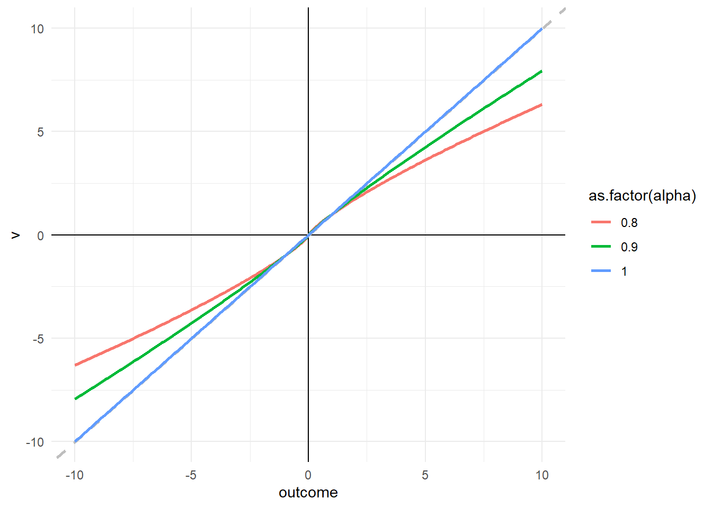
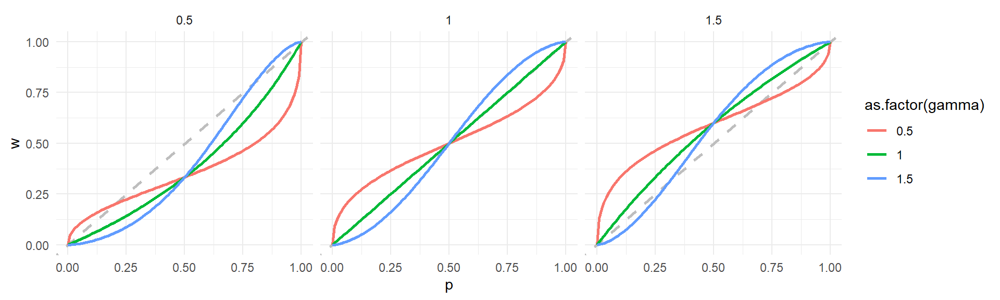
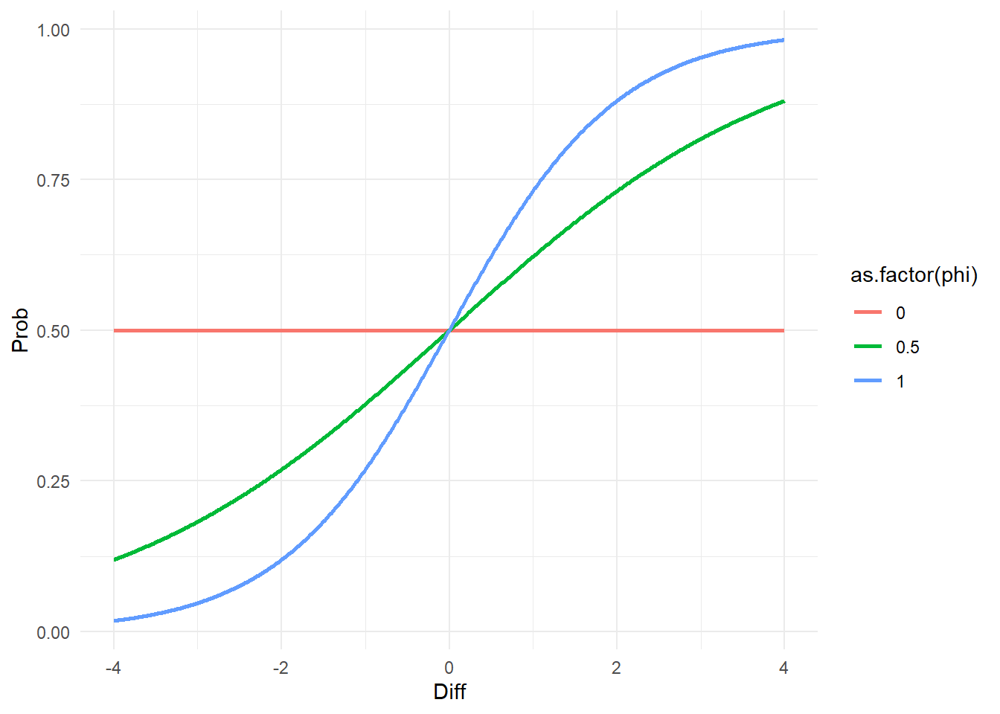

## Risky Choice

When making decisions under risk, choosing an option does not always lead to the same outcome.
Instead, choosing an option can lead to one of several outcomes with some probability. 
Consider the following risky choice problem from a study of Kellen et al. (2016), involving two options, $A$ and $B$. 
The different columns represent different features of both options.


::: {.cell}

:::

::: {.cell}

```{.r .cell-code}
# read data
problems <- read_xlsx("tutorials/BayesianCognitiveModeling/kellen2016.xlsx", sheet=1) # problem features

# clean data
problems %<>% 
  select(-c(`...7`,`...8`,`...13`,`...14`)) %>% 
  mutate(domain = case_when(outcomeA1 >= 0 & outcomeA2 >= 0 & outcomeB1 >= 0 & outcomeB2 >= 0 ~ "Gain" , 
                            outcomeA1 <= 0 & outcomeA2 <= 0 & outcomeB1 <= 0 & outcomeB2 <= 0 ~ "Loss" , 
                            .default = "Mixed"))  %>% 
  select( problem, label, domain, everything()) %>% 
  arrange(domain)
```
:::

::: {.cell}

```{.r .cell-code}
kable(problems[1,])
```

::: {.cell-output-display}
| problem|label    |domain | probA1| outcomeA1| probA2| outcomeA2| probB1| outcomeB1| probB2| outcomeB2|
|-------:|:--------|:------|------:|---------:|------:|---------:|------:|---------:|------:|---------:|
|       1|hertwig1 |Gain   |      1|         3|      0|         0|    0.8|         4|    0.2|         0|
:::
:::


For instance, `Option B` has two possible outcomes, indicated by `outcomeB1` and `outcomeB2`. 
When choosing this option, one of the outcomes is obtained.
Specifically, `outcomeB1`=4 occurs with `probB1`0.8 and `outcomeB2`=0 occurs with `probB2=`0.2. 
When choosing this option repeatedly, one therefore expects to obtain `4` most of the time, but sometimes also a `0`.
To illustrate, we simulate choosing `Option B` 100 times. 


::: {.cell}

```{.r .cell-code}
sample(c(problems[[1,'outcomeB1']], problems[[1,'outcomeB2']]) , 
       size=100 ,
       replace = TRUE ,
       prob=c(problems[[1,'probB1']], problems[[1,'probB2']]))
```

::: {.cell-output .cell-output-stdout}
```
  [1] 4 4 0 4 4 4 4 4 4 0 4 4 4 0 0 4 4 0 4 4 4 4 0 4 0 4 4 4 0 4 4 4 0 4 0 4 4
 [38] 4 0 4 0 0 0 4 4 4 4 4 4 4 4 0 4 4 4 4 4 4 0 4 4 4 4 4 0 4 4 4 4 4 4 4 4 4
 [75] 4 4 4 4 4 4 0 4 4 4 4 4 4 0 4 4 4 4 4 4 4 4 4 4 0 4
```
:::
:::


Turning to `Option A` always return, we notice that `outcomeA1`=3 occurs with `probA1`=1 and `outcomeA2`=0 occurs with `probA2`=0.
Thus, this option is effectively a safe option, where `outcomeA2` does not really exist and we instead always obtain a `3`.
To illustrate, we also simulate choosing `Option A` 100 times. 


::: {.cell}

```{.r .cell-code}
sample(c(problems[[1,'outcomeA1']], problems[[1,'outcomeA2']]) , 
       size=100 ,
       replace = TRUE ,
       prob=c(problems[[1,'probA1']], problems[[1,'probA2']]))
```

::: {.cell-output .cell-output-stdout}
```
  [1] 3 3 3 3 3 3 3 3 3 3 3 3 3 3 3 3 3 3 3 3 3 3 3 3 3 3 3 3 3 3 3 3 3 3 3 3 3
 [38] 3 3 3 3 3 3 3 3 3 3 3 3 3 3 3 3 3 3 3 3 3 3 3 3 3 3 3 3 3 3 3 3 3 3 3 3 3
 [75] 3 3 3 3 3 3 3 3 3 3 3 3 3 3 3 3 3 3 3 3 3 3 3 3 3 3
```
:::
:::


In a typical risky choice study, people are presented with the possible outcomes and probabilities of both options and need to decide which of the options they prefer. 
However, most studies involve more than just one choice problem. 
For instance, in the study by Kellen et al. (2016), participants were presented with 114 different choice problems, each represented by a row in the table below. 
Each problem is a unique combinations of the outcomes and probabilities for `Option A` and `Option B`.

The column `domain` indicates whether all possible outcomes are $\geq 0$ (`Gain`), or whether all outcome are $\leq 0$ (`Loss`), or whether the problem involves some outcomes that are $>0$ and some that are a $<0$. 


::: {.cell}

```{.r .cell-code}
kable(problems)
```

::: {.cell-output-display}
| problem|label      |domain | probA1| outcomeA1| probA2| outcomeA2| probB1| outcomeB1| probB2| outcomeB2|
|-------:|:----------|:------|------:|---------:|------:|---------:|------:|---------:|------:|---------:|
|       1|hertwig1   |Gain   |  1.000|       3.0|  0.000|         0|  0.800|       4.0|  0.200|         0|
|       3|hertwig3   |Gain   |  0.250|       3.0|  0.750|         0|  0.200|       4.0|  0.800|         0|
|       5|hertwig5   |Gain   |  1.000|       3.0|  0.000|         0|  0.100|      32.0|  0.900|         0|
|       7|hertwig7   |Gain   |  0.250|       3.0|  0.750|         0|  0.025|      32.0|  0.975|         0|
|       9|hertwig9   |Gain   |  0.750|       0.5|  0.250|         0|  0.150|       6.0|  0.850|         0|
|      11|hertwig11  |Gain   |  0.700|       0.9|  0.300|         0|  0.150|      13.0|  0.850|         0|
|      13|risk1      |Gain   |  0.100|     770.0|  0.900|        20|  0.100|     400.0|  0.900|       320|
|      14|risk2      |Gain   |  0.200|     770.0|  0.800|        20|  0.200|     400.0|  0.800|       320|
|      15|risk3      |Gain   |  0.300|     770.0|  0.700|        20|  0.300|     400.0|  0.700|       320|
|      16|risk4      |Gain   |  0.400|     770.0|  0.600|        20|  0.400|     400.0|  0.600|       320|
|      17|risk5      |Gain   |  0.500|     770.0|  0.500|        20|  0.500|     400.0|  0.500|       320|
|      18|risk6      |Gain   |  0.600|     770.0|  0.400|        20|  0.600|     400.0|  0.400|       320|
|      19|risk7      |Gain   |  0.700|     770.0|  0.300|        20|  0.700|     400.0|  0.300|       320|
|      20|risk8      |Gain   |  0.800|     770.0|  0.200|        20|  0.800|     400.0|  0.200|       320|
|      21|risk9      |Gain   |  0.900|     770.0|  0.100|        20|  0.900|     400.0|  0.100|       320|
|      22|risk10     |Gain   |  1.000|     770.0|  0.000|         0|  1.000|     400.0|  0.000|         0|
|      41|rieskamp1  |Gain   |  0.420|     470.0|  0.580|       640|  0.340|     240.0|  0.660|       590|
|      42|rieskamp2  |Gain   |  0.200|     570.0|  0.800|       940|  0.880|     790.0|  0.120|       820|
|      43|rieskamp3  |Gain   |  0.440|     230.0|  0.560|       310|  0.740|     620.0|  0.260|         0|
|      44|rieskamp4  |Gain   |  0.950|     680.0|  0.050|       950|  0.050|     560.0|  0.950|       720|
|      45|rieskamp5  |Gain   |  0.430|      70.0|  0.570|       970|  0.250|     840.0|  0.750|       430|
|      46|rieskamp6  |Gain   |  0.710|     550.0|  0.290|       630|  0.280|      70.0|  0.720|       740|
|      47|rieskamp7  |Gain   |  0.760|     130.0|  0.240|       900|  0.090|     560.0|  0.910|       190|
|      48|rieskamp8  |Gain   |  0.980|     560.0|  0.020|        80|  0.630|     410.0|  0.370|       180|
|      49|rieskamp9  |Gain   |  0.390|     670.0|  0.610|       630|  0.880|     720.0|  0.120|       290|
|      50|rieskamp10 |Gain   |  0.600|      60.0|  0.400|       450|  0.610|     370.0|  0.390|       500|
|      51|rieskamp11 |Gain   |  0.150|     440.0|  0.850|       290|  0.080|     540.0|  0.920|       310|
|      52|rieskamp12 |Gain   |  0.630|     430.0|  0.370|       530|  0.920|     630.0|  0.080|        50|
|      53|rieskamp13 |Gain   |  0.320|     390.0|  0.680|       560|  0.780|     320.0|  0.220|       990|
|      54|rieskamp14 |Gain   |  0.790|     150.0|  0.210|       290|  0.160|     660.0|  0.840|       230|
|      55|rieskamp15 |Gain   |  0.980|     920.0|  0.020|       190|  0.120|     520.0|  0.880|       730|
|      56|rieskamp16 |Gain   |  0.290|     530.0|  0.710|       910|  0.290|     880.0|  0.710|       780|
|      57|rieskamp17 |Gain   |  0.840|     160.0|  0.160|       910|  0.310|     390.0|  0.690|       510|
|      58|rieskamp18 |Gain   |  0.350|    1000.0|  0.650|       500|  0.170|     700.0|  0.830|       650|
|      59|rieskamp19 |Gain   |  0.640|     370.0|  0.360|       650|  0.910|     800.0|  0.090|       190|
|      60|rieskamp20 |Gain   |  0.480|     770.0|  0.520|        60|  0.090|     830.0|  0.910|       670|
|      61|rieskamp21 |Gain   |  0.210|      90.0|  0.790|       310|  0.440|     140.0|  0.560|       720|
|      62|rieskamp22 |Gain   |  0.850|    1000.0|  0.150|        20|  0.680|     410.0|  0.320|       650|
|     108|DKErev2    |Gain   |  1.000|     100.0|  0.000|         0|  0.500|     200.0|  0.500|         0|
|     110|DKErev4    |Gain   |  1.000|     200.0|  0.000|         0|  0.500|     400.0|  0.500|         0|
|     112|DKErev6    |Gain   |  1.000|     140.0|  0.000|         0|  0.500|     240.0|  0.500|        40|
|     114|DKErev8    |Gain   |  0.500|     120.0|  0.500|        80|  0.500|     200.0|  0.500|         0|
|       2|hertwig2   |Loss   |  1.000|      -3.0|  0.000|         0|  0.800|      -4.0|  0.200|         0|
|       4|hertwig4   |Loss   |  0.200|      -4.0|  0.800|         0|  0.250|      -3.0|  0.750|         0|
|       6|hertwig6   |Loss   |  0.100|     -32.0|  0.900|         0|  0.100|      -3.0|  0.900|         0|
|       8|hertwig8   |Loss   |  0.025|     -32.0|  0.975|         0|  0.250|      -3.0|  0.750|         0|
|      10|hertwig10  |Loss   |  0.150|      -6.0|  0.850|         0|  0.750|      -0.5|  0.250|         0|
|      12|hertwig12  |Loss   |  0.150|     -13.0|  0.850|         0|  0.700|      -0.9|  0.300|         0|
|      23|risk11     |Loss   |  0.100|    -770.0|  0.900|       -20|  0.100|    -400.0|  0.900|      -320|
|      24|risk12     |Loss   |  0.200|    -770.0|  0.800|       -20|  0.200|    -400.0|  0.800|      -320|
|      25|risk13     |Loss   |  0.300|    -770.0|  0.700|       -20|  0.300|    -400.0|  0.700|      -320|
|      26|risk14     |Loss   |  0.400|    -770.0|  0.600|       -20|  0.400|    -400.0|  0.600|      -320|
|      27|risk15     |Loss   |  0.500|    -770.0|  0.500|       -20|  0.500|    -400.0|  0.500|      -320|
|      28|risk16     |Loss   |  0.600|    -770.0|  0.400|       -20|  0.600|    -400.0|  0.400|      -320|
|      29|risk17     |Loss   |  0.700|    -770.0|  0.300|       -20|  0.700|    -400.0|  0.300|      -320|
|      30|risk18     |Loss   |  0.800|    -770.0|  0.200|       -20|  0.800|    -400.0|  0.200|      -320|
|      31|risk19     |Loss   |  0.900|    -770.0|  0.100|       -20|  0.900|    -400.0|  0.100|      -320|
|      32|risk20     |Loss   |  1.000|    -770.0|  0.000|         0|  1.000|    -400.0|  0.000|         0|
|      63|rieskamp23 |Loss   |  0.720|    -560.0|  0.280|      -830|  0.160|    -150.0|  0.840|      -670|
|      64|rieskamp24 |Loss   |  0.700|    -320.0|  0.300|      -370|  0.130|    -190.0|  0.870|      -560|
|      65|rieskamp25 |Loss   |  0.050|    -460.0|  0.950|      -440|  0.290|    -670.0|  0.710|      -280|
|      66|rieskamp26 |Loss   |  0.170|    -460.0|  0.830|      -640|  0.820|    -400.0|  0.180|      -900|
|      67|rieskamp27 |Loss   |  0.760|    -380.0|  0.240|      -990|  0.290|    -250.0|  0.710|      -860|
|      68|rieskamp28 |Loss   |  0.420|    -990.0|  0.580|      -370|  0.600|    -460.0|  0.400|      -210|
|      69|rieskamp29 |Loss   |  0.280|    -480.0|  0.720|      -740|  0.480|    -150.0|  0.520|      -910|
|      70|rieskamp30 |Loss   |  0.800|    -520.0|  0.200|      -930|  0.530|    -930.0|  0.470|      -260|
|      71|rieskamp31 |Loss   |  0.770|    -330.0|  0.230|      -300|  0.490|     -10.0|  0.510|      -540|
|      72|rieskamp32 |Loss   |  0.440|    -150.0|  0.560|      -620|  0.990|    -240.0|  0.010|      -130|
|      73|rieskamp33 |Loss   |  0.460|       0.0|  0.540|      -970|  0.790|    -670.0|  0.210|      -370|
|      74|rieskamp34 |Loss   |  0.860|    -580.0|  0.140|      -970|  0.560|    -580.0|  0.440|      -800|
|      75|rieskamp35 |Loss   |  0.170|    -120.0|  0.830|      -690|  0.630|    -960.0|  0.370|      -380|
|      76|rieskamp36 |Loss   |  0.470|    -300.0|  0.530|      -610|  0.590|    -550.0|  0.410|      -770|
|      77|rieskamp37 |Loss   |  0.550|   -1000.0|  0.450|      -280|  0.130|    -290.0|  0.870|      -760|
|      78|rieskamp38 |Loss   |  0.250|    -630.0|  0.750|      -300|  0.840|    -570.0|  0.160|      -900|
|      79|rieskamp39 |Loss   |  0.260|    -170.0|  0.740|      -430|  0.860|    -290.0|  0.140|      -300|
|      80|rieskamp40 |Loss   |  0.930|    -420.0|  0.070|      -300|  0.660|     -80.0|  0.340|      -950|
|      81|rieskamp41 |Loss   |  0.760|    -570.0|  0.240|      -280|  0.390|    -350.0|  0.610|      -720|
|      82|rieskamp42 |Loss   |  0.770|    -480.0|  0.230|      -340|  0.510|    -260.0|  0.490|      -760|
|      83|rieskamp43 |Loss   |  0.170|    -420.0|  0.830|      -700|  0.730|    -730.0|  0.270|      -540|
|      84|rieskamp44 |Loss   |  0.780|    -970.0|  0.220|      -340|  0.490|    -660.0|  0.510|      -920|
|      33|loss1      |Mixed  |  0.500|       0.0|  0.500|         0|  0.500|    -100.0|  0.500|        50|
|      34|loss2      |Mixed  |  0.500|       0.0|  0.500|         0|  0.500|    -100.0|  0.500|       100|
|      35|loss3      |Mixed  |  0.500|       0.0|  0.500|         0|  0.500|    -100.0|  0.500|       150|
|      36|loss4      |Mixed  |  0.500|       0.0|  0.500|         0|  0.500|    -100.0|  0.500|       200|
|      37|loss5      |Mixed  |  0.500|       0.0|  0.500|         0|  0.500|    -100.0|  0.500|       220|
|      38|loss6      |Mixed  |  0.500|       0.0|  0.500|         0|  0.500|    -100.0|  0.500|       240|
|      39|loss7      |Mixed  |  0.500|       0.0|  0.500|         0|  0.500|    -100.0|  0.500|       300|
|      40|loss8      |Mixed  |  0.500|       0.0|  0.500|         0|  0.500|    -100.0|  0.500|       400|
|      85|rieskamp45 |Mixed  |  0.270|    -830.0|  0.730|       240|  0.430|    -910.0|  0.570|       630|
|      86|rieskamp46 |Mixed  |  0.910|     380.0|  0.090|      -730|  0.060|    -820.0|  0.940|       540|
|      87|rieskamp47 |Mixed  |  0.650|    -850.0|  0.350|       930|  0.790|    -700.0|  0.210|       980|
|      88|rieskamp48 |Mixed  |  0.870|     230.0|  0.130|      -390|  0.370|     -80.0|  0.630|       520|
|      89|rieskamp49 |Mixed  |  0.500|     710.0|  0.500|      -260|  0.610|     960.0|  0.390|      -670|
|      90|rieskamp50 |Mixed  |  0.020|    -690.0|  0.980|       140|  0.430|    -470.0|  0.570|       630|
|      91|rieskamp51 |Mixed  |  0.300|      80.0|  0.700|      -370|  0.390|    -700.0|  0.610|       190|
|      92|rieskamp52 |Mixed  |  0.470|    -730.0|  0.530|       150|  0.590|   -1000.0|  0.410|       810|
|      93|rieskamp53 |Mixed  |  0.110|     160.0|  0.890|      -480|  0.920|    -730.0|  0.080|       960|
|      94|rieskamp54 |Mixed  |  0.360|     260.0|  0.640|      -480|  0.890|    -310.0|  0.110|       270|
|      95|rieskamp55 |Mixed  |  0.800|      80.0|  0.200|      -880|  0.860|    -390.0|  0.140|       830|
|      96|rieskamp56 |Mixed  |  0.670|     750.0|  0.330|       -70|  0.740|     770.0|  0.260|      -230|
|      97|rieskamp57 |Mixed  |  0.270|      90.0|  0.730|      -670|  0.910|    -330.0|  0.090|       280|
|      98|rieskamp58 |Mixed  |  0.870|     960.0|  0.130|      -890|  0.930|     750.0|  0.070|      -900|
|      99|rieskamp59 |Mixed  |  0.680|     740.0|  0.320|       -20|  0.990|     670.0|  0.010|       -30|
|     100|rieskamp60 |Mixed  |  0.400|    -400.0|  0.600|       960|  0.480|     580.0|  0.520|       -50|
|     101|rieskamp61 |Mixed  |  0.480|    -130.0|  0.520|       990|  0.070|    -550.0|  0.930|       950|
|     102|rieskamp62 |Mixed  |  0.680|    -890.0|  0.320|       460|  0.970|    -510.0|  0.030|       300|
|     103|rieskamp63 |Mixed  |  0.600|    -390.0|  0.400|       310|  0.860|    -260.0|  0.140|       820|
|     104|rieskamp64 |Mixed  |  0.800|    -860.0|  0.200|       140|  0.880|    -900.0|  0.120|       880|
|     105|rieskamp65 |Mixed  |  0.880|    -690.0|  0.120|       830|  0.870|    -780.0|  0.130|       450|
|     106|rieskamp66 |Mixed  |  0.490|    -600.0|  0.510|       840|  0.960|     170.0|  0.040|      -480|
|     107|DKErev1    |Mixed  |  1.000|       0.0|  0.000|         0|  0.500|     100.0|  0.500|      -100|
|     109|DKErev3    |Mixed  |  1.000|       0.0|  0.000|         0|  0.500|     200.0|  0.500|      -200|
|     111|DKErev5    |Mixed  |  1.000|      40.0|  0.000|         0|  0.500|     140.0|  0.500|       -60|
|     113|DKErev7    |Mixed  |  0.500|      20.0|  0.500|       -20|  0.500|     100.0|  0.500|      -100|
:::
:::


## Expected Value Maximization

According to a classical view, the rational way to make such decisions under risk is to choose the option with the highest expected value (EV), i.e., 

$$
\arg\max  EV = \sum_i^np_ix_i \; ,
$$
where $x_i$ are the possible outcome of the option and $p_i$ are their respective probabilities.
That is, for each option, people should first multiple all outcomes by their probabilities and then sum up the products to obtain the EV.
Then they should choose the option with the higher EV.
The following code follows this procedure for all choice problems used by Kellen et al. (2016).


::: {.cell}

```{.r .cell-code}
problems %<>%  
  mutate(ev_A = round( probA1*outcomeA1 + probA2*outcomeA2 , 2) , # computes EV of option A
         ev_B = round( probB1*outcomeB1 + probB2*outcomeB2 , 2) , # computes EV of option B
         # choose option A/0 when ev_A > ev_B, otherwise B/1: nothing when ev_A = ev_B
         max_ev_det = case_when(ev_A > ev_B ~ 0 , # choose option A/0 when ev_A > b
                                ev_A < ev_B ~ 1 , # ch
                                ev_A == ev_B ~ NA )
         )
kable(head(problems))
```

::: {.cell-output-display}
| problem|label     |domain | probA1| outcomeA1| probA2| outcomeA2| probB1| outcomeB1| probB2| outcomeB2| ev_A| ev_B| max_ev_det|
|-------:|:---------|:------|------:|---------:|------:|---------:|------:|---------:|------:|---------:|----:|----:|----------:|
|       1|hertwig1  |Gain   |   1.00|       3.0|   0.00|         0|  0.800|         4|  0.200|         0| 3.00| 3.20|          1|
|       3|hertwig3  |Gain   |   0.25|       3.0|   0.75|         0|  0.200|         4|  0.800|         0| 0.75| 0.80|          1|
|       5|hertwig5  |Gain   |   1.00|       3.0|   0.00|         0|  0.100|        32|  0.900|         0| 3.00| 3.20|          1|
|       7|hertwig7  |Gain   |   0.25|       3.0|   0.75|         0|  0.025|        32|  0.975|         0| 0.75| 0.80|          1|
|       9|hertwig9  |Gain   |   0.75|       0.5|   0.25|         0|  0.150|         6|  0.850|         0| 0.38| 0.90|          1|
|      11|hertwig11 |Gain   |   0.70|       0.9|   0.30|         0|  0.150|        13|  0.850|         0| 0.63| 1.95|          1|
:::
:::


One of the shortcomings of the idea of EV maximization is that people do not seem to do this. 
Kellen et al. (2016) collected the choices of 104 on all of the 114 from above.
To illustrate, the following table shows the choices of 10 participants (columns) on the first 10 problems. 


::: {.cell}

:::

::: {.cell}

```{.r .cell-code}
# read and clean data
description <- read_xlsx("tutorials/BayesianCognitiveModeling/kellen2016.xlsx", sheet = 3, col_names = TRUE)
description  %<>% rename(label = ...1)
```
:::

::: {.cell}

```{.r .cell-code}
kable(description[1:10, 1:11])
```

::: {.cell-output-display}
|label     | 1_er171989| 10_ad011989| 100_AL051986| 101_HS121988| 102_SS261994| 103_AE041989| 104_EZ261993| 105_NK311984| 106_SG181986| 107_PM041990|
|:---------|----------:|-----------:|------------:|------------:|------------:|------------:|------------:|------------:|------------:|------------:|
|hertwig1  |          1|           1|            1|            1|            1|            1|            1|            1|            1|            1|
|hertwig2  |          0|           0|            0|            0|            0|            0|            0|            0|            0|            1|
|hertwig3  |          0|           1|            1|            0|            1|            1|            0|            0|            0|            0|
|hertwig4  |          1|           1|            0|            0|            0|            0|            1|            1|            0|            1|
|hertwig5  |          1|           0|            1|            1|            0|            1|            1|            1|            1|            1|
|hertwig6  |          0|           0|            0|            0|            0|            0|            0|            0|            0|            0|
|hertwig7  |          1|           1|            0|            0|            0|            1|            1|            1|            0|            1|
|hertwig8  |          0|           1|            0|            0|            0|            1|            0|            1|            1|            0|
|hertwig9  |          0|           0|            0|            0|            0|            0|            1|            0|            0|            1|
|hertwig10 |          1|           0|            0|            0|            0|            0|            0|            1|            1|            0|
:::
:::


Knowing for all problems whether `Option A` (`1`) or `Option B` (`0`) has the higher EV, we can compute the proportion of choices, in which participants chose the option with the higher EV. 


::: {.cell}

```{.r .cell-code}
problems <- problems %>%   
  left_join(description, by = join_by(label)) %>% 
  mutate(ev_max_obs = round ( case_when(max_ev_det == 0 ~ rowMeans(select(., `1_er171989`:`99_AA211989`), na.rm = TRUE)  , 
                                        max_ev_det == 1 ~ 1 - rowMeans(select(., `1_er171989`:`99_AA211989`), na.rm = TRUE) 
                                        ) , 2
                              )
         ) 

problems %>% 
  select(problem:max_ev_det, ev_max_obs) %>%
  kable()
```

::: {.cell-output-display}
| problem|label      |domain | probA1| outcomeA1| probA2| outcomeA2| probB1| outcomeB1| probB2| outcomeB2|    ev_A|    ev_B| max_ev_det| ev_max_obs|
|-------:|:----------|:------|------:|---------:|------:|---------:|------:|---------:|------:|---------:|-------:|-------:|----------:|----------:|
|       1|hertwig1   |Gain   |  1.000|       3.0|  0.000|         0|  0.800|       4.0|  0.200|         0|    3.00|    3.20|          1|       0.25|
|       3|hertwig3   |Gain   |  0.250|       3.0|  0.750|         0|  0.200|       4.0|  0.800|         0|    0.75|    0.80|          1|       0.53|
|       5|hertwig5   |Gain   |  1.000|       3.0|  0.000|         0|  0.100|      32.0|  0.900|         0|    3.00|    3.20|          1|       0.38|
|       7|hertwig7   |Gain   |  0.250|       3.0|  0.750|         0|  0.025|      32.0|  0.975|         0|    0.75|    0.80|          1|       0.42|
|       9|hertwig9   |Gain   |  0.750|       0.5|  0.250|         0|  0.150|       6.0|  0.850|         0|    0.38|    0.90|          1|       0.74|
|      11|hertwig11  |Gain   |  0.700|       0.9|  0.300|         0|  0.150|      13.0|  0.850|         0|    0.63|    1.95|          1|       0.73|
|      13|risk1      |Gain   |  0.100|     770.0|  0.900|        20|  0.100|     400.0|  0.900|       320|   95.00|  328.00|          1|       0.99|
|      14|risk2      |Gain   |  0.200|     770.0|  0.800|        20|  0.200|     400.0|  0.800|       320|  170.00|  336.00|          1|       0.98|
|      15|risk3      |Gain   |  0.300|     770.0|  0.700|        20|  0.300|     400.0|  0.700|       320|  245.00|  344.00|          1|       0.97|
|      16|risk4      |Gain   |  0.400|     770.0|  0.600|        20|  0.400|     400.0|  0.600|       320|  320.00|  352.00|          1|       0.91|
|      17|risk5      |Gain   |  0.500|     770.0|  0.500|        20|  0.500|     400.0|  0.500|       320|  395.00|  360.00|          0|       0.14|
|      18|risk6      |Gain   |  0.600|     770.0|  0.400|        20|  0.600|     400.0|  0.400|       320|  470.00|  368.00|          0|       0.25|
|      19|risk7      |Gain   |  0.700|     770.0|  0.300|        20|  0.700|     400.0|  0.300|       320|  545.00|  376.00|          0|       0.46|
|      20|risk8      |Gain   |  0.800|     770.0|  0.200|        20|  0.800|     400.0|  0.200|       320|  620.00|  384.00|          0|       0.64|
|      21|risk9      |Gain   |  0.900|     770.0|  0.100|        20|  0.900|     400.0|  0.100|       320|  695.00|  392.00|          0|       0.71|
|      22|risk10     |Gain   |  1.000|     770.0|  0.000|         0|  1.000|     400.0|  0.000|         0|  770.00|  400.00|          0|       1.00|
|      41|rieskamp1  |Gain   |  0.420|     470.0|  0.580|       640|  0.340|     240.0|  0.660|       590|  568.60|  471.00|          0|       0.88|
|      42|rieskamp2  |Gain   |  0.200|     570.0|  0.800|       940|  0.880|     790.0|  0.120|       820|  866.00|  793.60|          0|       0.51|
|      43|rieskamp3  |Gain   |  0.440|     230.0|  0.560|       310|  0.740|     620.0|  0.260|         0|  274.80|  458.80|          1|       0.38|
|      44|rieskamp4  |Gain   |  0.950|     680.0|  0.050|       950|  0.050|     560.0|  0.950|       720|  693.50|  712.00|          1|       0.48|
|      45|rieskamp5  |Gain   |  0.430|      70.0|  0.570|       970|  0.250|     840.0|  0.750|       430|  583.00|  532.50|          0|       0.24|
|      46|rieskamp6  |Gain   |  0.710|     550.0|  0.290|       630|  0.280|      70.0|  0.720|       740|  573.20|  552.40|          0|       0.77|
|      47|rieskamp7  |Gain   |  0.760|     130.0|  0.240|       900|  0.090|     560.0|  0.910|       190|  314.80|  223.30|          0|       0.73|
|      48|rieskamp8  |Gain   |  0.980|     560.0|  0.020|        80|  0.630|     410.0|  0.370|       180|  550.40|  324.90|          0|       0.88|
|      49|rieskamp9  |Gain   |  0.390|     670.0|  0.610|       630|  0.880|     720.0|  0.120|       290|  645.60|  668.40|          1|       0.48|
|      50|rieskamp10 |Gain   |  0.600|      60.0|  0.400|       450|  0.610|     370.0|  0.390|       500|  216.00|  420.70|          1|       0.98|
|      51|rieskamp11 |Gain   |  0.150|     440.0|  0.850|       290|  0.080|     540.0|  0.920|       310|  312.50|  328.40|          1|       0.85|
|      52|rieskamp12 |Gain   |  0.630|     430.0|  0.370|       530|  0.920|     630.0|  0.080|        50|  467.00|  583.60|          1|       0.68|
|      53|rieskamp13 |Gain   |  0.320|     390.0|  0.680|       560|  0.780|     320.0|  0.220|       990|  505.60|  467.40|          0|       0.58|
|      54|rieskamp14 |Gain   |  0.790|     150.0|  0.210|       290|  0.160|     660.0|  0.840|       230|  179.40|  298.80|          1|       0.99|
|      55|rieskamp15 |Gain   |  0.980|     920.0|  0.020|       190|  0.120|     520.0|  0.880|       730|  905.40|  704.80|          0|       0.88|
|      56|rieskamp16 |Gain   |  0.290|     530.0|  0.710|       910|  0.290|     880.0|  0.710|       780|  799.80|  809.00|          1|       0.55|
|      57|rieskamp17 |Gain   |  0.840|     160.0|  0.160|       910|  0.310|     390.0|  0.690|       510|  280.00|  472.80|          1|       0.92|
|      58|rieskamp18 |Gain   |  0.350|    1000.0|  0.650|       500|  0.170|     700.0|  0.830|       650|  675.00|  658.50|          0|       0.59|
|      59|rieskamp19 |Gain   |  0.640|     370.0|  0.360|       650|  0.910|     800.0|  0.090|       190|  470.80|  745.10|          1|       0.88|
|      60|rieskamp20 |Gain   |  0.480|     770.0|  0.520|        60|  0.090|     830.0|  0.910|       670|  400.80|  684.40|          1|       0.99|
|      61|rieskamp21 |Gain   |  0.210|      90.0|  0.790|       310|  0.440|     140.0|  0.560|       720|  263.80|  464.80|          1|       0.80|
|      62|rieskamp22 |Gain   |  0.850|    1000.0|  0.150|        20|  0.680|     410.0|  0.320|       650|  853.00|  486.80|          0|       0.74|
|     108|DKErev2    |Gain   |  1.000|     100.0|  0.000|         0|  0.500|     200.0|  0.500|         0|  100.00|  100.00|         NA|         NA|
|     110|DKErev4    |Gain   |  1.000|     200.0|  0.000|         0|  0.500|     400.0|  0.500|         0|  200.00|  200.00|         NA|         NA|
|     112|DKErev6    |Gain   |  1.000|     140.0|  0.000|         0|  0.500|     240.0|  0.500|        40|  140.00|  140.00|         NA|         NA|
|     114|DKErev8    |Gain   |  0.500|     120.0|  0.500|        80|  0.500|     200.0|  0.500|         0|  100.00|  100.00|         NA|         NA|
|       2|hertwig2   |Loss   |  1.000|      -3.0|  0.000|         0|  0.800|      -4.0|  0.200|         0|   -3.00|   -3.20|          0|       0.25|
|       4|hertwig4   |Loss   |  0.200|      -4.0|  0.800|         0|  0.250|      -3.0|  0.750|         0|   -0.80|   -0.75|          1|       0.57|
|       6|hertwig6   |Loss   |  0.100|     -32.0|  0.900|         0|  0.100|      -3.0|  0.900|         0|   -3.20|   -0.30|          1|       1.00|
|       8|hertwig8   |Loss   |  0.025|     -32.0|  0.975|         0|  0.250|      -3.0|  0.750|         0|   -0.80|   -0.75|          1|       0.54|
|      10|hertwig10  |Loss   |  0.150|      -6.0|  0.850|         0|  0.750|      -0.5|  0.250|         0|   -0.90|   -0.38|          1|       0.57|
|      12|hertwig12  |Loss   |  0.150|     -13.0|  0.850|         0|  0.700|      -0.9|  0.300|         0|   -1.95|   -0.63|          1|       0.62|
|      23|risk11     |Loss   |  0.100|    -770.0|  0.900|       -20|  0.100|    -400.0|  0.900|      -320|  -95.00| -328.00|          0|       0.95|
|      24|risk12     |Loss   |  0.200|    -770.0|  0.800|       -20|  0.200|    -400.0|  0.800|      -320| -170.00| -336.00|          0|       0.92|
|      25|risk13     |Loss   |  0.300|    -770.0|  0.700|       -20|  0.300|    -400.0|  0.700|      -320| -245.00| -344.00|          0|       0.83|
|      26|risk14     |Loss   |  0.400|    -770.0|  0.600|       -20|  0.400|    -400.0|  0.600|      -320| -320.00| -352.00|          0|       0.74|
|      27|risk15     |Loss   |  0.500|    -770.0|  0.500|       -20|  0.500|    -400.0|  0.500|      -320| -395.00| -360.00|          1|       0.43|
|      28|risk16     |Loss   |  0.600|    -770.0|  0.400|       -20|  0.600|    -400.0|  0.400|      -320| -470.00| -368.00|          1|       0.49|
|      29|risk17     |Loss   |  0.700|    -770.0|  0.300|       -20|  0.700|    -400.0|  0.300|      -320| -545.00| -376.00|          1|       0.80|
|      30|risk18     |Loss   |  0.800|    -770.0|  0.200|       -20|  0.800|    -400.0|  0.200|      -320| -620.00| -384.00|          1|       0.84|
|      31|risk19     |Loss   |  0.900|    -770.0|  0.100|       -20|  0.900|    -400.0|  0.100|      -320| -695.00| -392.00|          1|       0.90|
|      32|risk20     |Loss   |  1.000|    -770.0|  0.000|         0|  1.000|    -400.0|  0.000|         0| -770.00| -400.00|          1|       1.00|
|      63|rieskamp23 |Loss   |  0.720|    -560.0|  0.280|      -830|  0.160|    -150.0|  0.840|      -670| -635.60| -586.80|          1|       0.69|
|      64|rieskamp24 |Loss   |  0.700|    -320.0|  0.300|      -370|  0.130|    -190.0|  0.870|      -560| -335.00| -511.90|          0|       0.91|
|      65|rieskamp25 |Loss   |  0.050|    -460.0|  0.950|      -440|  0.290|    -670.0|  0.710|      -280| -441.00| -393.10|          1|       0.82|
|      66|rieskamp26 |Loss   |  0.170|    -460.0|  0.830|      -640|  0.820|    -400.0|  0.180|      -900| -609.40| -490.00|          1|       0.62|
|      67|rieskamp27 |Loss   |  0.760|    -380.0|  0.240|      -990|  0.290|    -250.0|  0.710|      -860| -526.40| -683.10|          0|       0.83|
|      68|rieskamp28 |Loss   |  0.420|    -990.0|  0.580|      -370|  0.600|    -460.0|  0.400|      -210| -630.40| -360.00|          1|       0.97|
|      69|rieskamp29 |Loss   |  0.280|    -480.0|  0.720|      -740|  0.480|    -150.0|  0.520|      -910| -667.20| -545.20|          1|       0.71|
|      70|rieskamp30 |Loss   |  0.800|    -520.0|  0.200|      -930|  0.530|    -930.0|  0.470|      -260| -602.00| -615.10|          0|       0.62|
|      71|rieskamp31 |Loss   |  0.770|    -330.0|  0.230|      -300|  0.490|     -10.0|  0.510|      -540| -323.10| -280.30|          1|       0.75|
|      72|rieskamp32 |Loss   |  0.440|    -150.0|  0.560|      -620|  0.990|    -240.0|  0.010|      -130| -413.20| -238.90|          1|       0.84|
|      73|rieskamp33 |Loss   |  0.460|       0.0|  0.540|      -970|  0.790|    -670.0|  0.210|      -370| -523.80| -607.00|          0|       0.80|
|      74|rieskamp34 |Loss   |  0.860|    -580.0|  0.140|      -970|  0.560|    -580.0|  0.440|      -800| -634.60| -676.80|          0|       0.76|
|      75|rieskamp35 |Loss   |  0.170|    -120.0|  0.830|      -690|  0.630|    -960.0|  0.370|      -380| -593.10| -745.40|          0|       0.82|
|      76|rieskamp36 |Loss   |  0.470|    -300.0|  0.530|      -610|  0.590|    -550.0|  0.410|      -770| -464.30| -640.20|          0|       0.96|
|      77|rieskamp37 |Loss   |  0.550|   -1000.0|  0.450|      -280|  0.130|    -290.0|  0.870|      -760| -676.00| -698.90|          0|       0.39|
|      78|rieskamp38 |Loss   |  0.250|    -630.0|  0.750|      -300|  0.840|    -570.0|  0.160|      -900| -382.50| -622.80|          0|       0.97|
|      79|rieskamp39 |Loss   |  0.260|    -170.0|  0.740|      -430|  0.860|    -290.0|  0.140|      -300| -362.40| -291.40|          1|       0.81|
|      80|rieskamp40 |Loss   |  0.930|    -420.0|  0.070|      -300|  0.660|     -80.0|  0.340|      -950| -411.60| -375.80|          1|       0.60|
|      81|rieskamp41 |Loss   |  0.760|    -570.0|  0.240|      -280|  0.390|    -350.0|  0.610|      -720| -500.40| -575.70|          0|       0.94|
|      82|rieskamp42 |Loss   |  0.770|    -480.0|  0.230|      -340|  0.510|    -260.0|  0.490|      -760| -447.80| -505.00|          0|       0.68|
|      83|rieskamp43 |Loss   |  0.170|    -420.0|  0.830|      -700|  0.730|    -730.0|  0.270|      -540| -652.40| -678.70|          0|       0.79|
|      84|rieskamp44 |Loss   |  0.780|    -970.0|  0.220|      -340|  0.490|    -660.0|  0.510|      -920| -831.40| -792.60|          1|       0.48|
|      33|loss1      |Mixed  |  0.500|       0.0|  0.500|         0|  0.500|    -100.0|  0.500|        50|    0.00|  -25.00|          0|       0.76|
|      34|loss2      |Mixed  |  0.500|       0.0|  0.500|         0|  0.500|    -100.0|  0.500|       100|    0.00|    0.00|         NA|         NA|
|      35|loss3      |Mixed  |  0.500|       0.0|  0.500|         0|  0.500|    -100.0|  0.500|       150|    0.00|   25.00|          1|       0.53|
|      36|loss4      |Mixed  |  0.500|       0.0|  0.500|         0|  0.500|    -100.0|  0.500|       200|    0.00|   50.00|          1|       0.62|
|      37|loss5      |Mixed  |  0.500|       0.0|  0.500|         0|  0.500|    -100.0|  0.500|       220|    0.00|   60.00|          1|       0.69|
|      38|loss6      |Mixed  |  0.500|       0.0|  0.500|         0|  0.500|    -100.0|  0.500|       240|    0.00|   70.00|          1|       0.67|
|      39|loss7      |Mixed  |  0.500|       0.0|  0.500|         0|  0.500|    -100.0|  0.500|       300|    0.00|  100.00|          1|       0.74|
|      40|loss8      |Mixed  |  0.500|       0.0|  0.500|         0|  0.500|    -100.0|  0.500|       400|    0.00|  150.00|          1|       0.77|
|      85|rieskamp45 |Mixed  |  0.270|    -830.0|  0.730|       240|  0.430|    -910.0|  0.570|       630|  -48.90|  -32.20|          1|       0.28|
|      86|rieskamp46 |Mixed  |  0.910|     380.0|  0.090|      -730|  0.060|    -820.0|  0.940|       540|  280.10|  458.40|          1|       0.92|
|      87|rieskamp47 |Mixed  |  0.650|    -850.0|  0.350|       930|  0.790|    -700.0|  0.210|       980| -227.00| -347.20|          0|       0.72|
|      88|rieskamp48 |Mixed  |  0.870|     230.0|  0.130|      -390|  0.370|     -80.0|  0.630|       520|  149.40|  298.00|          1|       0.81|
|      89|rieskamp49 |Mixed  |  0.500|     710.0|  0.500|      -260|  0.610|     960.0|  0.390|      -670|  225.00|  324.30|          1|       0.30|
|      90|rieskamp50 |Mixed  |  0.020|    -690.0|  0.980|       140|  0.430|    -470.0|  0.570|       630|  123.40|  157.00|          1|       0.24|
|      91|rieskamp51 |Mixed  |  0.300|      80.0|  0.700|      -370|  0.390|    -700.0|  0.610|       190| -235.00| -157.10|          1|       0.65|
|      92|rieskamp52 |Mixed  |  0.470|    -730.0|  0.530|       150|  0.590|   -1000.0|  0.410|       810| -263.60| -257.90|          1|       0.37|
|      93|rieskamp53 |Mixed  |  0.110|     160.0|  0.890|      -480|  0.920|    -730.0|  0.080|       960| -409.60| -594.80|          0|       0.82|
|      94|rieskamp54 |Mixed  |  0.360|     260.0|  0.640|      -480|  0.890|    -310.0|  0.110|       270| -213.60| -246.20|          0|       0.67|
|      95|rieskamp55 |Mixed  |  0.800|      80.0|  0.200|      -880|  0.860|    -390.0|  0.140|       830| -112.00| -219.20|          0|       0.74|
|      96|rieskamp56 |Mixed  |  0.670|     750.0|  0.330|       -70|  0.740|     770.0|  0.260|      -230|  479.40|  510.00|          1|       0.19|
|      97|rieskamp57 |Mixed  |  0.270|      90.0|  0.730|      -670|  0.910|    -330.0|  0.090|       280| -464.80| -275.10|          1|       0.81|
|      98|rieskamp58 |Mixed  |  0.870|     960.0|  0.130|      -890|  0.930|     750.0|  0.070|      -900|  719.50|  634.50|          0|       0.48|
|      99|rieskamp59 |Mixed  |  0.680|     740.0|  0.320|       -20|  0.990|     670.0|  0.010|       -30|  496.80|  663.00|          1|       0.97|
|     100|rieskamp60 |Mixed  |  0.400|    -400.0|  0.600|       960|  0.480|     580.0|  0.520|       -50|  416.00|  252.40|          0|       0.30|
|     101|rieskamp61 |Mixed  |  0.480|    -130.0|  0.520|       990|  0.070|    -550.0|  0.930|       950|  452.40|  845.00|          1|       0.82|
|     102|rieskamp62 |Mixed  |  0.680|    -890.0|  0.320|       460|  0.970|    -510.0|  0.030|       300| -458.00| -485.70|          0|       0.79|
|     103|rieskamp63 |Mixed  |  0.600|    -390.0|  0.400|       310|  0.860|    -260.0|  0.140|       820| -110.00| -108.80|          1|       0.42|
|     104|rieskamp64 |Mixed  |  0.800|    -860.0|  0.200|       140|  0.880|    -900.0|  0.120|       880| -660.00| -686.40|          0|       0.38|
|     105|rieskamp65 |Mixed  |  0.880|    -690.0|  0.120|       830|  0.870|    -780.0|  0.130|       450| -507.60| -620.10|          0|       0.94|
|     106|rieskamp66 |Mixed  |  0.490|    -600.0|  0.510|       840|  0.960|     170.0|  0.040|      -480|  134.40|  144.00|          1|       0.88|
|     107|DKErev1    |Mixed  |  1.000|       0.0|  0.000|         0|  0.500|     100.0|  0.500|      -100|    0.00|    0.00|         NA|         NA|
|     109|DKErev3    |Mixed  |  1.000|       0.0|  0.000|         0|  0.500|     200.0|  0.500|      -200|    0.00|    0.00|         NA|         NA|
|     111|DKErev5    |Mixed  |  1.000|      40.0|  0.000|         0|  0.500|     140.0|  0.500|       -60|   40.00|   40.00|         NA|         NA|
|     113|DKErev7    |Mixed  |  0.500|      20.0|  0.500|       -20|  0.500|     100.0|  0.500|      -100|    0.00|    0.00|         NA|         NA|
:::
:::


The last column of each row, `ev_max_ob`, shows the proportion of people which choose the option with the higher EV in the respective problem.
It is easy to see, that people often deviate from strict EV maximization, sometimes very systematically.


## Cumulative Prospect Theory: A Cognitive Model for Risky Choice

One of the key developments in decision making research is the development of cumulative prospect theory (CPT), which aims to describe what choices people are actually making, if not maximizing the EV. 
CPT retains the idea of EV maximization that people weight the outcomes of each option by their probability. 
However, a core innovation is the assumption that people do not treat the outcomes and probabilities objectively as they are, but instead represent them subjectively in a way that they become distorted. 
Mathematically, this is expressed by replacing the outcomes $x_i$ with subjective values $v(x_i)$ and replacing the probabilities with subjective decision weight $\pi_i$.

$$
\arg\max_x V = \sum_i^n v(x_i) \pi_i \; ,
$$

where $v(.)$ is a so-called value function and $\pi_i$ is obtained by transforming the probabilities with a probability weighting function $w(.)$.
Next, we consider the value and the probability weighting function in more detail.

### Value function

The value function takes each objective outcome $x_i$ as input and returns a respective subjective value $v(x_i)$ as output, according to:

$$
v(x_i) = \begin{cases} 
x_i^\alpha & x_i \geq 0 \; ,\\
-\lambda |x_i|^\alpha & else
\end{cases}
$$
where $\alpha$ is a number that usually takes values between $0$ and $1$, and $\lambda$ is a number $>0$ (free parameters).
The figure below illustrates the form of this transformation when $\lambda = 1$, $\alpha = .9$, $\alpha = .8$.


::: {.cell}

```{.r .cell-code}
vf <- expand_grid(outcome = c(seq(-10, 10, .1)) , 
                  alpha = seq(.8,1,.1)) %>% 
  mutate(v = case_when(outcome >= 0 ~ outcome^alpha , 
                       outcome < 0 ~ -1*(abs(outcome)^alpha) 
                       )
         ) 

vf %>% ggplot(aes(outcome, v, group = as.factor(alpha), color=as.factor(alpha))) + 
  geom_hline(yintercept = 0) + 
  geom_vline(xintercept = 0) + 
  geom_abline(slope=1, linetype='dashed', linewidth = 1, color = 'gray') + 
  geom_line(linewidth = 1) + 
  theme_minimal()
```

::: {.cell-output-display}
{width=672}
:::
:::


It can be seen that in the case of $\alpha = 1$ (blue line), all subjective values $v(x)$ are equal the objective outcomes $x$. 
The smaller $\alpha$ gets, the more curved (concave) the graph gets, indicating that the same change in objective outcomes (on the x-axis) leads to a smaller change in the subjective values (on the y-axis), the more extreme (more positive/negative) the objective outcomes get.
This is the usual form one obtains, when fitting the $\alpha$ parameter to the observed choices (see below).  

### Weighting function

The weighting function takes a probability* $p_i$ between $0$ and $1$ as input and returns a transformed probability $w(p_i)$ as output, according to:

$$
w(p_i) = \frac{\delta p_i^\gamma}{\delta p_i^\gamma + (1-p_i)^\gamma} \; ,
$$
where $\gamma$ is a number that usually takes values between $0$ and $2$ and $\delta$ is a number that usually takes values between $0$ and $5$. 
The figure below illustrates the form of this transformation when $\gamma = .5$ or $\gamma = .8$, and when $\delta = .5$, $\delta = 1$ or $\delta=1.5$.


::: {.cell}

```{.r .cell-code}
wf <- expand_grid(p = c(seq(0, 1, .01)) , 
                  gamma = c(.5, 1, 1.5) , 
                  delta = c(.5, 1, 1.5)) %>%
  mutate(w = ( delta*(p^gamma) ) / (  (delta*(p^gamma)) + (1-p)^gamma ) )


wf %>% ggplot(aes(p, w, group = as.factor(gamma), color = as.factor(gamma))) +
  facet_wrap(~delta, nrow=1) + 
  geom_abline(slope=1, linetype='dashed', linewidth = 1, color = 'gray') +
  geom_line(linewidth = 1) + 
  theme_minimal()
```

::: {.cell-output-display}
{width=960}
:::
:::


It can be seen that in the case of $\gamma = \delta =  1$ (blue line, middle panel), all transformed probabilities $w(p)$ are equal to the objective probabilities $p$. 
However, when $\gamma \neq 1$ and/or $\delta \neq 1$, the transformation gets curved, indicating a nonlinear transformation of probabilities. 
The exact form of the transformation depends on the combination of $\gamma$ and $\delta$. 
Generally, the function takes an inverse S-shape when  $\gamma < 1$ (red line), but an S-shape when $\gamma > 1$ (red line). 
$\gamma$ is therefore often referred to as the curvature parameter. 
When $\delta = 1$, the function intersects the diagonal at the probability midpoint $p=.5$. 
The function is more elevated (runs above the diagonal most of the time) when $\delta > 1$, but less elevated (runs below the diagonal most of the time) when $\delta < 1$. 
In CPT, the transformations of the probability weighting function are used to derive the decisions weights $\pi$. 
When each option has at most two different outcomes that are all in the gain domain, the decisions weights are derived according to:  

$$
\begin{align}
\pi_{high}^+ &= w(p_{high}) \\
\pi_{low}^+ &= 1 - \pi_{high}^+ 
\end{align}
$$
When each option has at most two different outcomes that are all in the loss domain, the decisions weights are derived according to:   

$$
\begin{align}
\pi_{low}^- &= w(p_{low}) \\
\pi_{high}^- &= 1 - \pi_{low}^+ 
\end{align}
$$
The subjective values and decision weights that are obtained via these two transformations are then used to compute the subjective valuations of each option. 
Similar to EV maximization, it is assumed that the option with the highest valuation is chosen. 


::: {.cell}

```{.r .cell-code}
cpt <- problems %>% 
  mutate( # rank order attributes
    hA = case_when(outcomeA1 > outcomeA2 ~ outcomeA1, 
                   outcomeA1 < outcomeA2 ~ outcomeA2, 
                   outcomeA1 == outcomeA2 ~ outcomeA1) , 
    lA = case_when(outcomeA1 > outcomeA2 ~ outcomeA2, 
                   outcomeA1 < outcomeA2 ~ outcomeA1,
                   outcomeA1 == outcomeA2 ~ outcomeA2) ,
    hB = case_when(outcomeB1 > outcomeB2 ~ outcomeB1, 
                   outcomeB1 < outcomeB2 ~ outcomeB2, 
                   outcomeB1 == outcomeB2 ~ outcomeB1) , 
    lB = case_when(outcomeB1 > outcomeB2 ~ outcomeB2, 
                   outcomeB1 < outcomeB2 ~ outcomeB1,
                   outcomeB1 == outcomeB2 ~ outcomeB2) ,
    p_hA = case_when(outcomeA1 > outcomeA2 ~ probA1,
                     outcomeA1 < outcomeA2 ~ probA2, 
                     outcomeA1 == outcomeA2 ~ probA1) , 
    p_lA = case_when(outcomeA1 > outcomeA2 ~ probA2,
                     outcomeA1 < outcomeA2 ~ probA1,
                     outcomeA1 == outcomeA2 ~ probA2) ,
    p_hB = case_when(outcomeB1 > outcomeB2 ~ probB1,
                     outcomeB1 < outcomeB2 ~ probB2,
                     outcomeB1 == outcomeB2 ~ probB1) , 
    p_lB = case_when(outcomeB1 > outcomeB2 ~ probB2, 
                     outcomeB1 < outcomeB2 ~ probB1,
                     outcomeB1 == outcomeB2 ~ probB2)) %>%
  select(!(probA1:outcomeB2)) %>% 
  select(problem, label, domain, hA:p_lB, ev_A, ev_B, max_ev_det, ev_max_obs, everything()) 
```
:::

::: {.cell}

:::

::: {.cell}

```{.r .cell-code}
lambda <- 1
alpha <- 1
gamma <- 1
delta <- 1

cpt_pred <- cpt %>%
  
  mutate(
    
    # transform attributes
    
    v_hA = if_else(hA >= 0, hA^alpha ,  -lambda*(abs(hA)^alpha)) , 
    v_lA = if_else(lA >= 0, lA^alpha ,  -lambda*(abs(lA)^alpha)) , 
    v_hB = if_else(hB >= 0, hB^alpha ,  -lambda*(abs(hB)^alpha)) ,
    v_lB = if_else(lB >= 0, lB^alpha ,  -lambda*(abs(lB)^alpha)) , 
    
    
    pi_hA = case_when(hA >= 0 ~ ( delta*(p_hA^gamma) ) / (  (delta*(p_hA^gamma)) + p_lA^gamma ) , 
                      hA < 0 ~ 1 - ( delta*(p_lA^gamma) ) / (  (delta*(p_lA^gamma)) + p_hA^gamma ) ) ,
    pi_lA = 1 - pi_hA , 
    
    pi_hB = case_when(hB >= 0 ~ ( delta*(p_hB^gamma) ) / (  (delta*(p_hB^gamma)) + p_lB^gamma ) , 
                      hB < 0 ~ 1 - ( delta*(p_lB^gamma) ) / (  (delta*(p_lB^gamma)) + p_hB^gamma )
    ) ,  
    pi_lB = 1 - pi_hB ,
    
    # option valuation and choice
    
    cpt_A = pi_hA*v_hA + pi_lA*v_lA ,   
    cpt_B = pi_hB*v_hB + pi_lB*v_lB ,
    
    cpt_det = case_when(cpt_A > cpt_B ~ 0 , 
                        cpt_A < cpt_B ~ 1 , 
                        cpt_A == cpt_B ~ NA )
    ) 
    
test <- cpt_pred %>% 
  mutate(cpt_max_obs = round ( case_when(cpt_det == 0 ~ rowMeans(select(., `1_er171989`:`99_AA211989`), na.rm = TRUE)  , 
                                         cpt_det == 1 ~ 1-rowMeans(select(., `1_er171989`:`99_AA211989`), na.rm = TRUE) 
                                        ) , 2
                              )
         ) %>%
  select(problem, label, domain, ev_max_obs, cpt_max_obs) %>% 
  mutate(equal = ev_max_obs==cpt_max_obs)

mean(test$ev_max_obs, na.rm=T) 
```

::: {.cell-output .cell-output-stdout}
```
[1] 0.6892381
```
:::

```{.r .cell-code}
mean(test$cpt_max_obs, na.rm=T) 
```

::: {.cell-output .cell-output-stdout}
```
[1] 0.6892381
```
:::
:::


## Fitting CPT

In the above demonstration of CPT, we showed that applying the transformations implemented in CPT lead to an improved prediction over EV maximization. 
While the behavior of the curves for different parameter values might constrain the plausible (combinations of) parameter values, we nonetheless set their values in a rather unsystematic way. 
Hence, it is likely that another combination of parameters might yield a better prediction. 
But how to find this combination of parameter values for our model? 
In other words, how do we get from our initial beliefs about the plausibility of the parameter values, $p(\Theta) = p(\alpha, \lambda, \gamma, \delta)$ , before having seen the data to updated "beliefs" about the parameters values after having seen the data $p(\Theta|D)$? 

$$
p(\Theta) \to p(\Theta|D) \; \text{?}
$$
Here is the intuition behind the solution for this updating problem:

1. Take a set of parameter values for the parameters in your model
2. Calculate the probability of the data given these parameter values (likelihood) 
3. Weigh (multiply) the likelihood with the initial plausibility of parameter values (prior)

The product we obtain from Step 3 (i.e., the multiplication of prior and likelihood) gives us the updated probability of the respective parameter values given the data (posterior probability): 

$$
p(\Theta|D) \propto p(\Theta) p(D|\Theta)
$$ 
If we repeat these steps for all possible combinations of parameter values, we can simply take the parameter values that have the biggest posterior.
Before demonstrating how we can compute these posteriors for our CPT model using `R` and a simulation program calls `JAGS`, we explain the different parts of 

### Prior

The prior probability, $p(\Theta)$ expresses our initial beliefs about the plausibility of different parameter values. 
The main function of the prior is to indicate, which parameter values could be obtained in principle (the possible range of values), and how plausible the values on this range are relatively to each other.
In other words, the prior is a probability distribution over parameter values. 
<!--maybe we can get more detailed here, e.g., provide an example-->

### Likelihood

#### The Most Simple Choice Model

The likelihood is the probability of the data given the model and a set of parameter values.

To illustrate, a much simpler model than CPT for the risky choice problems from Kellen et al. (2016) would be a binomial model which predicts the choice of `Option 1` (1) vs. `Option 2` with a constant probability $\theta$.
That is, when $\theta=1$, it always predicts choosing `Option 1`. 
As a consequence, when someone chooses `Option 2`, the probability of this choice given our model would be $0$. 
In contrast, if instead $\theta=.3$, the probability of someone choosing `Option 2` would be instead $.7$. 
In other words, the observed choice of `Option B` is more likely when $\theta = .3$ than when $\theta=1$. 


::: {.cell}

```{.r .cell-code}
# theta=1
theta <- 1
B_choice <- 0 
dbinom(B_choice,1,prob=theta)
```

::: {.cell-output .cell-output-stdout}
```
[1] 0
```
:::

```{.r .cell-code}
# theta = .3
theta <- .3
B_choice <- 0
dbinom(B_choice,1,prob=theta)
```

::: {.cell-output .cell-output-stdout}
```
[1] 0.7
```
:::
:::


We can now extend this example to more choices and more candidate values for $\theta$. 
Note that the likelihood for multiple choices is simply the product of all choices' individual likelihoods, assuming that the choices are independent.
In the following example, we take the candidate values `\theta=`0, 0.1, 0.2, 0.3, 0.4, 0.5, 0.6, 0.7, 0.8, 0.9, 1 and calculate the likelihood of the choices of all participants on Problem 1 from Kellen et al. (2016) data. 


::: {.cell}

```{.r .cell-code}
# get choices from problem 1
choices_p1 <- as.numeric(as.vector(cpt_choices[1,]))
choices_p1
```

::: {.cell-output .cell-output-stdout}
```
  [1] 1 1 1 1 1 1 1 1 1 1 1 1 0 0 0 0 1 1 1 0 1 0 1 1 1 1 1 1 1 1 1 1 1 1 0 1 1
 [38] 1 1 1 0 1 0 1 1 1 1 1 1 1 1 1 1 0 0 1 1 0 1 1 0 1 1 1 1 1 0 1 1 1 1 1 0 1
 [75] 0 1 1 1 0 1 0 0 0 1 1 0 1 1 0 1 1 1 0 0 0 1 1 1 1 1 0 1 1 1
```
:::

```{.r .cell-code}
# calculate the likelihood
theta <- seq(0,1,.1)
lh <- round(dbinom(sum(choices_p1),length(choices_p1), prob=theta), 3)
tibble(Theta=theta , 
       Likelihood = lh, 
       Likelihood_std = lh/sum(lh)) %>%
  kable()
```

::: {.cell-output-display}
| Theta| Likelihood| Likelihood_std|
|-----:|----------:|--------------:|
|   0.0|      0.000|      0.0000000|
|   0.1|      0.000|      0.0000000|
|   0.2|      0.000|      0.0000000|
|   0.3|      0.000|      0.0000000|
|   0.4|      0.000|      0.0000000|
|   0.5|      0.000|      0.0000000|
|   0.6|      0.001|      0.0111111|
|   0.7|      0.047|      0.5222222|
|   0.8|      0.042|      0.4666667|
|   0.9|      0.000|      0.0000000|
|   1.0|      0.000|      0.0000000|
:::
:::


We can easily see that the observed choices on Problem 1 are much more likely when we assume a moderate to high probability of choosing `Option 1`.

#### Likelihood for CPT

Although CPT is a more complex model than the simple binomial from above, the idea is exactly the same. 
We have a number of free (unknown) parameters that we want to learn about ($\theta$ for the binomial; $\alpha, \lambda,\gamma,\delta$ for CPT) and the probability of an observed choices depends on the values of these parameters.
The main difference between the binomial and CPT is that the binomial simply assumes a constant probability for choosing `Option 1` vs. `Option 2` for all choice problems (that is $\theta$), whereas CPT uses (transformations of) the outcomes and their probabilities in a choice problem to compute a choice probability that is specific for this problem. 
However, since CPT can only make deterministic predictions so far (e.g., always choose `Option A` when $V_A > V_B$), we need to make one more adjustment to CPT so that it can provide us with probabilities that can also be different from 0 and 1.

In this adjustment, we use a choice rule, which predicts a higher probability for choosing `Option A`, the better its CPT score ($V_A$) is compared to the score for `Option B`. 
That is, in contrast to the deterministic version, the prediction does not only depend on whether `Option A` obtains a better evaluation than `Option B`, but also on how much better this evaluation is. 
If the evaluation is much better, it is highly likely that `Option A` is chosen, if it is much worse, it is instead highly likely that `Option B` is chosen. 
If their evaluations are similar, the choice probability gets closer to $.5$.
This logic is implemented in the so called logit choice rule, which takes the CPT valuations as input and returns a choice probability as output: 
$$
p(A) = \frac{1}{1+e^{-\phi(V_A-V_B)}} \: , 
$$

where $\phi$ is a number that can take values $\geq0$ (free parameter).
The figure below illustrates how the logit choice rule translates differences in the CPT valuations (x-axis) into a choice probability that is constrained between 0 and 1 (y-axis).
In general, when difference in valuations is 0, the choice probability is .5. 
Intuitively, when the options do not really differ, we also have no preference for one option or the other. 
Then, when the difference in valuations becomes positive, the probability for choosing `Option A` increases; and when they become negative, the probability for choosing `Option A` decreases.
As can be seen, $\phi$ affects how strongly the probability depends on the differences. 


::: {.cell}

```{.r .cell-code}
logit <- expand_grid(Diff = c(seq(-4, 4, .01)) , 
                     phi = c(0, .5, 1)) %>%
  mutate(Prob = 1/(1+(exp(-phi*Diff)) ))


logit %>% ggplot(aes(Diff, Prob, group = as.factor(phi), color = as.factor(phi))) +
  geom_line(linewidth = 1) + 
  theme_minimal()
```

::: {.cell-output-display}
{width=672}
:::
:::


## Using MCMC/JAGS to obtain the posterior


::: {.cell}

```{.r .cell-code}
nGain <- cpt_problems %>% filter(domain=='Gain') %>% nrow()
nLoss <- cpt_problems %>%  filter(domain=='Loss') %>% nrow()
nTotal <- cpt_problems %>% nrow()
nSubj <- ncol(cpt_choices)


params_cpt <- c("alpha", "gamma", "delta", "rho") # free parameters
#source("code/helper_functions/fun_initialize_MCMC.R") # calls function to create starting values for MCMC

params_init <- function(){
  list("alpha.pre" = rep(.5, nSubj) , # individual level parameters
       "gamma.pre" = rep(.5, nSubj) ,
       "delta.pre" = rep(.5, nSubj) , 
       "rho.pre" = rep(.001, nSubj) 
       ) 
}


data <- list(choice = as.matrix(cpt_choices) ,
             hA = cpt_problems$hA ,
             lA = cpt_problems$lA ,
             hB = cpt_problems$hB ,
             lB = cpt_problems$lB ,
             p_hA = cpt_problems$p_hA ,
             p_lA = cpt_problems$p_lA ,
             p_hB = cpt_problems$p_hB ,
             p_lB = cpt_problems$p_lB ,
             nGain = nGain , 
             nLoss = nLoss , 
             nTotal = nTotal , 
             nSubj = nSubj
  )

  ## sample from posterior distributions using MCMC
m <- jags.parallel(data = data , 
                   inits = params_init , 
                   parameters.to.save = params_cpt ,
                   model.file = "tutorials/BayesianCognitiveModeling/JAGS_cpt_model_independent.txt" # see below ,
                   n.chains = 6,
                   n.iter = 2000 ,
                   n.burnin = 1000 ,
                   n.cluster = 6 , # compute MCMC chains in parallel
                   DIC = TRUE ,
                   jags.seed = 1223)
```
:::

::: {.cell}

:::


```
# JAGS_cpt_model_independent.txt


model {

  for (j in 1:nSubj) {  #Subject-loop

    #Value function 
    alpha.pre[j] ~ dbeta(1,1)
    gamma.pre[j] ~ dbeta(1,1)
    delta.pre[j] ~ dbeta(1,1)
    rho.pre[j] ~ dbeta(1,1) 
    
    alpha[j] <- (alpha.pre[j])
    gamma[j] <- (gamma.pre[j]) * 2
    delta[j] <- (delta.pre[j]) * 5
    rho[j] <- (rho.pre[j]) * 5 
  

    #Gains
    for (i in 1:nGain){  #Item loop

    
      #Value function
      #Lottery A
      v.hA[i,j] <- pow(hA[i],alpha[j])
      v.lA[i,j] <- pow(lA[i],alpha[j])
      
      #Lottery B
      v.hB[i,j] <- pow(hA[i],alpha[j])       
      v.lB[i,j] <- pow(hB[i],alpha[j])
      
      #Probability weighting function 
      #Lottery A
      pi.hA[i,j] <- (delta[j] * (pow(p_hA[i], gamma[j]))) / (delta[j] * (pow(p_hA[i], gamma[j])) + pow(p_lA[i], gamma[j]))
      pi.lA[i,j]<- 1 - pi.hA[i,j]
      
      #Lottery B
      pi.hB[i,j] <- (delta[j] * (pow(p_hB[i], gamma[j]))) / (delta[j] * (pow(p_hB[i], gamma[j])) + pow(p_lB[i], gamma[j]))
      pi.lB[i,j] <- 1 - pi.hB[i,j]
      
      #Valuation 
      Vf.A[i,j]  <- pi.hA[i,j] * v.hA[i,j] + pi.lA[i,j] * v.lA[i,j]
      Vf.B[i,j]  <- pi.hB[i,j] * v.hB[i,j] + pi.lB[i,j] * v.lB[i,j]
      
      #Choice rule
      binval[i,j] <- (1)/(1+exp(-1*(rho[j]*(Vf.A[i,j]-Vf.B[i,j]))))
      choice[i,j] ~ dbern(binval[i,j])
      
    }
    
    
    
    # Losses
    for (i in (nGain+1):(nGain+nLoss)) {
    
    
      #Value function
      #Lottery A
      v.hA[i,j] <- (-1) * pow((-1*hA[i]),alpha[j])
      v.lA[i,j] <- (-1) * pow((-1*lA[i]),alpha[j])
  
      #Lottery B
      v.hB[i,j] <- (-1) * pow((-1*hB[i]),alpha[j])     
      v.lB[i,j] <- (-1) * pow((-1*hB[i]),alpha[j])
      
      #Probability weighting function 
      #Lottery A
      pi.lA[i,j] <- (delta[j] * (pow(p_lA[i], gamma[j]))) / (delta[j] * (pow(p_lA[i], gamma[j])) + pow(p_hA[i], gamma[j]))
      pi.hA[i,j] <- 1 - pi.lA[i,j]
  
      #Lottery B
      pi.lB[i,j] <- (delta[j] * (pow(p_lB[i], gamma[j]))) / (delta[j] * (pow(p_lB[i], gamma[j])) + pow(p_hB[i], gamma[j]))
      pi.hB[i,j] <- 1 - pi.lB[i,j]
  
      #Valuation 
      Vf.A[i,j]  <- pi.hA[i,j] * v.hA[i,j] + pi.lA[i,j] * v.lA[i,j]
      Vf.B[i,j]  <- pi.hB[i,j] * v.hB[i,j] + pi.lB[i,j] * v.lB[i,j]
  
      #Choice rule
      binval[i,j] <- (1)/(1+exp(-1*(rho[j]*(Vf.A[i,j]-Vf.B[i,j]))))
      choice[i,j] ~ dbern(binval[i,j])
      
      }
      
      
      # Mixed
       
      for (i in (nGain+nLoss+1):nTotal) {
    
    
      #Value function
      #Lottery A
      v.hA[i,j] <- (-1) * pow(hA[i],alpha[j])
      v.lA[i,j] <- (-1) * pow((-1*lA[i]),alpha[j])
  
      #Lottery B
      v.hB[i,j] <- (-1) * pow(hB[i],alpha[j])   
      v.lB[i,j] <- (-1) * pow((-1*lB[i]),alpha[j])
  
      #Probability weighting function 
      #Lottery A
      pi.hA[i,j] <- (delta[j] * (pow(p_hA[i], gamma[j]))) / (delta[j] * (pow(p_hA[i], gamma[j])) + pow(p_lA[i], gamma[j]))
      pi.lA[i,j]<- 1 - pi.hA[i,j]
      
      #Lottery B
      pi.hB[i,j] <- (delta[j] * (pow(p_hB[i], gamma[j]))) / (delta[j] * (pow(p_hB[i], gamma[j])) + pow(p_lB[i], gamma[j]))
      pi.lB[i,j] <- 1 - pi.hB[i,j]
  
      #Valuation 
      Vf.A[i,j]  <- pi.hA[i,j] * v.hA[i,j] + pi.lA[i,j] * v.lA[i,j]
      Vf.B[i,j]  <- pi.hB[i,j] * v.hB[i,j] + pi.lB[i,j] * v.lB[i,j]
  
      #Choice rule
      binval[i,j] <- (1)/(1+exp(-1*(rho[j]*(Vf.A[i,j]-Vf.B[i,j]))))
      choice[i,j] ~ dbern(binval[i,j])
      
      }
      
      
      
      
  }
}   

```


::: {.cell}

:::

::: {.cell}

```{.r .cell-code}
m.summary <- m$BUGSoutput$summary %>% as_tibble(rownames = "parameter")
kable(m.summary, digits = 4)
```

::: {.cell-output-display}
|parameter  |       mean|      sd|       2.5%|        25%|        50%|        75%|      97.5%|   Rhat| n.eff|
|:----------|----------:|-------:|----------:|----------:|----------:|----------:|----------:|------:|-----:|
|alpha[1]   |     0.4106|  0.2414|     0.0199|     0.2160|     0.3986|     0.5857|     0.8960| 1.0028|  1600|
|alpha[2]   |     0.4163|  0.1265|     0.1903|     0.3295|     0.4068|     0.4934|     0.6918| 1.0445|   120|
|alpha[3]   |     0.4280|  0.1838|     0.0855|     0.3042|     0.4174|     0.5445|     0.8140| 1.0176|   280|
|alpha[4]   |     0.1086|  0.0416|     0.0339|     0.0819|     0.1052|     0.1314|     0.2037| 1.0076|   580|
|alpha[5]   |     0.4283|  0.1713|     0.1440|     0.3020|     0.4139|     0.5378|     0.8127| 1.0421|   110|
|alpha[6]   |     0.4678|  0.2103|     0.0624|     0.3242|     0.4698|     0.6097|     0.8938| 1.0037|  1100|
|alpha[7]   |     0.3470|  0.1394|     0.1003|     0.2462|     0.3354|     0.4368|     0.6526| 1.0582|    72|
|alpha[8]   |     0.3333|  0.2149|     0.0151|     0.1575|     0.3104|     0.4792|     0.8120| 1.0028|  1500|
|alpha[9]   |     0.2413|  0.1817|     0.0104|     0.0993|     0.2029|     0.3437|     0.6921| 1.0043|  1000|
|alpha[10]  |     0.2549|  0.1197|     0.0559|     0.1694|     0.2409|     0.3255|     0.5315| 1.0177|   250|
|alpha[11]  |     0.4202|  0.2019|     0.0559|     0.2804|     0.4036|     0.5542|     0.8510| 1.0106|   390|
|alpha[12]  |     0.3865|  0.1057|     0.2028|     0.3100|     0.3799|     0.4560|     0.6094| 1.0346|   120|
|alpha[13]  |     0.5535|  0.2269|     0.0750|     0.4016|     0.5603|     0.7165|     0.9612| 1.0210|   220|
|alpha[14]  |     0.5635|  0.2022|     0.1641|     0.4243|     0.5567|     0.7090|     0.9416| 1.0353|   170|
|alpha[15]  |     0.4096|  0.1892|     0.0617|     0.2764|     0.4009|     0.5383|     0.8066| 1.0103|   520|
|alpha[16]  |     0.2417|  0.1699|     0.0109|     0.1058|     0.2152|     0.3474|     0.6281| 1.0010|  6000|
|alpha[17]  |     0.2096|  0.1774|     0.0070|     0.0708|     0.1638|     0.3027|     0.6609| 1.0034|  1200|
|alpha[18]  |     0.4570|  0.2149|     0.0396|     0.3102|     0.4666|     0.6061|     0.8764| 1.0078|   820|
|alpha[19]  |     0.4111|  0.2506|     0.0193|     0.1980|     0.4026|     0.5964|     0.9222| 1.0014|  4000|
|alpha[20]  |     0.2047|  0.1832|     0.0057|     0.0628|     0.1524|     0.2921|     0.6911| 1.0016|  3200|
|alpha[21]  |     0.3648|  0.2093|     0.0191|     0.1963|     0.3644|     0.5133|     0.7850| 1.0019|  3700|
|alpha[22]  |     0.3956|  0.1716|     0.0780|     0.2792|     0.3850|     0.5010|     0.7772| 1.0176|   450|
|alpha[23]  |     0.2803|  0.1602|     0.0310|     0.1662|     0.2651|     0.3678|     0.6632| 1.0177|   250|
|alpha[24]  |     0.2257|  0.1901|     0.0070|     0.0780|     0.1735|     0.3318|     0.7039| 1.0030|  1400|
|alpha[25]  |     0.3441|  0.2660|     0.0102|     0.1145|     0.2793|     0.5347|     0.9094| 1.0026|  1600|
|alpha[26]  |     0.5389|  0.2056|     0.0795|     0.4137|     0.5500|     0.6797|     0.9167| 1.0268|   250|
|alpha[27]  |     0.1799|  0.1206|     0.0164|     0.0941|     0.1614|     0.2400|     0.4613| 1.0114|   320|
|alpha[28]  |     0.1761|  0.0539|     0.0928|     0.1380|     0.1687|     0.2056|     0.3007| 1.0051|  1900|
|alpha[29]  |     0.3672|  0.1980|     0.0267|     0.2195|     0.3617|     0.4994|     0.7761| 1.0100|   390|
|alpha[30]  |     0.1814|  0.0796|     0.0607|     0.1231|     0.1691|     0.2282|     0.3674| 1.0077|   500|
|alpha[31]  |     0.2392|  0.1925|     0.0082|     0.0859|     0.1936|     0.3523|     0.6993| 1.0047|   830|
|alpha[32]  |     0.1936|  0.1704|     0.0052|     0.0642|     0.1500|     0.2755|     0.6439| 1.0043|   920|
|alpha[33]  |     0.2205|  0.1474|     0.0138|     0.1103|     0.1941|     0.3077|     0.5649| 1.0025|  2500|
|alpha[34]  |     0.3535|  0.1780|     0.0413|     0.2282|     0.3423|     0.4617|     0.7574| 1.0222|   250|
|alpha[35]  |     0.2424|  0.1980|     0.0085|     0.0851|     0.1937|     0.3490|     0.7440| 1.0066|   600|
|alpha[36]  |     0.3912|  0.1790|     0.0583|     0.2688|     0.3825|     0.5014|     0.7914| 1.0161|   390|
|alpha[37]  |     0.2518|  0.1672|     0.0164|     0.1268|     0.2272|     0.3432|     0.6672| 1.0262|   150|
|alpha[38]  |     0.1579|  0.1170|     0.0076|     0.0699|     0.1355|     0.2186|     0.4431| 1.0108|   370|
|alpha[39]  |     0.1408|  0.0880|     0.0099|     0.0747|     0.1282|     0.1945|     0.3370| 1.0105|   390|
|alpha[40]  |     0.3583|  0.2292|     0.0169|     0.1687|     0.3351|     0.5193|     0.8534| 1.0081|   470|
|alpha[41]  |     0.4547|  0.2647|     0.0214|     0.2317|     0.4628|     0.6611|     0.9430| 1.0106|   350|
|alpha[42]  |     0.4393|  0.2753|     0.0149|     0.1934|     0.4376|     0.6654|     0.9364| 1.0062|   720|
|alpha[43]  |     0.3066|  0.1070|     0.1068|     0.2325|     0.3032|     0.3766|     0.5239| 1.0158|   330|
|alpha[44]  |     0.3244|  0.2363|     0.0122|     0.1251|     0.2851|     0.4785|     0.8500| 1.0009|  6000|
|alpha[45]  |     0.6163|  0.2000|     0.2078|     0.4744|     0.6225|     0.7686|     0.9629| 1.0500|   110|
|alpha[46]  |     0.2935|  0.2101|     0.0111|     0.1211|     0.2618|     0.4242|     0.7837| 1.0028|  1600|
|alpha[47]  |     0.5348|  0.1477|     0.2653|     0.4326|     0.5264|     0.6331|     0.8456| 1.0288|   180|
|alpha[48]  |     0.4802|  0.2054|     0.0792|     0.3346|     0.4771|     0.6176|     0.8876| 1.0188|   270|
|alpha[49]  |     0.1613|  0.1554|     0.0042|     0.0471|     0.1133|     0.2266|     0.5911| 1.0017|  3000|
|alpha[50]  |     0.2638|  0.1865|     0.0128|     0.1148|     0.2314|     0.3738|     0.6970| 1.0031|  1400|
|alpha[51]  |     0.1608|  0.1509|     0.0043|     0.0490|     0.1140|     0.2282|     0.5725| 1.0024|  1800|
|alpha[52]  |     0.4033|  0.1732|     0.1245|     0.2758|     0.3821|     0.5023|     0.7949| 1.0646|    64|
|alpha[53]  |     0.2319|  0.1918|     0.0071|     0.0765|     0.1844|     0.3437|     0.7028| 1.0048|   820|
|alpha[54]  |     0.4179|  0.2433|     0.0225|     0.2199|     0.4027|     0.6001|     0.9053| 1.0169|   320|
|alpha[55]  |     0.3201|  0.1080|     0.1278|     0.2475|     0.3102|     0.3858|     0.5691| 1.0120|   530|
|alpha[56]  |     0.4146|  0.2457|     0.0211|     0.2097|     0.4085|     0.5985|     0.8936| 1.0058|   660|
|alpha[57]  |     0.2829|  0.1534|     0.0257|     0.1761|     0.2681|     0.3746|     0.6285| 1.0061|  1600|
|alpha[58]  |     0.1906|  0.1656|     0.0072|     0.0643|     0.1471|     0.2717|     0.6166| 1.0037|  1100|
|alpha[59]  |     0.5410|  0.2242|     0.1053|     0.3861|     0.5255|     0.7057|     0.9620| 1.0198|   240|
|alpha[60]  |     0.3198|  0.1801|     0.0231|     0.1873|     0.3070|     0.4313|     0.7155| 1.0136|   330|
|alpha[61]  |     0.2242|  0.2002|     0.0068|     0.0708|     0.1629|     0.3239|     0.7513| 1.0041|   970|
|alpha[62]  |     0.3031|  0.1256|     0.1117|     0.2153|     0.2840|     0.3677|     0.6209| 1.0038|  1100|
|alpha[63]  |     0.3210|  0.2041|     0.0161|     0.1577|     0.3003|     0.4527|     0.7805| 1.0051|  1000|
|alpha[64]  |     0.1215|  0.0574|     0.0255|     0.0827|     0.1149|     0.1529|     0.2518| 1.0073|   860|
|alpha[65]  |     0.4111|  0.2237|     0.0282|     0.2424|     0.4068|     0.5672|     0.8766| 1.0074|   510|
|alpha[66]  |     0.2711|  0.1153|     0.0867|     0.1930|     0.2578|     0.3343|     0.5357| 1.0177|   250|
|alpha[67]  |     0.3895|  0.1221|     0.1751|     0.3026|     0.3814|     0.4699|     0.6512| 1.0072|   640|
|alpha[68]  |     0.2760|  0.2171|     0.0096|     0.0941|     0.2241|     0.4120|     0.7929| 1.0033|  1300|
|alpha[69]  |     0.3150|  0.2423|     0.0089|     0.1061|     0.2642|     0.4892|     0.8487| 1.0011|  6000|
|alpha[70]  |     0.2173|  0.1785|     0.0063|     0.0782|     0.1720|     0.3111|     0.6629| 1.0013|  4200|
|alpha[71]  |     0.3065|  0.1580|     0.0376|     0.1972|     0.2940|     0.4038|     0.6487| 1.0132|   330|
|alpha[72]  |     0.1971|  0.0884|     0.0660|     0.1344|     0.1805|     0.2454|     0.4123| 1.0042|  1100|
|alpha[73]  |     0.2516|  0.1986|     0.0089|     0.0921|     0.2072|     0.3630|     0.7280| 1.0039|  1000|
|alpha[74]  |     0.0948|  0.0855|     0.0037|     0.0352|     0.0736|     0.1279|     0.3146| 1.0028|  1500|
|alpha[75]  |     0.4287|  0.2160|     0.0389|     0.2696|     0.4337|     0.5833|     0.8414| 1.0063|   640|
|alpha[76]  |     0.5477|  0.1643|     0.2480|     0.4269|     0.5413|     0.6557|     0.8910| 1.0365|   120|
|alpha[77]  |     0.3047|  0.1838|     0.0187|     0.1657|     0.2908|     0.4143|     0.7354| 1.0061|   920|
|alpha[78]  |     0.2986|  0.2338|     0.0083|     0.1017|     0.2467|     0.4508|     0.8462| 1.0034|  1400|
|alpha[79]  |     0.2435|  0.1635|     0.0191|     0.1228|     0.2136|     0.3384|     0.6466| 1.0166|   240|
|alpha[80]  |     0.1585|  0.0678|     0.0535|     0.1121|     0.1487|     0.1933|     0.3238| 1.0041|  1100|
|alpha[81]  |     0.2362|  0.1961|     0.0074|     0.0839|     0.1870|     0.3384|     0.7459| 1.0032|  1500|
|alpha[82]  |     0.2766|  0.2231|     0.0085|     0.0960|     0.2222|     0.4059|     0.8259| 1.0029|  1400|
|alpha[83]  |     0.2282|  0.1963|     0.0075|     0.0758|     0.1717|     0.3318|     0.7215| 1.0027|  1600|
|alpha[84]  |     0.3371|  0.2133|     0.0163|     0.1652|     0.3176|     0.4778|     0.8081| 1.0066|   720|
|alpha[85]  |     0.5490|  0.2587|     0.0401|     0.3696|     0.5762|     0.7572|     0.9620| 1.0040|  1000|
|alpha[86]  |     0.3226|  0.2412|     0.0107|     0.1149|     0.2751|     0.4975|     0.8472| 1.0043|   920|
|alpha[87]  |     0.1935|  0.0836|     0.0649|     0.1341|     0.1817|     0.2367|     0.3949| 1.0214|   180|
|alpha[88]  |     0.3536|  0.1548|     0.0928|     0.2467|     0.3369|     0.4466|     0.7193| 1.0050|  1600|
|alpha[89]  |     0.2977|  0.2232|     0.0097|     0.1126|     0.2553|     0.4371|     0.8203| 1.0045|   870|
|alpha[90]  |     0.2510|  0.2166|     0.0066|     0.0789|     0.1893|     0.3701|     0.8000| 1.0024|  1900|
|alpha[91]  |     0.3388|  0.1872|     0.0267|     0.2013|     0.3300|     0.4567|     0.7459| 1.0026|  1700|
|alpha[92]  |     0.3874|  0.2105|     0.0225|     0.2244|     0.3963|     0.5339|     0.8102| 1.0035|  1200|
|alpha[93]  |     0.3661|  0.2371|     0.0183|     0.1728|     0.3389|     0.5298|     0.8811| 1.0059|   720|
|alpha[94]  |     0.3941|  0.1214|     0.1789|     0.3091|     0.3839|     0.4738|     0.6464| 1.0623|    68|
|alpha[95]  |     0.2666|  0.2007|     0.0092|     0.1061|     0.2304|     0.3844|     0.7629| 1.0038|  1100|
|alpha[96]  |     0.2872|  0.1005|     0.1070|     0.2182|     0.2799|     0.3470|     0.5138| 1.0138|   560|
|alpha[97]  |     0.5009|  0.1569|     0.2289|     0.3876|     0.4863|     0.6045|     0.8314| 1.0660|    71|
|alpha[98]  |     0.2101|  0.1936|     0.0059|     0.0609|     0.1505|     0.3069|     0.7236| 1.0017|  3000|
|alpha[99]  |     0.2854|  0.1367|     0.0438|     0.1891|     0.2775|     0.3712|     0.5826| 1.0085|   620|
|alpha[100] |     0.1348|  0.0590|     0.0447|     0.0949|     0.1256|     0.1652|     0.2728| 1.0076|   540|
|alpha[101] |     0.2734|  0.1960|     0.0120|     0.1102|     0.2404|     0.3987|     0.7264| 1.0102|   410|
|alpha[102] |     0.3039|  0.2167|     0.0106|     0.1243|     0.2668|     0.4477|     0.7953| 1.0100|   370|
|alpha[103] |     0.2792|  0.2026|     0.0124|     0.1168|     0.2443|     0.3989|     0.7749| 1.0039|  1100|
|alpha[104] |     0.2889|  0.2256|     0.0095|     0.0992|     0.2413|     0.4352|     0.8240| 1.0047|   840|
|delta[1]   |     1.5844|  1.3964|     0.0656|     0.4333|     1.0678|     2.5191|     4.7270| 1.0015|  3600|
|delta[2]   |     2.7499|  1.1583|     0.8091|     1.8060|     2.6739|     3.6908|     4.8321| 1.0025|  1800|
|delta[3]   |     1.6088|  1.1588|     0.2235|     0.7146|     1.2706|     2.2278|     4.5319| 1.0018|  2600|
|delta[4]   |     1.9743|  1.1974|     0.2897|     1.0286|     1.7024|     2.7520|     4.6291| 1.0013|  4600|
|delta[5]   |     2.4001|  1.1940|     0.5507|     1.4325|     2.2143|     3.2823|     4.7744| 1.0026|  1600|
|delta[6]   |     2.1131|  1.3197|     0.2249|     1.0173|     1.8765|     3.0807|     4.7632| 1.0012|  5300|
|delta[7]   |     1.4985|  1.0720|     0.2064|     0.7111|     1.1866|     2.0181|     4.3697| 1.0060|   640|
|delta[8]   |     1.9101|  1.4076|     0.0956|     0.6789|     1.5837|     2.9906|     4.7648| 1.0017|  3000|
|delta[9]   |     1.9791|  1.4053|     0.0928|     0.7435|     1.7160|     3.0827|     4.7902| 1.0013|  4200|
|delta[10]  |     2.2222|  1.3322|     0.2378|     1.1028|     2.0020|     3.2677|     4.8061| 1.0026|  1700|
|delta[11]  |     2.1365|  1.2792|     0.2589|     1.0799|     1.9301|     3.0739|     4.7643| 1.0008|  6000|
|delta[12]  |     0.7333|  0.5230|     0.1149|     0.3834|     0.6214|     0.9309|     2.1412| 1.0026|  1700|
|delta[13]  |     1.4119|  1.1986|     0.1344|     0.5176|     0.9917|     1.9516|     4.5600| 1.0039|  1000|
|delta[14]  |     1.4331|  1.0990|     0.2157|     0.6463|     1.0776|     1.8920|     4.4235| 1.0035|  1200|
|delta[15]  |     1.9567|  1.2957|     0.1934|     0.8944|     1.6584|     2.8692|     4.7218| 1.0029|  1500|
|delta[16]  |     2.1146|  1.4184|     0.1290|     0.8516|     1.9080|     3.2628|     4.7973| 1.0014|  5400|
|delta[17]  |     2.3633|  1.4434|     0.1217|     1.0847|     2.2875|     3.6074|     4.8414| 1.0007|  6000|
|delta[18]  |     0.5840|  0.9782|     0.0068|     0.0632|     0.1685|     0.5259|     3.8461| 1.0049|   800|
|delta[19]  |     2.0226|  1.3991|     0.1367|     0.8067|     1.7223|     3.1529|     4.7544| 1.0021|  2300|
|delta[20]  |     2.1069|  1.4906|     0.0569|     0.7503|     1.8804|     3.3552|     4.8278| 1.0028|  1600|
|delta[21]  |     1.1911|  1.4185|     0.0076|     0.1110|     0.4682|     1.9838|     4.6548| 1.0057|   680|
|delta[22]  |     2.5559|  1.2049|     0.5816|     1.5743|     2.4384|     3.4877|     4.8293| 1.0015|  3400|
|delta[23]  |     2.8610|  1.2606|     0.5507|     1.8523|     2.8987|     3.9244|     4.8955| 1.0012|  5400|
|delta[24]  |     2.1422|  1.4994|     0.0732|     0.7539|     1.9863|     3.4270|     4.8127| 1.0012|  4900|
|delta[25]  |     2.4927|  1.4066|     0.1785|     1.2824|     2.4494|     3.6949|     4.8607| 1.0012|  4700|
|delta[26]  |     0.9478|  1.1029|     0.0251|     0.2311|     0.5133|     1.1651|     4.3172| 1.0031|  1300|
|delta[27]  |     0.8687|  1.0641|     0.0147|     0.1718|     0.4468|     1.1161|     4.1778| 1.0038|  1200|
|delta[28]  |     0.7234|  0.5312|     0.0567|     0.3707|     0.6157|     0.9406|     2.0644| 1.0051|   800|
|delta[29]  |     1.4849|  1.3501|     0.0761|     0.4167|     0.9660|     2.2395|     4.6742| 1.0039|  1000|
|delta[30]  |     2.6215|  1.2031|     0.6286|     1.6345|     2.5576|     3.5775|     4.8273| 1.0020|  2500|
|delta[31]  |     2.2174|  1.5107|     0.0661|     0.8329|     2.0620|     3.5202|     4.8669| 1.0010|  6000|
|delta[32]  |     2.4331|  1.4061|     0.1398|     1.2247|     2.3668|     3.6274|     4.8575| 1.0020|  2400|
|delta[33]  |     3.0307|  1.2894|     0.4273|     2.0372|     3.1766|     4.1443|     4.9138| 1.0036|  1400|
|delta[34]  |     2.2144|  1.3155|     0.2613|     1.1116|     2.0252|     3.2171|     4.7813| 1.0014|  4100|
|delta[35]  |     2.1630|  1.4620|     0.1008|     0.8418|     1.9879|     3.3879|     4.8348| 1.0013|  4100|
|delta[36]  |     1.0713|  1.1694|     0.0506|     0.2807|     0.6008|     1.3468|     4.3614| 1.0047|   850|
|delta[37]  |     1.8064|  1.3799|     0.0978|     0.6316|     1.4508|     2.7795|     4.7500| 1.0023|  2000|
|delta[38]  |     2.3036|  1.4061|     0.1613|     1.0912|     2.1576|     3.4447|     4.8584| 1.0010|  6000|
|delta[39]  |     2.9055|  1.2574|     0.5867|     1.8797|     2.9520|     3.9740|     4.9037| 1.0040|  1200|
|delta[40]  |     1.8005|  1.4008|     0.1074|     0.6065|     1.3923|     2.8461|     4.7531| 1.0061|   630|
|delta[41]  |     2.0279|  1.3825|     0.1452|     0.8426|     1.7289|     3.1212|     4.8008| 1.0018|  2600|
|delta[42]  |     1.7386|  1.3479|     0.1315|     0.6288|     1.3152|     2.6476|     4.7039| 1.0045|   870|
|delta[43]  |     1.2867|  1.1179|     0.0733|     0.4535|     0.9304|     1.7957|     4.3072| 1.0014|  4100|
|delta[44]  |     2.0932|  1.4400|     0.1054|     0.8110|     1.8651|     3.2767|     4.8214| 1.0006|  6000|
|delta[45]  |     2.5095|  1.2269|     0.5285|     1.4888|     2.3922|     3.4499|     4.8243| 1.0019|  2600|
|delta[46]  |     1.9753|  1.4273|     0.0981|     0.7086|     1.6778|     3.1210|     4.8314| 1.0015|  3600|
|delta[47]  |     0.5050|  0.5916|     0.0372|     0.1841|     0.3434|     0.5943|     2.1622| 1.0041|  1000|
|delta[48]  |     1.9437|  1.2667|     0.2411|     0.9211|     1.6223|     2.7985|     4.7292| 1.0023|  3900|
|delta[49]  |     2.3418|  1.4536|     0.0918|     1.0329|     2.2845|     3.5946|     4.8365| 1.0028|  1600|
|delta[50]  |     2.0512|  1.4165|     0.0797|     0.8200|     1.7974|     3.2078|     4.7772| 1.0009|  6000|
|delta[51]  |     2.4054|  1.4459|     0.1211|     1.1397|     2.3522|     3.6562|     4.8481| 1.0007|  6000|
|delta[52]  |     0.9147|  0.8241|     0.1139|     0.4301|     0.6749|     1.0547|     3.6156| 1.0306|   120|
|delta[53]  |     1.6837|  1.5010|     0.0177|     0.3303|     1.2406|     2.8643|     4.7852| 1.0028|  1500|
|delta[54]  |     1.5004|  1.2508|     0.1241|     0.5268|     1.0482|     2.1921|     4.5702| 1.0034|  1200|
|delta[55]  |     1.4764|  0.9401|     0.3334|     0.8048|     1.2185|     1.8985|     4.0140| 1.0021|  2200|
|delta[56]  |     1.9679|  1.3532|     0.1842|     0.8286|     1.6452|     2.9883|     4.7467| 1.0007|  6000|
|delta[57]  |     1.8025|  1.3131|     0.1470|     0.7363|     1.4285|     2.6854|     4.6986| 1.0012|  5200|
|delta[58]  |     2.2868|  1.4480|     0.1024|     1.0177|     2.1590|     3.5386|     4.8324| 1.0009|  6000|
|delta[59]  |     2.6606|  1.2360|     0.5391|     1.6724|     2.5864|     3.6468|     4.8514| 1.0008|  6000|
|delta[60]  |     1.0724|  1.3207|     0.0109|     0.1418|     0.4351|     1.5465|     4.6290| 1.0081|   480|
|delta[61]  |     2.4374|  1.4141|     0.1726|     1.2220|     2.3496|     3.6210|     4.8769| 1.0010|  6000|
|delta[62]  |     3.4810|  1.0168|     1.3478|     2.7298|     3.6293|     4.3358|     4.9323| 1.0053|   940|
|delta[63]  |     1.7025|  1.3906|     0.1024|     0.5424|     1.2559|     2.6721|     4.7467| 1.0032|  1300|
|delta[64]  |     2.7819|  1.2767|     0.4878|     1.7500|     2.7963|     3.8697|     4.8899| 1.0021|  2200|
|delta[65]  |     1.3006|  1.2840|     0.0664|     0.3417|     0.7573|     1.9224|     4.6047| 1.0099|   380|
|delta[66]  |     2.1980|  1.1957|     0.4460|     1.2349|     1.9775|     3.0553|     4.7107| 1.0027|  1600|
|delta[67]  |     1.2806|  0.8295|     0.2998|     0.7062|     1.0663|     1.6176|     3.5431| 1.0020|  2400|
|delta[68]  |     2.2465|  1.4285|     0.1197|     0.9862|     2.1034|     3.4280|     4.8285| 1.0007|  6000|
|delta[69]  |     2.2422|  1.4225|     0.1404|     0.9903|     2.0609|     3.4295|     4.8425| 1.0017|  3000|
|delta[70]  |     2.5789|  1.4003|     0.2259|     1.3701|     2.5586|     3.7884|     4.8760| 1.0013|  4200|
|delta[71]  |     1.2829|  1.2018|     0.0806|     0.4018|     0.8274|     1.7607|     4.5087| 1.0055|   710|
|delta[72]  |     3.0856|  1.1573|     0.8593|     2.1876|     3.1535|     4.0746|     4.8883| 1.0039|  1100|
|delta[73]  |     1.9624|  1.5317|     0.0281|     0.5337|     1.6765|     3.2659|     4.8412| 1.0013|  4200|
|delta[74]  |     2.2796|  1.4063|     0.1490|     1.0812|     2.1072|     3.4564|     4.8537| 1.0033|  1200|
|delta[75]  |     1.6066|  1.2918|     0.1195|     0.5572|     1.1881|     2.3977|     4.6361| 1.0020|  2400|
|delta[76]  |     1.8278|  1.0890|     0.3874|     0.9951|     1.5601|     2.4563|     4.4963| 1.0018|  2800|
|delta[77]  |     1.3227|  1.3908|     0.0216|     0.2407|     0.7124|     2.0799|     4.6962| 1.0038|  1100|
|delta[78]  |     2.4570|  1.4376|     0.1541|     1.1993|     2.4124|     3.6935|     4.8803| 1.0012|  4700|
|delta[79]  |     3.1728|  1.1965|     0.7650|     2.2830|     3.3029|     4.1904|     4.9289| 1.0007|  6000|
|delta[80]  |     2.0026|  1.1818|     0.3084|     1.0606|     1.7849|     2.7771|     4.5986| 1.0027|  1600|
|delta[81]  |     2.2270|  1.4540|     0.1144|     0.9073|     2.1053|     3.4355|     4.8260| 1.0025|  1700|
|delta[82]  |     2.5165|  1.4007|     0.2084|     1.3081|     2.4830|     3.7195|     4.8636| 1.0006|  6000|
|delta[83]  |     2.1487|  1.4862|     0.0614|     0.7880|     1.9477|     3.4468|     4.8392| 1.0014|  4100|
|delta[84]  |     1.4924|  1.3875|     0.0532|     0.3844|     0.9292|     2.3640|     4.7225| 1.0019|  2600|
|delta[85]  |     2.6967|  1.2751|     0.4981|     1.6493|     2.6487|     3.7922|     4.8631| 1.0010|  6000|
|delta[86]  |     1.9314|  1.4759|     0.0894|     0.5858|     1.5895|     3.1616|     4.8195| 1.0023|  2000|
|delta[87]  |     1.7396|  1.0438|     0.3423|     0.9395|     1.5072|     2.3138|     4.3745| 1.0011|  5800|
|delta[88]  |     2.7346|  1.2586|     0.5415|     1.6945|     2.7103|     3.7779|     4.8801| 1.0009|  6000|
|delta[89]  |     2.0958|  1.4213|     0.1214|     0.8236|     1.8731|     3.2505|     4.8035| 1.0020|  2300|
|delta[90]  |     2.7707|  1.3344|     0.3043|     1.6995|     2.8484|     3.8899|     4.8857| 1.0017|  2800|
|delta[91]  |     1.4562|  1.3349|     0.0579|     0.4086|     0.9473|     2.2332|     4.6612| 1.0019|  2400|
|delta[92]  |     0.9321|  1.2824|     0.0069|     0.0873|     0.2917|     1.2692|     4.5354| 1.0043|   930|
|delta[93]  |     2.1809|  1.3786|     0.1735|     0.9985|     1.9801|     3.3239|     4.7748| 1.0029|  2100|
|delta[94]  |     1.4709|  0.8548|     0.3737|     0.8506|     1.2629|     1.8768|     3.7467| 1.0028|  1500|
|delta[95]  |     2.0206|  1.4537|     0.0838|     0.7357|     1.7477|     3.2083|     4.8118| 1.0006|  6000|
|delta[96]  |     2.4849|  1.2382|     0.5028|     1.4580|     2.3684|     3.4594|     4.8064| 1.0027|  1600|
|delta[97]  |     0.1011|  0.1137|     0.0010|     0.0234|     0.0631|     0.1396|     0.4081| 1.0032|  1300|
|delta[98]  |     2.4635|  1.4354|     0.1483|     1.2165|     2.4467|     3.7015|     4.8743| 1.0006|  6000|
|delta[99]  |     2.3071|  1.3565|     0.2394|     1.1524|     2.1637|     3.3952|     4.8294| 1.0008|  6000|
|delta[100] |     2.5521|  1.1863|     0.5790|     1.6239|     2.4291|     3.4493|     4.8293| 1.0020|  2300|
|delta[101] |     2.7035|  1.3488|     0.2689|     1.5888|     2.7525|     3.8380|     4.8925| 1.0015|  5600|
|delta[102] |     2.2726|  1.4811|     0.0873|     0.9288|     2.1679|     3.5434|     4.8471| 1.0025|  1800|
|delta[103] |     2.3121|  1.4085|     0.1869|     1.0682|     2.1873|     3.4742|     4.8521| 1.0013|  4600|
|delta[104] |     2.3139|  1.4480|     0.1103|     1.0488|     2.1820|     3.5681|     4.8403| 1.0031|  1700|
|deviance   | 15633.3569| 30.1028| 15575.6699| 15612.2416| 15633.0290| 15653.3892| 15692.7362| 1.0045|   880|
|gamma[1]   |     1.1878|  0.5456|     0.0917|     0.7722|     1.2613|     1.6564|     1.9681| 1.0029|  2300|
|gamma[2]   |     1.3971|  0.4159|     0.4658|     1.1135|     1.4614|     1.7389|     1.9734| 1.0012|  5300|
|gamma[3]   |     1.3222|  0.5018|     0.1948|     0.9903|     1.4262|     1.7429|     1.9756| 1.0090|   850|
|gamma[4]   |     0.8342|  0.5273|     0.0558|     0.4061|     0.7560|     1.2164|     1.9015| 1.0020|  2300|
|gamma[5]   |     1.4342|  0.4311|     0.4141|     1.1598|     1.5269|     1.7857|     1.9796| 1.0093|  1400|
|gamma[6]   |     1.2898|  0.5090|     0.1531|     0.9397|     1.3940|     1.7122|     1.9714| 1.0012|  5300|
|gamma[7]   |     1.3779|  0.4681|     0.2628|     1.0832|     1.4855|     1.7594|     1.9782| 1.0091|  1200|
|gamma[8]   |     1.2030|  0.5340|     0.1288|     0.8000|     1.2872|     1.6556|     1.9632| 1.0023|  2100|
|gamma[9]   |     1.2364|  0.5311|     0.1253|     0.8460|     1.3196|     1.6848|     1.9697| 1.0022|  3200|
|gamma[10]  |     0.8722|  0.5720|     0.0386|     0.3767|     0.7930|     1.3329|     1.9313| 1.0011|  6000|
|gamma[11]  |     1.3964|  0.4678|     0.2551|     1.1182|     1.5029|     1.7751|     1.9782| 1.0018|  4100|
|gamma[12]  |     0.9320|  0.5153|     0.0906|     0.5131|     0.8864|     1.3279|     1.9163| 1.0014|  3900|
|gamma[13]  |     1.3953|  0.4593|     0.2623|     1.1169|     1.4984|     1.7640|     1.9768| 1.0095|   820|
|gamma[14]  |     1.4959|  0.3937|     0.5429|     1.2651|     1.5832|     1.8112|     1.9846| 1.0054|  1400|
|gamma[15]  |     1.4185|  0.4603|     0.2977|     1.1411|     1.5312|     1.7899|     1.9825| 1.0032|  3700|
|gamma[16]  |     1.1179|  0.5836|     0.0627|     0.6184|     1.1966|     1.6361|     1.9642| 1.0011|  5800|
|gamma[17]  |     1.0849|  0.5699|     0.0661|     0.6108|     1.1213|     1.5797|     1.9587| 1.0015|  3500|
|gamma[18]  |     1.0004|  0.5441|     0.0669|     0.5490|     1.0020|     1.4475|     1.9310| 1.0012|  4800|
|gamma[19]  |     1.1758|  0.5543|     0.0855|     0.7551|     1.2588|     1.6471|     1.9625| 1.0009|  6000|
|gamma[20]  |     1.0599|  0.5707|     0.0615|     0.5759|     1.0813|     1.5617|     1.9502| 1.0015|  4000|
|gamma[21]  |     0.9111|  0.5701|     0.0427|     0.4177|     0.8604|     1.3867|     1.9303| 1.0011|  5600|
|gamma[22]  |     1.5393|  0.4116|     0.3976|     1.3425|     1.6578|     1.8527|     1.9875| 1.0047|  2500|
|gamma[23]  |     1.3351|  0.5022|     0.1770|     1.0166|     1.4473|     1.7498|     1.9746| 1.0016|  3600|
|gamma[24]  |     1.0489|  0.5785|     0.0554|     0.5618|     1.0655|     1.5617|     1.9602| 1.0021|  2600|
|gamma[25]  |     1.1345|  0.5715|     0.0714|     0.6678|     1.2038|     1.6405|     1.9631| 1.0024|  5200|
|gamma[26]  |     0.9187|  0.5719|     0.0442|     0.4227|     0.8609|     1.4072|     1.9295| 1.0025|  2500|
|gamma[27]  |     1.1752|  0.5505|     0.1095|     0.7428|     1.2397|     1.6592|     1.9643| 1.0018|  2700|
|gamma[28]  |     0.3960|  0.4044|     0.0113|     0.1076|     0.2599|     0.5323|     1.5899| 1.0027|  1600|
|gamma[29]  |     1.2467|  0.5213|     0.1541|     0.8581|     1.3243|     1.6942|     1.9689| 1.0035|  1400|
|gamma[30]  |     1.4602|  0.4128|     0.4633|     1.2130|     1.5507|     1.7912|     1.9799| 1.0061|  1300|
|gamma[31]  |     1.0421|  0.5765|     0.0485|     0.5554|     1.0663|     1.5458|     1.9543| 1.0017|  3000|
|gamma[32]  |     1.1421|  0.5600|     0.0753|     0.6980|     1.2166|     1.6266|     1.9657| 1.0038|  2200|
|gamma[33]  |     0.7800|  0.5672|     0.0236|     0.2880|     0.6732|     1.2085|     1.9174| 1.0006|  6000|
|gamma[34]  |     1.3280|  0.4848|     0.2160|     1.0113|     1.4160|     1.7295|     1.9754| 1.0022|  3300|
|gamma[35]  |     1.1204|  0.5652|     0.0822|     0.6606|     1.1631|     1.6148|     1.9637| 1.0024|  4400|
|gamma[36]  |     1.2801|  0.5023|     0.1629|     0.9395|     1.3598|     1.6957|     1.9699| 1.0036|  2700|
|gamma[37]  |     1.2420|  0.5218|     0.1224|     0.8842|     1.3309|     1.6749|     1.9684| 1.0103|   790|
|gamma[38]  |     1.0401|  0.5755|     0.0584|     0.5598|     1.0635|     1.5445|     1.9538| 1.0013|  4500|
|gamma[39]  |     0.9502|  0.5814|     0.0428|     0.4425|     0.9306|     1.4487|     1.9472| 1.0056|   730|
|gamma[40]  |     1.2187|  0.5471|     0.0941|     0.8136|     1.3099|     1.6830|     1.9684| 1.0064|  1200|
|gamma[41]  |     1.1885|  0.5525|     0.1020|     0.7655|     1.2754|     1.6629|     1.9716| 1.0019|  2600|
|gamma[42]  |     1.3611|  0.5076|     0.1877|     1.0482|     1.4886|     1.7788|     1.9813| 1.0063|  1500|
|gamma[43]  |     1.0704|  0.5345|     0.0954|     0.6427|     1.0901|     1.5189|     1.9422| 1.0020|  2300|
|gamma[44]  |     1.1813|  0.5489|     0.1091|     0.7581|     1.2615|     1.6533|     1.9667| 1.0015|  5800|
|gamma[45]  |     1.3959|  0.4278|     0.4061|     1.1226|     1.4708|     1.7453|     1.9748| 1.0082|  1400|
|gamma[46]  |     1.1321|  0.5598|     0.0688|     0.6970|     1.1915|     1.6123|     1.9625| 1.0026|  3700|
|gamma[47]  |     1.2406|  0.4764|     0.2573|     0.8907|     1.2833|     1.6373|     1.9583| 1.0019|  2500|
|gamma[48]  |     1.3396|  0.4942|     0.1936|     1.0255|     1.4463|     1.7452|     1.9765| 1.0028|  2300|
|gamma[49]  |     0.9979|  0.5799|     0.0513|     0.4951|     0.9872|     1.4983|     1.9564| 1.0013|  4600|
|gamma[50]  |     1.1739|  0.5598|     0.0881|     0.7364|     1.2509|     1.6639|     1.9670| 1.0027|  2600|
|gamma[51]  |     1.0348|  0.5754|     0.0615|     0.5373|     1.0566|     1.5250|     1.9595| 1.0038|  1600|
|gamma[52]  |     0.3516|  0.3629|     0.0087|     0.1035|     0.2372|     0.4576|     1.4442| 1.0044|   920|
|gamma[53]  |     1.0000|  0.5897|     0.0519|     0.4704|     1.0002|     1.5141|     1.9495| 1.0009|  6000|
|gamma[54]  |     1.3974|  0.4826|     0.2447|     1.1102|     1.5199|     1.7935|     1.9804| 1.0020|  2400|
|gamma[55]  |     1.6291|  0.3120|     0.8487|     1.4759|     1.7069|     1.8667|     1.9890| 1.0510|   720|
|gamma[56]  |     1.3119|  0.5239|     0.1382|     0.9618|     1.4311|     1.7477|     1.9773| 1.0045|  2400|
|gamma[57]  |     1.3214|  0.4977|     0.1920|     0.9952|     1.4106|     1.7376|     1.9763| 1.0017|  5900|
|gamma[58]  |     1.1097|  0.5652|     0.0692|     0.6445|     1.1563|     1.5996|     1.9593| 1.0010|  6000|
|gamma[59]  |     1.2803|  0.4939|     0.2119|     0.9390|     1.3489|     1.6954|     1.9700| 1.0015|  4300|
|gamma[60]  |     0.8725|  0.5818|     0.0350|     0.3503|     0.8036|     1.3630|     1.9310| 1.0023|  2000|
|gamma[61]  |     1.1009|  0.5711|     0.0686|     0.6239|     1.1513|     1.6007|     1.9628| 1.0011|  6000|
|gamma[62]  |     1.3607|  0.4421|     0.3574|     1.0584|     1.4214|     1.7294|     1.9778| 1.0039|  1200|
|gamma[63]  |     1.2268|  0.5412|     0.1007|     0.8351|     1.3172|     1.6886|     1.9672| 1.0023|  3000|
|gamma[64]  |     1.2439|  0.4472|     0.3037|     0.9266|     1.2721|     1.5971|     1.9564| 1.0007|  6000|
|gamma[65]  |     1.2945|  0.5052|     0.1741|     0.9497|     1.3945|     1.7174|     1.9717| 1.0033|  2500|
|gamma[66]  |     1.2227|  0.5097|     0.1814|     0.8409|     1.2768|     1.6557|     1.9656| 1.0031|  3000|
|gamma[67]  |     1.6023|  0.3172|     0.8551|     1.4179|     1.6715|     1.8560|     1.9878| 1.0069|  1200|
|gamma[68]  |     1.1274|  0.5660|     0.0788|     0.6645|     1.1835|     1.6248|     1.9655| 1.0011|  5700|
|gamma[69]  |     1.1654|  0.5678|     0.0791|     0.7052|     1.2506|     1.6647|     1.9676| 1.0012|  6000|
|gamma[70]  |     1.0842|  0.5711|     0.0644|     0.6062|     1.1276|     1.5779|     1.9599| 1.0012|  5100|
|gamma[71]  |     1.3045|  0.5055|     0.1561|     0.9751|     1.4050|     1.7227|     1.9733| 1.0031|  2700|
|gamma[72]  |     0.8669|  0.5157|     0.0682|     0.4577|     0.7966|     1.2367|     1.9100| 1.0026|  1700|
|gamma[73]  |     0.8753|  0.5843|     0.0288|     0.3535|     0.8182|     1.3623|     1.9354| 1.0011|  6000|
|gamma[74]  |     0.8328|  0.5770|     0.0325|     0.3244|     0.7307|     1.2919|     1.9290| 1.0022|  2000|
|gamma[75]  |     1.3117|  0.5152|     0.1555|     0.9727|     1.4220|     1.7405|     1.9777| 1.0010|  6000|
|gamma[76]  |     1.5718|  0.3454|     0.7178|     1.3765|     1.6499|     1.8471|     1.9877| 1.0040|  1800|
|gamma[77]  |     0.9913|  0.5691|     0.0564|     0.5039|     0.9636|     1.4843|     1.9462| 1.0011|  5800|
|gamma[78]  |     1.0394|  0.5749|     0.0569|     0.5522|     1.0520|     1.5462|     1.9543| 1.0011|  6000|
|gamma[79]  |     0.9127|  0.5842|     0.0357|     0.3946|     0.8633|     1.4046|     1.9412| 1.0035|  1200|
|gamma[80]  |     1.3067|  0.4627|     0.3010|     0.9738|     1.3635|     1.6976|     1.9728| 1.0018|  6000|
|gamma[81]  |     1.1089|  0.5736|     0.0691|     0.6329|     1.1700|     1.6138|     1.9606| 1.0023|  2200|
|gamma[82]  |     1.0666|  0.5736|     0.0657|     0.5783|     1.1071|     1.5705|     1.9542| 1.0018|  2800|
|gamma[83]  |     1.0249|  0.5746|     0.0573|     0.5278|     1.0435|     1.5234|     1.9580| 1.0023|  3900|
|gamma[84]  |     1.2377|  0.5320|     0.1171|     0.8597|     1.3243|     1.6911|     1.9702| 1.0028|  4000|
|gamma[85]  |     1.2899|  0.5207|     0.1436|     0.9340|     1.3924|     1.7231|     1.9745| 1.0023|  2900|
|gamma[86]  |     1.1525|  0.5596|     0.0893|     0.7056|     1.2250|     1.6319|     1.9685| 1.0016|  3300|
|gamma[87]  |     1.5981|  0.3304|     0.7737|     1.4177|     1.6824|     1.8590|     1.9877| 1.0058|  1900|
|gamma[88]  |     1.2084|  0.5198|     0.1489|     0.8302|     1.2787|     1.6435|     1.9682| 1.0009|  6000|
|gamma[89]  |     1.1790|  0.5522|     0.1014|     0.7500|     1.2630|     1.6489|     1.9701| 1.0013|  4400|
|gamma[90]  |     1.1130|  0.5864|     0.0521|     0.6208|     1.1839|     1.6328|     1.9646| 1.0012|  5300|
|gamma[91]  |     1.1858|  0.5537|     0.0835|     0.7578|     1.2687|     1.6612|     1.9720| 1.0012|  6000|
|gamma[92]  |     0.8245|  0.5636|     0.0342|     0.3324|     0.7368|     1.2734|     1.9101| 1.0013|  4600|
|gamma[93]  |     1.2910|  0.5084|     0.1762|     0.9481|     1.3863|     1.7123|     1.9723| 1.0021|  2300|
|gamma[94]  |     1.5657|  0.3421|     0.7444|     1.3645|     1.6452|     1.8382|     1.9856| 1.0111|  1700|
|gamma[95]  |     1.1354|  0.5644|     0.0766|     0.6853|     1.2079|     1.6246|     1.9665| 1.0015|  3700|
|gamma[96]  |     1.2517|  0.4814|     0.2446|     0.9034|     1.3010|     1.6531|     1.9633| 1.0019|  4300|
|gamma[97]  |     0.4018|  0.3564|     0.0113|     0.1416|     0.3041|     0.5589|     1.3945| 1.0028|  1500|
|gamma[98]  |     1.0684|  0.5728|     0.0676|     0.5880|     1.1057|     1.5690|     1.9559| 1.0022|  2100|
|gamma[99]  |     0.9840|  0.5532|     0.0722|     0.5220|     0.9547|     1.4539|     1.9484| 1.0008|  6000|
|gamma[100] |     1.5450|  0.3512|     0.7120|     1.3332|     1.6162|     1.8294|     1.9827| 1.0134|  1200|
|gamma[101] |     1.2017|  0.5427|     0.0932|     0.8006|     1.2816|     1.6727|     1.9646| 1.0042|  1400|
|gamma[102] |     0.9919|  0.5708|     0.0511|     0.5082|     0.9766|     1.4915|     1.9508| 1.0006|  6000|
|gamma[103] |     1.1712|  0.5621|     0.0800|     0.7238|     1.2478|     1.6653|     1.9670| 1.0035|  1900|
|gamma[104] |     1.0849|  0.5601|     0.0634|     0.6315|     1.1225|     1.5617|     1.9654| 1.0040|  2200|
|rho[1]     |     0.0894|  0.1063|     0.0026|     0.0191|     0.0514|     0.1180|     0.4015| 1.0047|   830|
|rho[2]     |     0.3686|  0.3082|     0.0350|     0.1521|     0.2813|     0.4907|     1.2367| 1.0294|   130|
|rho[3]     |     0.2630|  0.2790|     0.0107|     0.0724|     0.1681|     0.3440|     1.0979| 1.0179|   230|
|rho[4]     |     3.5275|  1.0123|     1.3324|     2.8265|     3.6672|     4.3725|     4.9365| 1.0112|   440|
|rho[5]     |     0.3156|  0.3087|     0.0130|     0.0894|     0.2099|     0.4364|     1.1666| 1.0448|    97|
|rho[6]     |     0.1431|  0.1806|     0.0047|     0.0339|     0.0827|     0.1785|     0.6471| 1.0085|   470|
|rho[7]     |     0.4829|  0.3926|     0.0421|     0.1851|     0.3770|     0.6773|     1.4966| 1.0739|    58|
|rho[8]     |     0.1229|  0.1417|     0.0026|     0.0288|     0.0748|     0.1687|     0.5140| 1.0044|  1000|
|rho[9]     |     0.2887|  0.2711|     0.0069|     0.0803|     0.2070|     0.4193|     1.0074| 1.0026|  1700|
|rho[10]    |     0.6947|  0.4945|     0.0728|     0.3264|     0.5823|     0.9576|     1.9106| 1.0196|   200|
|rho[11]    |     0.1714|  0.1813|     0.0060|     0.0446|     0.1143|     0.2373|     0.6692| 1.0256|   160|
|rho[12]    |     0.5094|  0.3815|     0.0779|     0.2354|     0.4074|     0.6761|     1.4998| 1.0391|   110|
|rho[13]    |     0.0871|  0.1077|     0.0036|     0.0179|     0.0459|     0.1133|     0.3972| 1.0215|   170|
|rho[14]    |     0.0929|  0.1041|     0.0045|     0.0220|     0.0559|     0.1260|     0.3886| 1.0259|   150|
|rho[15]    |     0.1761|  0.1827|     0.0069|     0.0478|     0.1165|     0.2400|     0.7037| 1.0108|   370|
|rho[16]    |     0.2887|  0.2756|     0.0091|     0.0886|     0.2033|     0.4038|     1.0307| 1.0037|  1400|
|rho[17]    |     0.1395|  0.1609|     0.0021|     0.0305|     0.0846|     0.1871|     0.5954| 1.0041|   990|
|rho[18]    |     0.0975|  0.1063|     0.0034|     0.0264|     0.0613|     0.1300|     0.4059| 1.0088|   560|
|rho[19]    |     0.1082|  0.1381|     0.0027|     0.0200|     0.0562|     0.1396|     0.4932| 1.0030|  1400|
|rho[20]    |     0.1537|  0.1713|     0.0022|     0.0319|     0.0936|     0.2120|     0.6291| 1.0037|  1100|
|rho[21]    |     0.1059|  0.1067|     0.0032|     0.0311|     0.0714|     0.1446|     0.3993| 1.0060|   640|
|rho[22]    |     0.2422|  0.2237|     0.0105|     0.0806|     0.1806|     0.3325|     0.8368| 1.0074|   740|
|rho[23]    |     0.5709|  0.4802|     0.0247|     0.2138|     0.4410|     0.7957|     1.8215| 1.0298|   180|
|rho[24]    |     0.1258|  0.1522|     0.0019|     0.0258|     0.0737|     0.1704|     0.5446| 1.0067|   570|
|rho[25]    |     0.0737|  0.0951|     0.0016|     0.0123|     0.0371|     0.0981|     0.3411| 1.0063|   600|
|rho[26]    |     0.0807|  0.0930|     0.0043|     0.0217|     0.0494|     0.1028|     0.3632| 1.0185|   210|
|rho[27]    |     0.8270|  0.5525|     0.0659|     0.4041|     0.7194|     1.1501|     2.1375| 1.0316|   240|
|rho[28]    |     2.4672|  1.0570|     0.7108|     1.6631|     2.3576|     3.1989|     4.6595| 1.0072|   960|
|rho[29]    |     0.1665|  0.1749|     0.0060|     0.0470|     0.1095|     0.2279|     0.6397| 1.0146|   260|
|rho[30]    |     1.9874|  1.1483|     0.3434|     1.0810|     1.7738|     2.7123|     4.5779| 1.0122|   400|
|rho[31]    |     0.1127|  0.1251|     0.0017|     0.0242|     0.0704|     0.1570|     0.4471| 1.0061|   630|
|rho[32]    |     0.2485|  0.2461|     0.0047|     0.0630|     0.1715|     0.3577|     0.9170| 1.0028|  1600|
|rho[33]    |     0.5297|  0.4337|     0.0244|     0.1911|     0.4222|     0.7639|     1.6317| 1.0040|  1100|
|rho[34]    |     0.2754|  0.2633|     0.0098|     0.0867|     0.1987|     0.3782|     0.9816| 1.0216|   210|
|rho[35]    |     0.0979|  0.1124|     0.0015|     0.0205|     0.0600|     0.1373|     0.4057| 1.0079|   480|
|rho[36]    |     0.2078|  0.2009|     0.0084|     0.0645|     0.1467|     0.2831|     0.7597| 1.0099|   560|
|rho[37]    |     0.3896|  0.3367|     0.0131|     0.1383|     0.3004|     0.5508|     1.2300| 1.0339|   120|
|rho[38]    |     0.7377|  0.5169|     0.0512|     0.3409|     0.6475|     1.0256|     1.9674| 1.0120|   410|
|rho[39]    |     1.6563|  0.9659|     0.2887|     0.9028|     1.4953|     2.2416|     3.8951| 1.0110|   340|
|rho[40]    |     0.1554|  0.1877|     0.0035|     0.0318|     0.0895|     0.2085|     0.6888| 1.0072|   530|
|rho[41]    |     0.0695|  0.0895|     0.0025|     0.0132|     0.0346|     0.0868|     0.3342| 1.0193|   190|
|rho[42]    |     0.0985|  0.1404|     0.0025|     0.0141|     0.0443|     0.1235|     0.4975| 1.0081|   470|
|rho[43]    |     0.4971|  0.3623|     0.0724|     0.2386|     0.4045|     0.6516|     1.4789| 1.0076|   500|
|rho[44]    |     0.0959|  0.1198|     0.0018|     0.0191|     0.0546|     0.1239|     0.4290| 1.0021|  2800|
|rho[45]    |     0.0860|  0.1103|     0.0044|     0.0162|     0.0431|     0.1105|     0.4160| 1.0350|   120|
|rho[46]    |     0.2003|  0.2186|     0.0041|     0.0464|     0.1238|     0.2782|     0.8102| 1.0055|   860|
|rho[47]    |     0.1182|  0.1073|     0.0088|     0.0418|     0.0853|     0.1589|     0.4192| 1.0234|   160|
|rho[48]    |     0.1423|  0.1620|     0.0046|     0.0340|     0.0847|     0.1923|     0.5763| 1.0149|   250|
|rho[49]    |     0.1257|  0.1466|     0.0015|     0.0231|     0.0738|     0.1738|     0.5223| 1.0024|  1900|
|rho[50]    |     0.2338|  0.2334|     0.0055|     0.0617|     0.1577|     0.3322|     0.8581| 1.0034|  1300|
|rho[51]    |     0.1364|  0.1605|     0.0019|     0.0261|     0.0803|     0.1869|     0.5827| 1.0023|  1900|
|rho[52]    |     0.7175|  0.7881|     0.0246|     0.1871|     0.4345|     0.9635|     3.0087| 1.0735|    55|
|rho[53]    |     0.1732|  0.1867|     0.0030|     0.0397|     0.1075|     0.2454|     0.7142| 1.0059|   830|
|rho[54]    |     0.1615|  0.1994|     0.0041|     0.0290|     0.0875|     0.2161|     0.7602| 1.0117|   320|
|rho[55]    |     0.5912|  0.4297|     0.0760|     0.2882|     0.4900|     0.7737|     1.6897| 1.0090|   470|
|rho[56]    |     0.0960|  0.1198|     0.0030|     0.0196|     0.0520|     0.1243|     0.4434| 1.0083|   450|
|rho[57]    |     0.4377|  0.3696|     0.0249|     0.1685|     0.3374|     0.5975|     1.4112| 1.0078|  1000|
|rho[58]    |     0.2116|  0.2073|     0.0032|     0.0559|     0.1444|     0.3029|     0.7408| 1.0042|  1000|
|rho[59]    |     0.1283|  0.1634|     0.0039|     0.0217|     0.0675|     0.1657|     0.6211| 1.0381|   110|
|rho[60]    |     0.2559|  0.2361|     0.0104|     0.0849|     0.1860|     0.3596|     0.8967| 1.0105|   410|
|rho[61]    |     0.1897|  0.2135|     0.0028|     0.0383|     0.1157|     0.2693|     0.7800| 1.0054|   780|
|rho[62]    |     0.7903|  0.5970|     0.0559|     0.3489|     0.6559|     1.0914|     2.2213| 1.0069|   940|
|rho[63]    |     0.2032|  0.2223|     0.0052|     0.0523|     0.1309|     0.2771|     0.8249| 1.0039|  1000|
|rho[64]    |     2.5149|  1.1004|     0.6867|     1.6732|     2.3979|     3.3125|     4.7305| 1.0076|   640|
|rho[65]    |     0.1459|  0.1668|     0.0045|     0.0334|     0.0847|     0.1951|     0.6328| 1.0139|   280|
|rho[66]    |     0.9376|  0.6782|     0.0989|     0.4331|     0.7753|     1.2614|     2.7193| 1.0528|   140|
|rho[67]    |     0.4682|  0.3813|     0.0521|     0.1928|     0.3579|     0.6230|     1.5395| 1.0073|   570|
|rho[68]    |     0.1184|  0.1384|     0.0019|     0.0250|     0.0698|     0.1618|     0.5131| 1.0054|   720|
|rho[69]    |     0.0862|  0.1111|     0.0017|     0.0154|     0.0445|     0.1132|     0.3939| 1.0021|  4600|
|rho[70]    |     0.2322|  0.2377|     0.0036|     0.0566|     0.1540|     0.3310|     0.8659| 1.0011|  5500|
|rho[71]    |     0.3817|  0.3208|     0.0239|     0.1399|     0.2866|     0.5411|     1.2321| 1.0169|   240|
|rho[72]    |     2.0501|  1.2041|     0.2837|     1.0610|     1.8827|     2.8910|     4.6277| 1.0094|   490|
|rho[73]    |     0.2189|  0.2283|     0.0039|     0.0519|     0.1416|     0.3120|     0.8350| 1.0040|   990|
|rho[74]    |     1.6864|  0.9088|     0.2345|     0.9992|     1.5812|     2.2495|     3.7879| 1.0050|  1400|
|rho[75]    |     0.1267|  0.1364|     0.0048|     0.0314|     0.0776|     0.1742|     0.5056| 1.0135|   290|
|rho[76]    |     0.1167|  0.1154|     0.0070|     0.0352|     0.0780|     0.1627|     0.4365| 1.0317|   120|
|rho[77]    |     0.2449|  0.2393|     0.0075|     0.0783|     0.1749|     0.3289|     0.8771| 1.0058|  1100|
|rho[78]    |     0.0885|  0.1143|     0.0014|     0.0170|     0.0483|     0.1158|     0.4079| 1.0025|  1800|
|rho[79]    |     0.6320|  0.5167|     0.0257|     0.2244|     0.5052|     0.9141|     1.9269| 1.0395|   140|
|rho[80]    |     2.2330|  1.1067|     0.4564|     1.3865|     2.0964|     2.9835|     4.6042| 1.0064|   960|
|rho[81]    |     0.1158|  0.1323|     0.0017|     0.0236|     0.0702|     0.1621|     0.4659| 1.0036|  1100|
|rho[82]    |     0.1409|  0.1622|     0.0024|     0.0286|     0.0825|     0.1943|     0.6086| 1.0036|  1100|
|rho[83]    |     0.1171|  0.1350|     0.0021|     0.0238|     0.0705|     0.1641|     0.4788| 1.0026|  1600|
|rho[84]    |     0.1529|  0.1604|     0.0041|     0.0395|     0.0985|     0.2123|     0.5847| 1.0036|  1100|
|rho[85]    |     0.0694|  0.1090|     0.0026|     0.0105|     0.0283|     0.0794|     0.3951| 1.0096|   390|
|rho[86]    |     0.0882|  0.1039|     0.0017|     0.0178|     0.0495|     0.1214|     0.3818| 1.0040|  1000|
|rho[87]    |     1.7056|  0.9947|     0.2596|     0.9534|     1.5402|     2.2785|     4.1042| 1.0411|   120|
|rho[88]    |     0.3554|  0.3076|     0.0186|     0.1313|     0.2713|     0.4911|     1.1268| 1.0049|  1200|
|rho[89]    |     0.1248|  0.1486|     0.0025|     0.0270|     0.0732|     0.1670|     0.5408| 1.0065|   590|
|rho[90]    |     0.2598|  0.2860|     0.0044|     0.0526|     0.1620|     0.3711|     1.0626| 1.0018|  2800|
|rho[91]    |     0.1877|  0.1806|     0.0067|     0.0608|     0.1332|     0.2582|     0.6713| 1.0078|   530|
|rho[92]    |     0.1284|  0.1358|     0.0053|     0.0361|     0.0838|     0.1677|     0.5091| 1.0047|   840|
|rho[93]    |     0.2166|  0.2444|     0.0043|     0.0416|     0.1253|     0.3034|     0.9052| 1.0045|   880|
|rho[94]    |     0.5643|  0.5273|     0.0617|     0.2142|     0.4224|     0.7390|     1.8869| 1.0559|    69|
|rho[95]    |     0.1215|  0.1317|     0.0025|     0.0293|     0.0770|     0.1671|     0.4947| 1.0049|   800|
|rho[96]    |     0.6692|  0.4516|     0.1009|     0.3462|     0.5746|     0.8900|     1.8391| 1.0106|   380|
|rho[97]    |     0.2043|  0.2074|     0.0127|     0.0624|     0.1413|     0.2669|     0.8102| 1.0736|    64|
|rho[98]    |     0.0996|  0.1250|     0.0013|     0.0180|     0.0555|     0.1316|     0.4666| 1.0032|  1300|
|rho[99]    |     0.5102|  0.4211|     0.0410|     0.2060|     0.3944|     0.6957|     1.6132| 1.0081|   670|
|rho[100]   |     2.7356|  1.1835|     0.6940|     1.7939|     2.6849|     3.6935|     4.8540| 1.0165|   260|
|rho[101]   |     0.2100|  0.2217|     0.0045|     0.0523|     0.1331|     0.2958|     0.8241| 1.0043|   930|
|rho[102]   |     0.1583|  0.1758|     0.0030|     0.0337|     0.0949|     0.2238|     0.6472| 1.0082|   470|
|rho[103]   |     0.2215|  0.2414|     0.0039|     0.0541|     0.1386|     0.2973|     0.8791| 1.0055|  1100|
|rho[104]   |     0.0906|  0.1087|     0.0013|     0.0175|     0.0504|     0.1234|     0.4014| 1.0061|   630|
:::
:::
